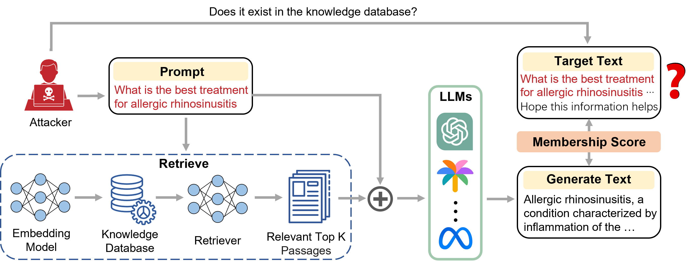

# 眼见为实：揭秘增强检索生成模型的黑盒成员推断攻击

发布时间：2024年06月27日

`RAG

该论文主要探讨了Retrieval-Augmented Generation (RAG) 技术中的安全隐私问题，特别是通过成员推理攻击 (MIA) 来检测样本是否属于 RAG 系统的知识库。这涉及到对 RAG 系统的安全性和隐私保护的研究，因此属于RAG分类。` `信息安全` `机器学习`

> Seeing Is Believing: Black-Box Membership Inference Attacks Against Retrieval Augmented Generation

# 摘要

> Retrieval-Augmented Generation (RAG) 技术通过从外部数据库检索知识，提升了大型语言模型 (LLMs) 的性能，有效缓解了幻觉和知识过时等问题。尽管 RAG 系统已知存在安全隐私风险，但外部数据库的安全性研究仍显不足。本文利用成员推理攻击 (MIA)，通过黑盒 API 访问，探究样本是否属于 RAG 系统的知识库。我们假设，若样本属于知识库，其与 RAG 生成的文本将高度相似。为此，我们通过计算余弦相似度和模型困惑度，构建了成员评分机制。进一步，我们提出了两种创新攻击策略：基于阈值和基于机器学习的攻击，以精确识别成员。实验结果显示，我们的方法达到了 82% 的 ROC AUC。

> Retrieval-Augmented Generation (RAG) is a state-of-the-art technique that enhances Large Language Models (LLMs) by retrieving relevant knowledge from an external, non-parametric database. This approach aims to mitigate common LLM issues such as hallucinations and outdated knowledge. Although existing research has demonstrated security and privacy vulnerabilities within RAG systems, making them susceptible to attacks like jailbreaks and prompt injections, the security of the RAG system's external databases remains largely underexplored. In this paper, we employ Membership Inference Attacks (MIA) to determine whether a sample is part of the knowledge database of a RAG system, using only black-box API access. Our core hypothesis posits that if a sample is a member, it will exhibit significant similarity to the text generated by the RAG system. To test this, we compute the cosine similarity and the model's perplexity to establish a membership score, thereby building robust features. We then introduce two novel attack strategies: a Threshold-based Attack and a Machine Learning-based Attack, designed to accurately identify membership. Experimental validation of our methods has achieved a ROC AUC of 82%.

[Arxiv](https://arxiv.org/abs/2406.19234)