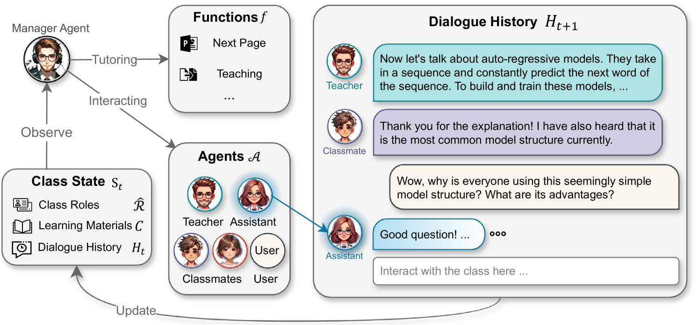
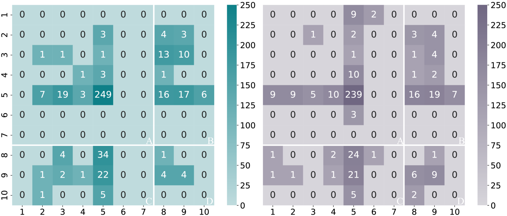
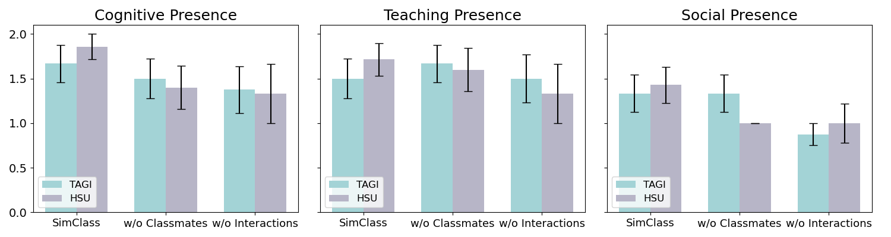
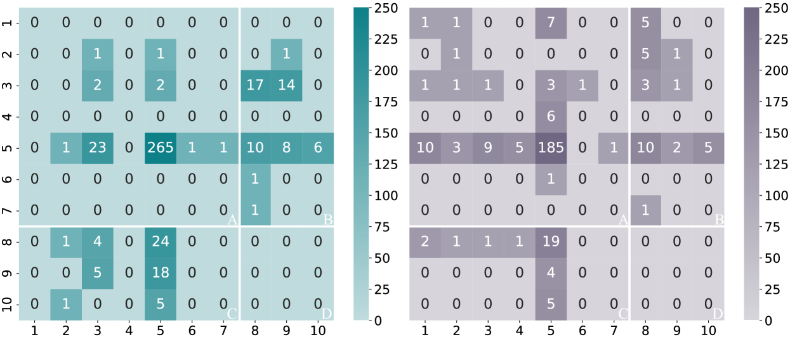
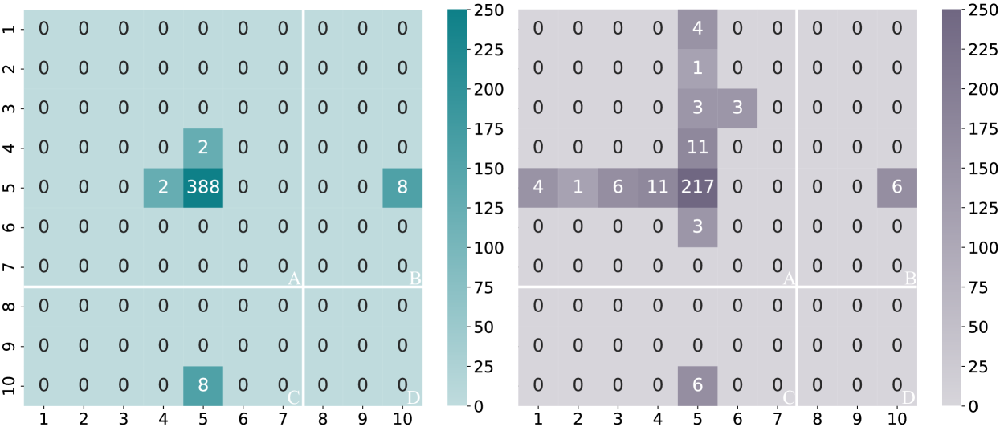

# 借助LLM赋能的代理，模拟课堂教育场景

发布时间：2024年06月27日

`Agent

这篇论文主要介绍了SimClass框架，这是一个结合用户参与的多代理模拟课堂系统。它通过定义关键的课堂角色和设计自动课堂控制机制，利用大型语言模型（LLMs）在多代理协作环境中模拟真实课堂。研究通过用户实验验证了系统的效果，并展示了LLMs如何有效模拟传统课堂互动，提升用户体验。此外，论文还观察到系统中代理间自发形成的协作行为，这些行为旨在通过课堂互动促进学习过程。因此，这篇论文更符合Agent分类，因为它主要关注的是多代理系统的设计和应用，以及这些代理如何在模拟课堂环境中协作。` `虚拟教学`

> Simulating Classroom Education with LLM-Empowered Agents

# 摘要

> 大型语言模型（LLMs）在智能教育领域已广泛应用，但其在多代理协作环境中模拟真实课堂的潜力尚未充分挖掘。本研究推出了SimClass框架，这是一个结合用户参与的多代理模拟课堂系统。我们定义了关键的课堂角色，并创新性地设计了自动课堂控制机制，通过在两门真实课程中进行用户实验来验证其效果。借助Flanders互动分析系统和探究社区理论，我们展示了LLMs如何有效模拟传统课堂互动，并提升用户体验。此外，我们还观察到SimClass中代理间自发形成的协作行为，这些行为旨在通过课堂互动促进学习过程。我们期望这项研究能够引领LLM赋能的多代理系统在虚拟教学中的新应用。

> Large language models (LLMs) have been employed in various intelligent educational tasks to assist teaching. While preliminary explorations have focused on independent LLM-empowered agents for specific educational tasks, the potential for LLMs within a multi-agent collaborative framework to simulate a classroom with real user participation remains unexplored. In this work, we propose SimClass, a multi-agent classroom simulation framework involving user participation. We recognize representative class roles and introduce a novel class control mechanism for automatic classroom teaching, and conduct user experiments in two real-world courses. Utilizing the Flanders Interactive Analysis System and Community of Inquiry theoretical frame works from educational analysis, we demonstrate that LLMs can simulate traditional classroom interaction patterns effectively while enhancing user's experience. We also observe emergent group behaviors among agents in SimClass, where agents collaborate to create enlivening interactions in classrooms to improve user learning process. We hope this work pioneers the application of LLM-empowered multi-agent systems in virtual classroom teaching.

[Arxiv](https://arxiv.org/abs/2406.19226)