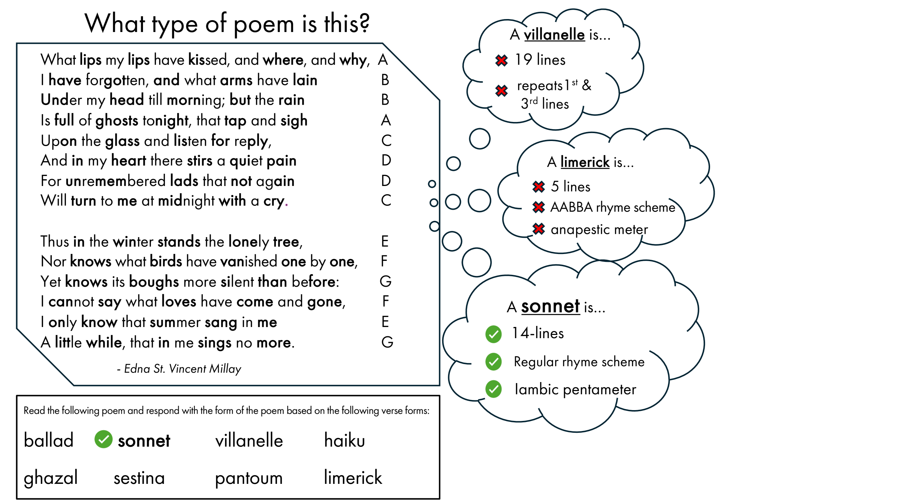
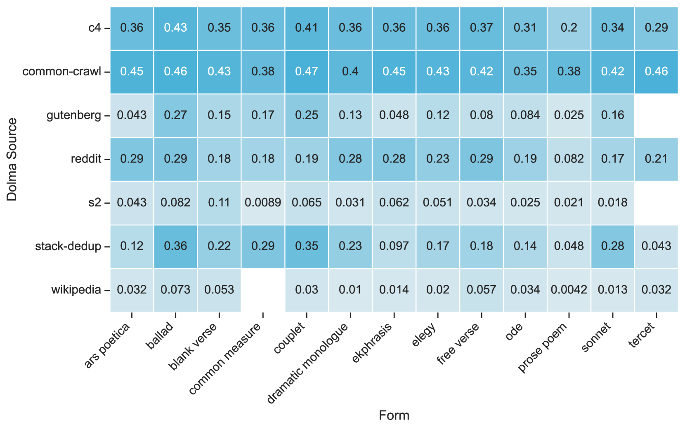
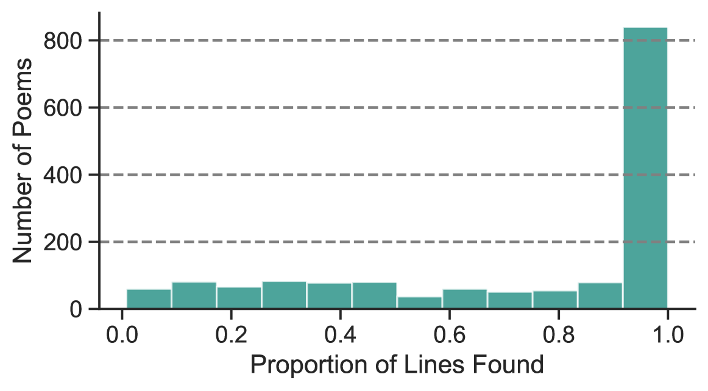

# 《机器人，这是十四行诗吗？——大型模型与数据集的诗歌评鉴》

发布时间：2024年06月27日

`LLM应用

这篇论文主要探讨了大型语言模型（LLMs）在识别和理解英语诗歌形式及其元素方面的能力，包括韵律、格律和重复等特征。通过设计特定的任务来测试LLMs的性能，并探讨了为诗歌等创意任务设定NLP基准的挑战。这一研究不仅关注了LLMs在特定领域的应用能力，还涉及了对预训练数据集中诗歌内容的分析，这对于NLP模型评估、数字人文研究以及文化遗产保护等领域具有重要意义。因此，这篇论文应归类为LLM应用。` `数字人文`

> Sonnet or Not, Bot? Poetry Evaluation for Large Models and Datasets

# 摘要

> 大型语言模型（LLMs）如今能驾驭多种文本风格与体裁，包括诗歌这类高度创意的领域。但它们对诗歌的理解究竟有多深？我们设计了一项任务，旨在测试LLMs识别英语中超过20种诗歌形式及其元素的能力，涵盖韵律、格律及重复等诗歌特征。通过这项任务，我们不仅审视了LLMs在诗歌领域的当前能力，还探讨了为诗歌及其他创意任务设定NLP基准的挑战与误区。特别地，我们借此机会审视了流行预训练数据集中的诗歌内容。这些发现对NLP模型评估研究者、数字人文与文化分析学者以及文化遗产保护者均具有重要意义。

> Large language models (LLMs) can now generate and recognize text in a wide range of styles and genres, including highly specialized, creative genres like poetry. But what do LLMs really know about poetry? What can they know about poetry? We develop a task to evaluate how well LLMs recognize a specific aspect of poetry, poetic form, for more than 20 forms and formal elements in the English language. Poetic form captures many different poetic features, including rhyme scheme, meter, and word or line repetition. We use this task to reflect on LLMs' current poetic capabilities, as well as the challenges and pitfalls of creating NLP benchmarks for poetry and for other creative tasks. In particular, we use this task to audit and reflect on the poems included in popular pretraining datasets. Our findings have implications for NLP researchers interested in model evaluation, digital humanities and cultural analytics scholars, and cultural heritage professionals.

[Arxiv](https://arxiv.org/abs/2406.18906)