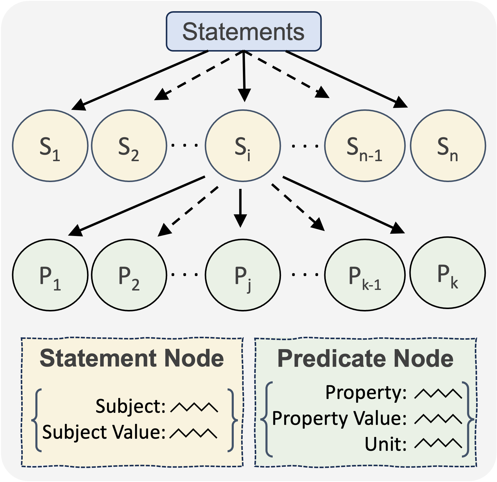
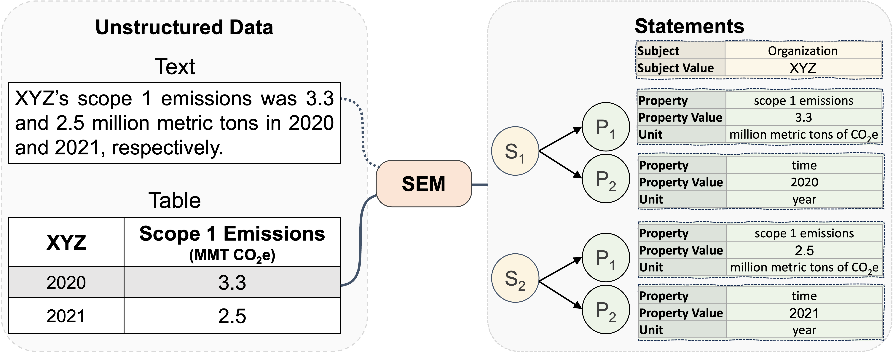
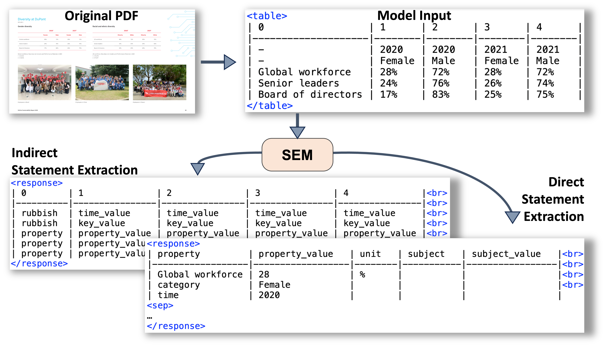
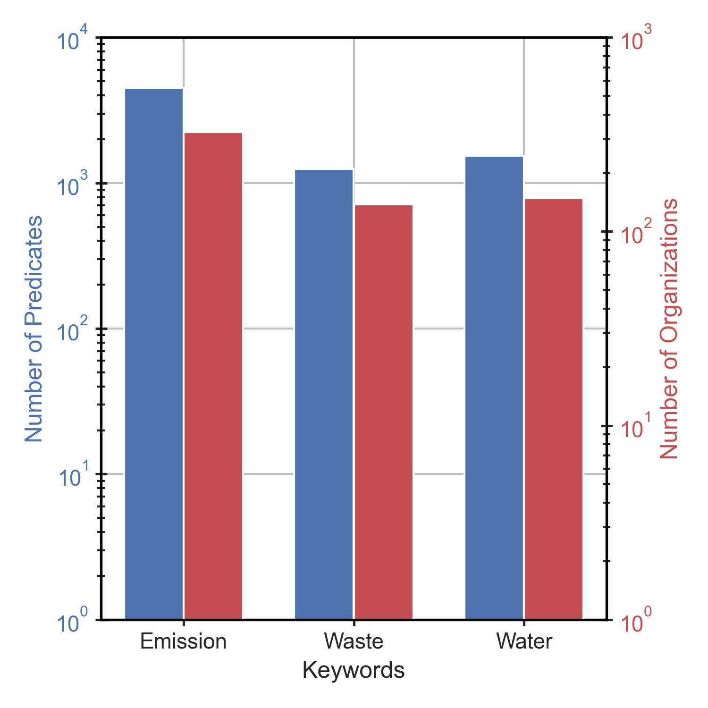
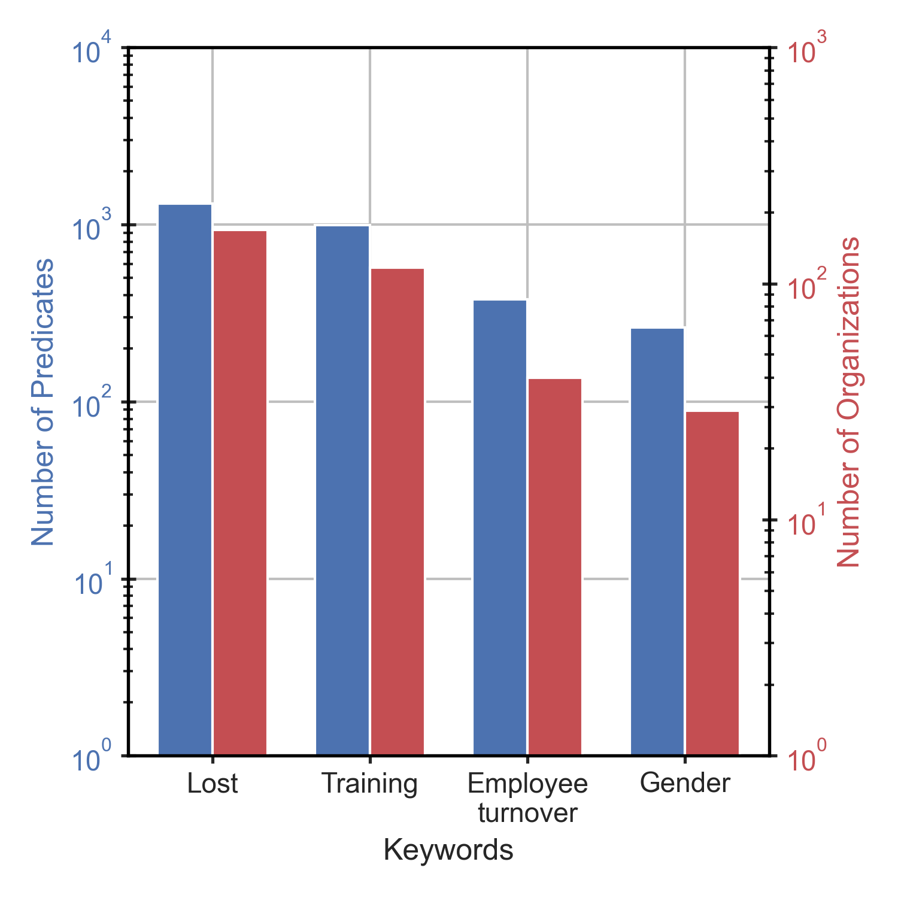
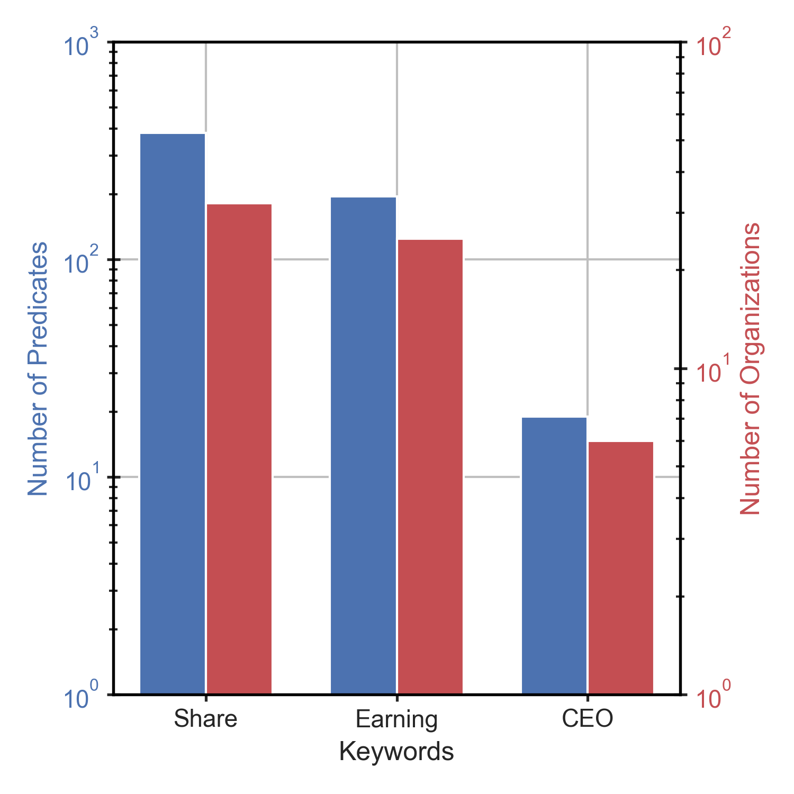
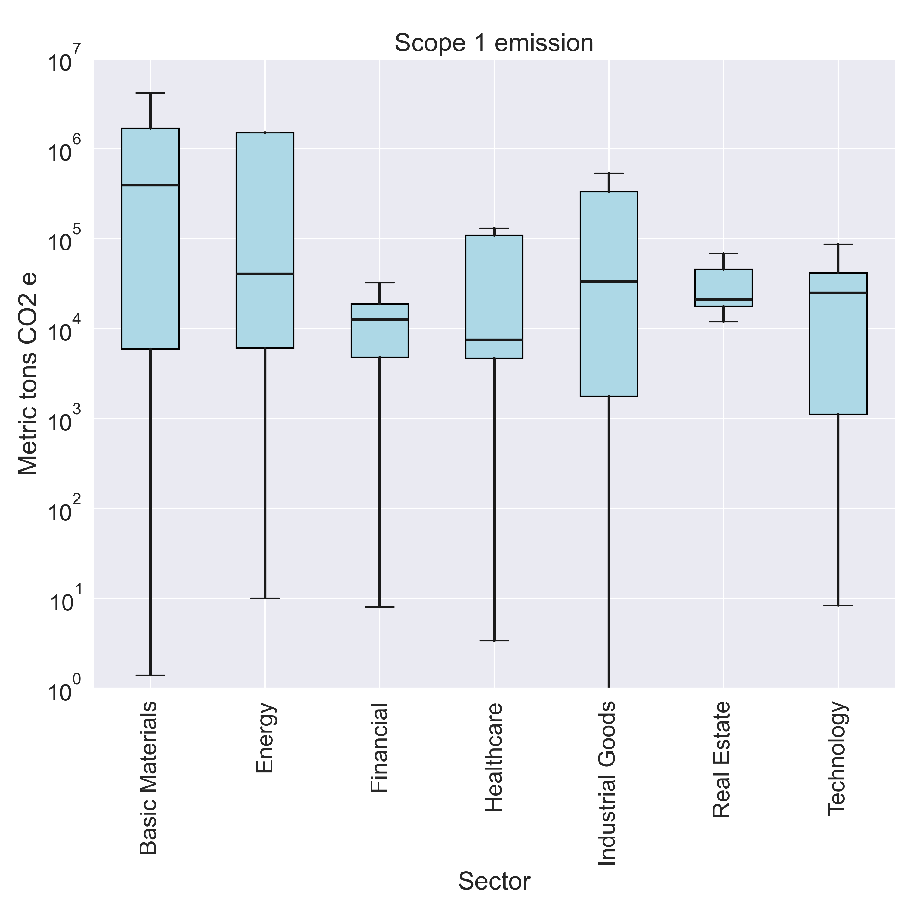
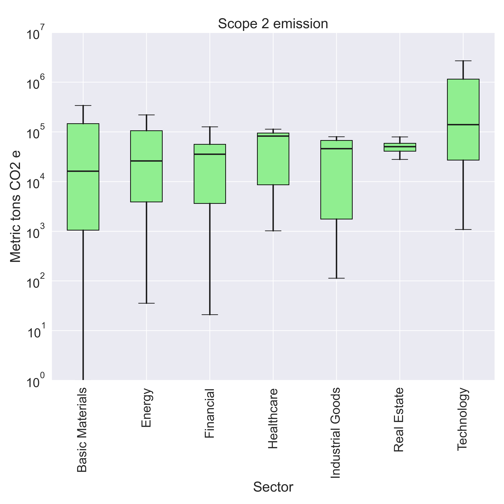
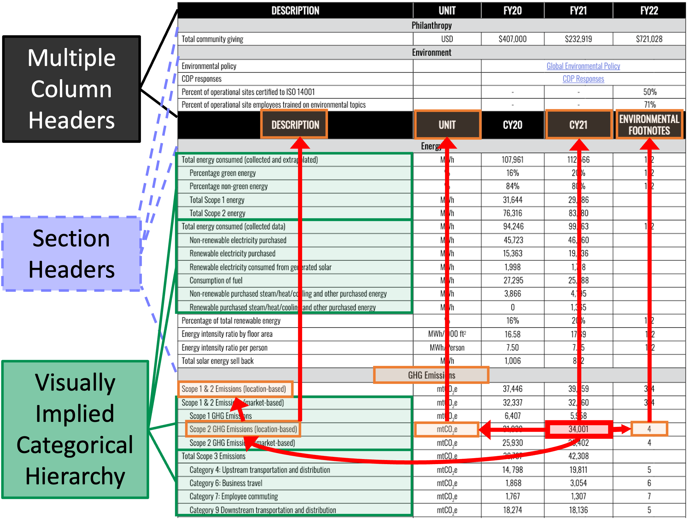

# 声明：借助大型语言模型，我们能从表格中提取通用信息，以支持ESG关键绩效指标的评估。

发布时间：2024年06月27日

`LLM应用

这篇论文主要探讨了如何利用深度学习模型，特别是基于T5的模型，从ESG报告中的表格结构中提取关键的定量信息。这种方法涉及将表格转换为一种称为“陈述”的数据结构，并通过监督学习任务来训练模型以提高信息提取的准确性。论文中提到的SemTabNet数据集和模型性能的提升，以及其在实际ESG报告中的应用，都表明了这项工作在实际应用中的价值和潜力。因此，这项研究更符合LLM应用分类，因为它展示了大型语言模型在特定领域（如ESG报告分析）中的实际应用和效果。` `ESG报告` `数据提取`

> Statements: Universal Information Extraction from Tables with Large Language Models for ESG KPIs

# 摘要

> 环境、社会和治理（ESG）的关键绩效指标（KPIs）评估组织在气候变化、温室气体排放、水资源利用、废物处理、人权、多样性和政策等方面的表现，并通过表格形式在ESG报告中传达这些关键的定量信息。然而，由于表格结构和内容的多样性，提取这些信息颇具挑战。为此，我们创新性地提出了Statements，一种适用于各领域的数据结构，旨在提取定量事实及其相关信息。我们将表格转换为陈述的过程定义为一项新的监督深度学习信息提取任务，并推出了SemTabNet数据集，包含超过10万个标注表格。通过研究一系列基于T5的陈述提取模型，我们发现最佳模型生成的陈述与真实数据的一致性高达82%，远超基线水平的21%。我们通过将该模型应用于2700多份ESG报告中的表格，展示了陈述方法的优势。陈述的统一性使得我们能够对大量ESG报告中的信息进行深入的探索性分析。

> Environment, Social, and Governance (ESG) KPIs assess an organization's performance on issues such as climate change, greenhouse gas emissions, water consumption, waste management, human rights, diversity, and policies. ESG reports convey this valuable quantitative information through tables. Unfortunately, extracting this information is difficult due to high variability in the table structure as well as content. We propose Statements, a novel domain agnostic data structure for extracting quantitative facts and related information. We propose translating tables to statements as a new supervised deep-learning universal information extraction task. We introduce SemTabNet - a dataset of over 100K annotated tables. Investigating a family of T5-based Statement Extraction Models, our best model generates statements which are 82% similar to the ground-truth (compared to baseline of 21%). We demonstrate the advantages of statements by applying our model to over 2700 tables from ESG reports. The homogeneous nature of statements permits exploratory data analysis on expansive information found in large collections of ESG reports.

[Arxiv](https://arxiv.org/abs/2406.19102)