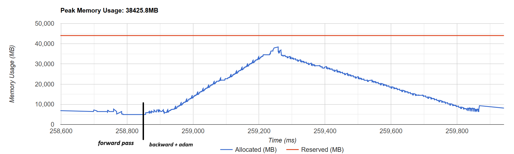
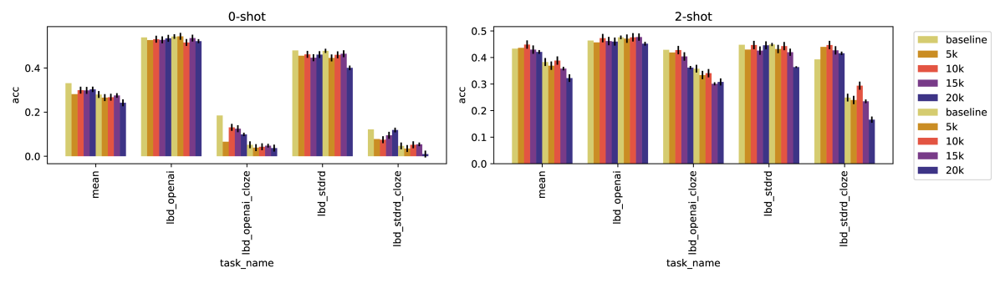

# T-FREE：利用稀疏表示技术，打造无需分词器的生成型大型语言模型，实现内存高效嵌入。

发布时间：2024年06月27日

`LLM理论

理由：这篇论文主要探讨了大型语言模型中的Tokenizers问题，并提出了一种新的方法T-FREE来解决这些问题。这种方法涉及到模型的内部结构和运作机制，特别是嵌入层的优化，这属于对LLM理论层面的深入研究。因此，将其归类为LLM理论。` `机器学习`

> T-FREE: Tokenizer-Free Generative LLMs via Sparse Representations for Memory-Efficient Embeddings

# 摘要

> 在大型语言模型中，Tokenizers 对信息编码至关重要，但近期发展停滞，且存在固有缺陷，如计算负担重、词汇使用效率低、嵌入层和头部层过于庞大。此外，它们的表现受限于参考语料库，对少数语言的支持不足。为此，我们提出了 T-FREE，一种通过字符三元组的稀疏激活直接嵌入单词的方法，无需依赖参考语料库。T-FREE 利用形态相似性，大幅压缩嵌入层，实验中参数减少了 85% 以上，同时保持了竞争性的下游性能。T-FREE 在跨语言迁移学习方面也展现出显著的进步。

> Tokenizers are crucial for encoding information in Large Language Models, but their development has recently stagnated, and they contain inherent weaknesses. Major limitations include computational overhead, ineffective vocabulary use, and unnecessarily large embedding and head layers. Additionally, their performance is biased towards a reference corpus, leading to reduced effectiveness for underrepresented languages.
  To remedy these issues, we propose T-FREE, which directly embeds words through sparse activation patterns over character triplets, and does not require a reference corpus. T-FREE inherently exploits morphological similarities and allows for strong compression of embedding layers. In our exhaustive experimental evaluation, we achieve competitive downstream performance with a parameter reduction of more than 85% on these layers. Further, T-FREE shows significant improvements in cross-lingual transfer learning.

[Arxiv](https://arxiv.org/abs/2406.19223)