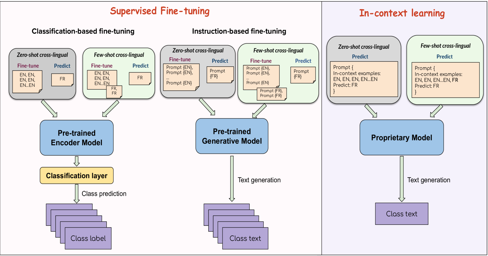
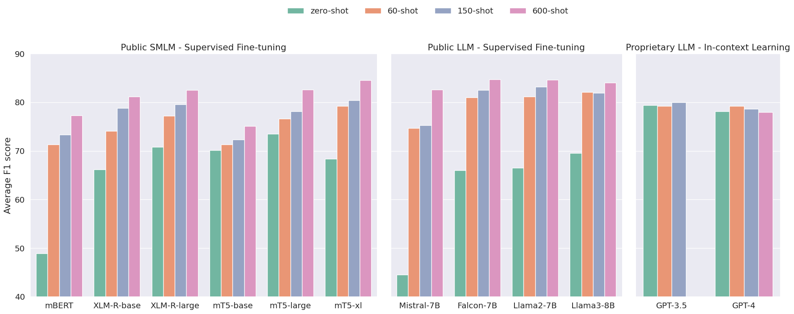

# 大型语言模型时代下的跨语言情感分析：一场模型间的较量研究

发布时间：2024年06月27日

`LLM应用

这篇论文主要探讨了大型语言模型（LLM）在跨语言情感分析中的应用和性能比较。研究通过对比不同规模和类型的模型（如XLM-R、mT5、Llama-3等）在多种语言（英语、西班牙语、法语和中文）的情感分析任务中的表现，分析了它们在零-shot和少-shot设置下的性能差异。这表明了LLM在特定应用场景下的潜力和局限性，属于LLM应用的范畴。` `情感分析`

> The Model Arena for Cross-lingual Sentiment Analysis: A Comparative Study in the Era of Large Language Models

# 摘要

> 情感分析在NLP中扮演着核心角色，而多语言预训练模型如XLM-R和mT5的进步和大型语言模型（LLM）的兴起，更是推动了跨语言情感分析的研究热潮。尽管LLM在通用NLP任务中表现出色，但其在跨语言情感分析上的潜力尚未完全挖掘。本研究通过实证分析，对比了公共小型多语言模型（如XLM-R）与以英语为中心的大型模型（如Llama-3）在英语、西班牙语、法语和中文情感分析中的跨语言表现。结果显示，SMLM在零-shot跨语言性能上优于LLM，而在少-shot设置中，LLM则展现出更强的适应性。此外，专有模型GPT-3.5和GPT-4虽在零-shot跨语言能力上领先，但在少-shot情况下，公共模型表现更佳。

> Sentiment analysis serves as a pivotal component in Natural Language Processing (NLP). Advancements in multilingual pre-trained models such as XLM-R and mT5 have contributed to the increasing interest in cross-lingual sentiment analysis. The recent emergence in Large Language Models (LLM) has significantly advanced general NLP tasks, however, the capability of such LLMs in cross-lingual sentiment analysis has not been fully studied. This work undertakes an empirical analysis to compare the cross-lingual transfer capability of public Small Multilingual Language Models (SMLM) like XLM-R, against English-centric LLMs such as Llama-3, in the context of sentiment analysis across English, Spanish, French and Chinese. Our findings reveal that among public models, SMLMs exhibit superior zero-shot cross-lingual performance relative to LLMs. However, in few-shot cross-lingual settings, public LLMs demonstrate an enhanced adaptive potential. In addition, we observe that proprietary GPT-3.5 and GPT-4 lead in zero-shot cross-lingual capability, but are outpaced by public models in few-shot scenarios.

[Arxiv](https://arxiv.org/abs/2406.19358)