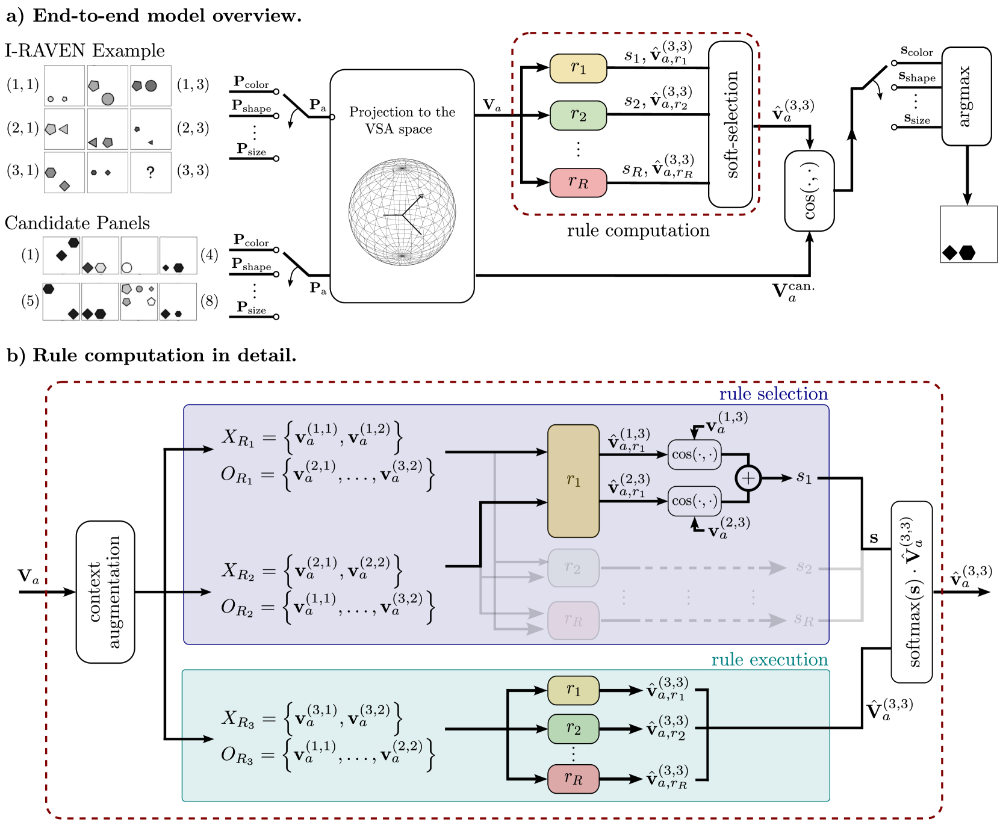
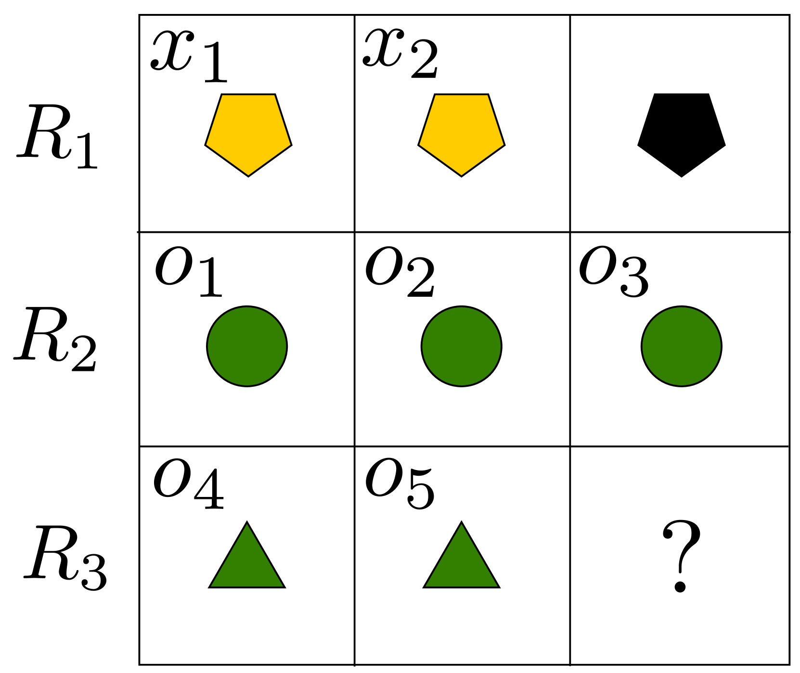
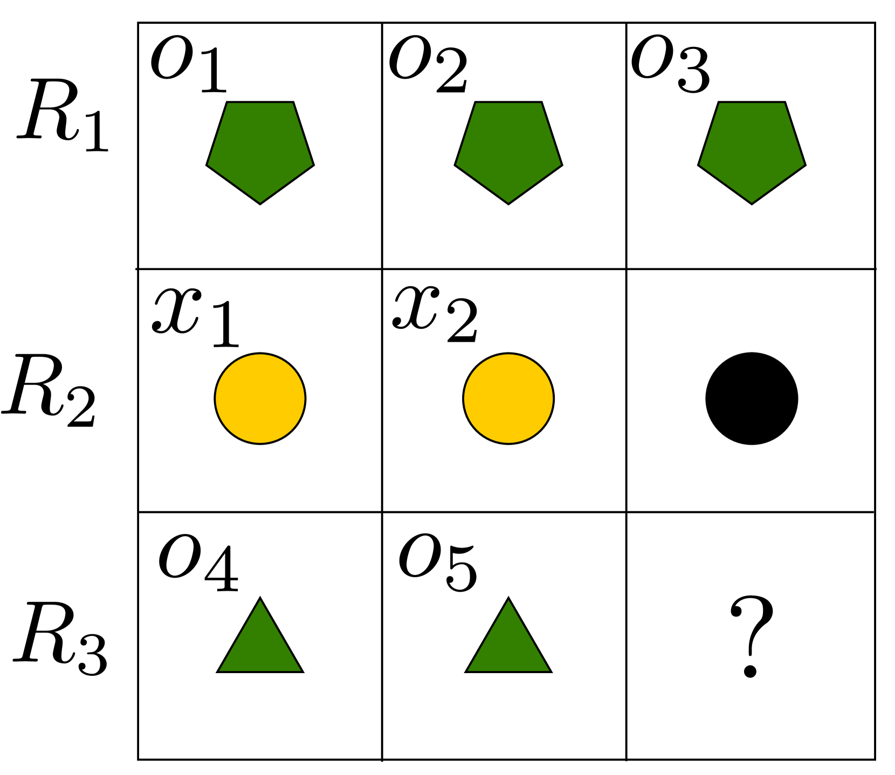
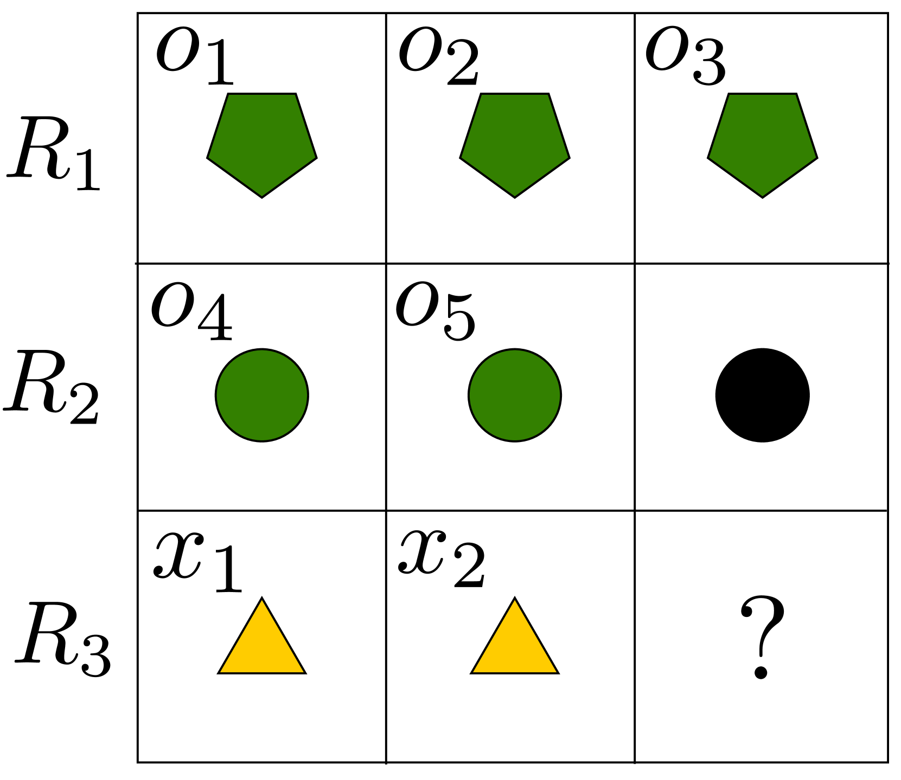

# 利用VSA分布式表示探索溯因推理的学习方法

发布时间：2024年06月27日

`Agent

理由：这篇论文介绍了一个名为上下文感知归纳规则学习器（ARLC）的模型，它专门用于解决抽象推理任务，如Raven渐进矩阵（RPM）问题。ARLC不仅融入了编程领域知识，还能学习数据分布背后的规则，并在多个测试中展示了高准确性和鲁棒性。这个模型可以被视为一个智能代理（Agent），因为它能够执行复杂的推理任务，并在不同的环境和数据分布中进行学习和适应。此外，ARLC的特性，如避免灾难性遗忘和无缝迁移学习能力，进一步支持了它作为一个智能代理的分类。` `人工智能`

> Towards Learning Abductive Reasoning using VSA Distributed Representations

# 摘要

> 我们推出了上下文感知归纳规则学习器（ARLC），这是一种基于Learn-VRF的模型，专门用于解决抽象推理任务。ARLC采用了一种新颖且广泛适用的归纳推理训练目标，显著提升了Raven渐进矩阵（RPM）问题的解决准确性和可解释性。该模型不仅融入了编程领域知识，还能学习数据分布背后的规则。在I-RAVEN数据集上的测试表明，ARLC在分布内外的测试中均达到了业界领先的准确性，超越了参数数量级更大的神经符号和连接主义模型，包括大型语言模型。此外，ARLC通过在编程知识基础上逐步学习示例，展现了强大的编程后训练鲁棒性，不仅提升了性能，还避免了灾难性遗忘。我们还验证了ARLC从2x2 RPM星座到未见星座的无缝迁移学习能力。相关代码已公开在https://github.com/IBM/abductive-rule-learner-with-context-awareness。

> We introduce the Abductive Rule Learner with Context-awareness (ARLC), a model that solves abstract reasoning tasks based on Learn-VRF. ARLC features a novel and more broadly applicable training objective for abductive reasoning, resulting in better interpretability and higher accuracy when solving Raven's progressive matrices (RPM). ARLC allows both programming domain knowledge and learning the rules underlying a data distribution. We evaluate ARLC on the I-RAVEN dataset, showcasing state-of-the-art accuracy across both in-distribution and out-of-distribution (unseen attribute-rule pairs) tests. ARLC surpasses neuro-symbolic and connectionist baselines, including large language models, despite having orders of magnitude fewer parameters. We show ARLC's robustness to post-programming training by incrementally learning from examples on top of programmed knowledge, which only improves its performance and does not result in catastrophic forgetting of the programmed solution. We validate ARLC's seamless transfer learning from a 2x2 RPM constellation to unseen constellations. Our code is available at https://github.com/IBM/abductive-rule-learner-with-context-awareness.

[Arxiv](https://arxiv.org/abs/2406.19121)