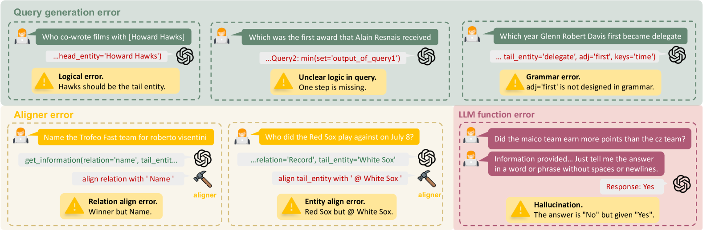

# TrustUQA：构建可信赖的统一结构化数据问答框架

发布时间：2024年06月27日

`LLM应用

这篇论文摘要描述了一个名为UnifiedTQA的框架，它旨在通过使用大型语言模型（LLMs）来改进自然语言问答（QA）在结构化数据源上的应用。该框架通过采用一种名为Condition Graph（CG）的统一知识表示，并结合LLM和演示的二级查询方法，以及动态演示检索功能，来提高处理多种结构化数据的能力和可信度。论文中提到的实验结果表明，UnifiedTQA在多个基准测试中超越了现有方法，并展示了其在更广泛的QA任务中的应用潜力。因此，这篇论文属于LLM应用类别，因为它专注于使用LLMs来解决实际的QA问题，并提出了一个具体的应用框架。` `问答系统` `数据处理`

> TrustUQA: A Trustful Framework for Unified Structured Data Question Answering

# 摘要

> 自然语言问答（QA）在表格和知识图谱等结构化数据源上的研究已广泛展开，主要通过大型语言模型（LLMs）实现。现有方法包括问题解析成正式查询和基于检索的答案生成，但前者泛化能力不足，难以同时处理多源数据，后者则可信度有限。为此，我们提出了UnifiedTQA，一个可信的QA框架，能统一处理多种结构化数据。该框架采用Condition Graph（CG）这一LLM友好的统一知识表示，并结合LLM和演示的二级查询方法。此外，它还具备动态演示检索功能，以增强性能。我们在5个涵盖3种结构化数据的基准上测试了UnifiedTQA，结果显示它超越了两种现有方法，并在与特定数据类型的基线对比中，在两个基准上达到了最先进水平。此外，我们还展示了UnifiedTQA在更广泛的QA任务，如混合结构化数据和跨结构化数据QA中的应用潜力。

> Natural language question answering (QA) over structured data sources such as tables and knowledge graphs (KGs) have been widely investigated, for example with Large Language Models (LLMs). The main solutions include question to formal query parsing and retrieval-based answer generation. However, current methods of the former often suffer from weak generalization, failing to dealing with multiple sources simultaneously, while the later is limited in trustfulness. In this paper, we propose UnifiedTQA, a trustful QA framework that can simultaneously support multiple types of structured data in a unified way. To this end, it adopts an LLM-friendly and unified knowledge representation method called Condition Graph (CG), and uses an LLM and demonstration-based two-level method for CG querying. For enhancement, it is also equipped with dynamic demonstration retrieval. We have evaluated UnifiedTQA with 5 benchmarks covering 3 types of structured data. It outperforms 2 existing unified structured data QA methods and in comparison with the baselines that are specific to a data type, it achieves state-of-the-art on 2 of them. Further more, we demonstrates potential of our method for more general QA tasks, QA over mixed structured data and QA across structured data.

[Arxiv](https://arxiv.org/abs/2406.18916)