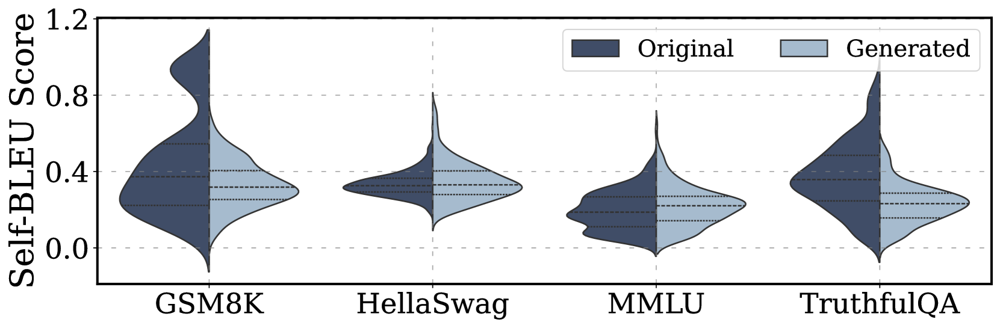

# UniGen：大型语言模型驱动下的文本数据集生成统一框架

发布时间：2024年06月27日

`LLM应用

这篇论文介绍了一个名为UniGen的框架，该框架由大型语言模型（LLMs）驱动，旨在生成多样、准确且高度可控的文本数据集。UniGen的设计目标是解决现有生成框架在泛化、可控性、多样性和真实性方面的挑战。它通过创新的机制，如属性引导的生成模块和组检查功能，以及基于代码的数学评估和检索增强的生成技术，来优化数据生成过程。此外，用户可以通过指定约束来定制数据生成过程。实验结果表明，UniGen生成的数据质量高，且在多个领域提升了LLM的性能。因此，这篇论文属于LLM应用分类，因为它专注于开发和应用LLM技术来解决实际问题。` `数据增强` `人工智能`

> UniGen: A Unified Framework for Textual Dataset Generation Using Large Language Models

# 摘要

> GPT-4和Llama3等大型语言模型（LLMs）通过高质量的合成数据生成，显著减少了对昂贵人工数据集的依赖，从而在多个领域产生了深远影响。然而，现有生成框架在泛化、可控、多样性和真实性方面仍存在挑战。为此，我们提出了UniGen，一个由LLM驱动的全面框架，旨在生成多样、准确且高度可控的数据集。UniGen灵活支持各类文本数据集，并通过创新机制优化生成过程。它通过属性引导的生成模块和组检查功能增强数据多样性，利用基于代码的数学评估和检索增强的生成技术确保数据准确性。用户还可通过指定约束来定制数据生成过程。实验证明，UniGen生成的数据质量卓越，各模块均发挥关键作用。在LLMs基准测试和数据增强的实际应用中，UniGen展现了其支持动态基准测试的能力，并在多个领域，包括代理导向能力和推理技能，提升了LLM的性能。

> Large Language Models (LLMs) such as GPT-4 and Llama3 have significantly impacted various fields by enabling high-quality synthetic data generation and reducing dependence on expensive human-generated datasets. Despite this, challenges remain in the areas of generalization, controllability, diversity, and truthfulness within the existing generative frameworks. To address these challenges, this paper presents UniGen, a comprehensive LLM-powered framework designed to produce diverse, accurate, and highly controllable datasets. UniGen is adaptable, supporting all types of text datasets and enhancing the generative process through innovative mechanisms. To augment data diversity, UniGen incorporates an attribute-guided generation module and a group checking feature. For accuracy, it employs a code-based mathematical assessment for label verification alongside a retrieval-augmented generation technique for factual validation. The framework also allows for user-specified constraints, enabling customization of the data generation process to suit particular requirements. Extensive experiments demonstrate the superior quality of data generated by UniGen, and each module within UniGen plays a critical role in this enhancement. Additionally, UniGen is applied in two practical scenarios: benchmarking LLMs and data augmentation. The results indicate that UniGen effectively supports dynamic and evolving benchmarking, and that data augmentation improves LLM capabilities in various domains, including agent-oriented abilities and reasoning skills.

[Arxiv](https://arxiv.org/abs/2406.18966)