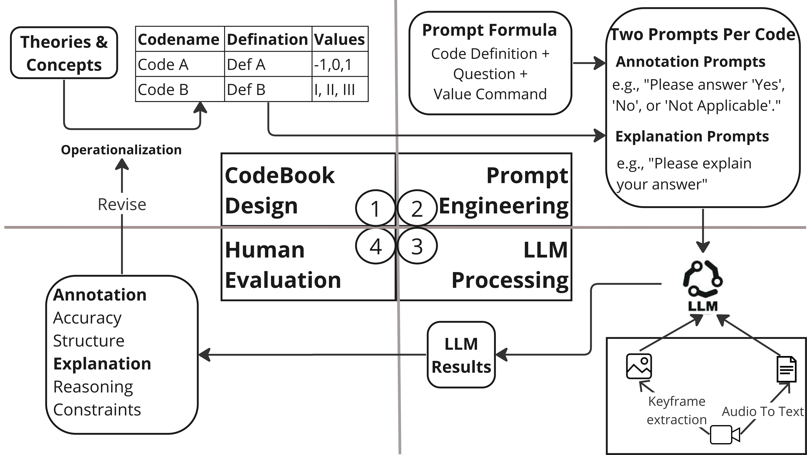

# 借助大型语言模型，我们探索了抑郁症短视频的内容分析，旨在深入研究这一辅助手段的潜力。

发布时间：2024年06月27日

`LLM应用` `视频分析` `心理健康`

> Using Large Language Models to Assist Video Content Analysis: An Exploratory Study of Short Videos on Depression

# 摘要

> 尽管 LLMs 在内容分析领域的应用日益受到关注，但现有研究大多聚焦于文本内容。本研究通过一项新颖的 LLM 辅助多模态内容分析案例，探索了其在视频分析中的潜力。该流程涉及代码本设计、提示工程、LLM 处理及人工评估等环节。我们精心设计注释与解释提示，以结构化形式获取 LLM 注释，并生成解释以增强 LLM 推理的透明度。通过分析 25 个抑郁症主题的 YouTube 短视频中的 203 个关键帧，我们对比了 LLM 与人工编码员的注释准确性，发现 LLM 在对象和活动识别上表现更优，但在情感和类型识别上稍逊一筹。此外，我们揭示了 LLM 在视频注释中的潜力与局限。基于此，我们探讨了未来研究的方向与挑战，并就 LLM 辅助视频分析引发的伦理问题进行了讨论。

> Despite the growing interest in leveraging Large Language Models (LLMs) for content analysis, current studies have primarily focused on text-based content. In the present work, we explored the potential of LLMs in assisting video content analysis by conducting a case study that followed a new workflow of LLM-assisted multimodal content analysis. The workflow encompasses codebook design, prompt engineering, LLM processing, and human evaluation. We strategically crafted annotation prompts to get LLM Annotations in structured form and explanation prompts to generate LLM Explanations for a better understanding of LLM reasoning and transparency. To test LLM's video annotation capabilities, we analyzed 203 keyframes extracted from 25 YouTube short videos about depression. We compared the LLM Annotations with those of two human coders and found that LLM has higher accuracy in object and activity Annotations than emotion and genre Annotations. Moreover, we identified the potential and limitations of LLM's capabilities in annotating videos. Based on the findings, we explore opportunities and challenges for future research and improvements to the workflow. We also discuss ethical concerns surrounding future studies based on LLM-assisted video analysis.

[Arxiv](https://arxiv.org/abs/2406.19528)