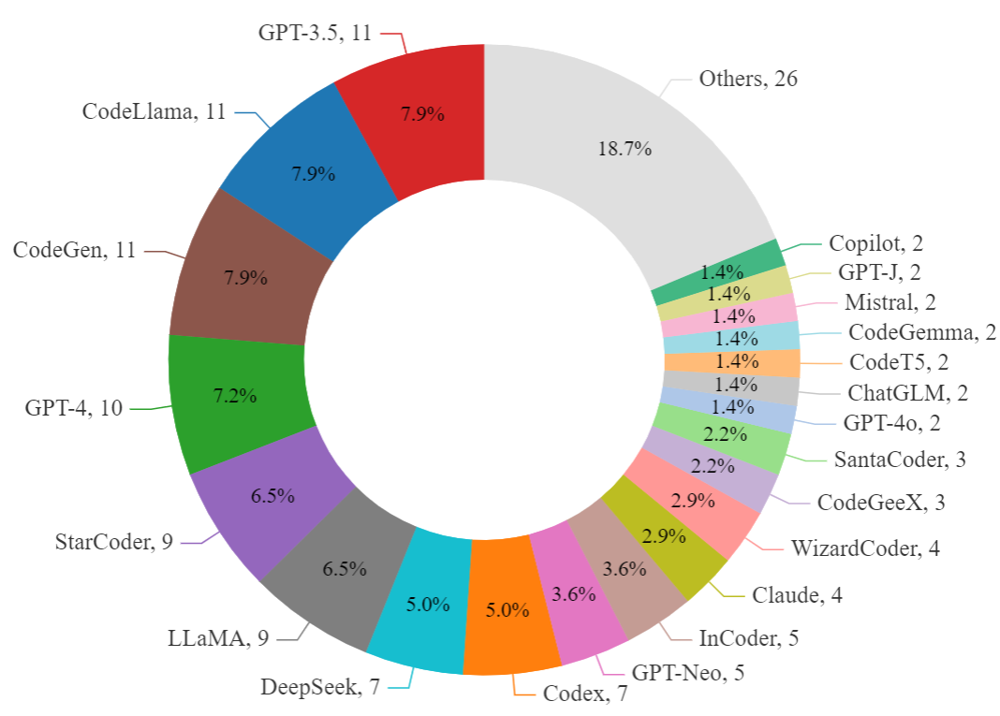
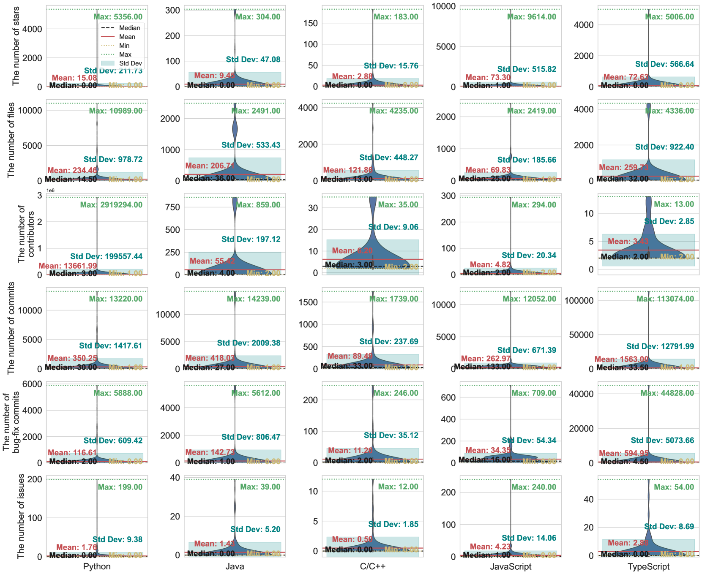
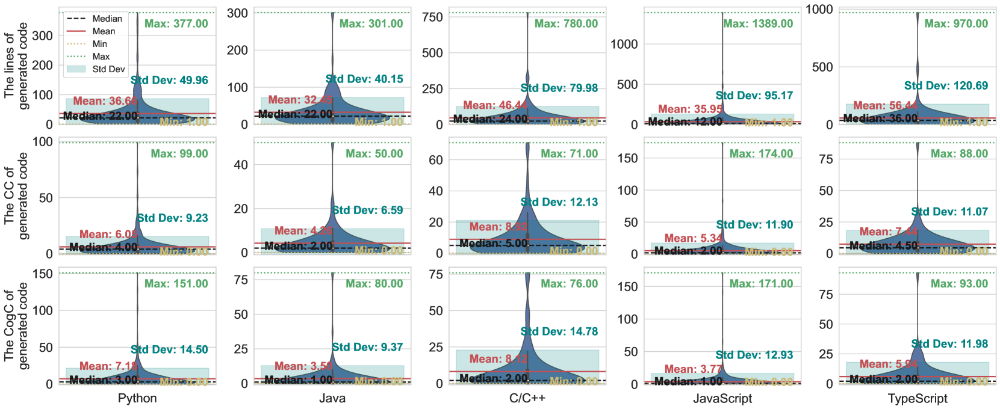
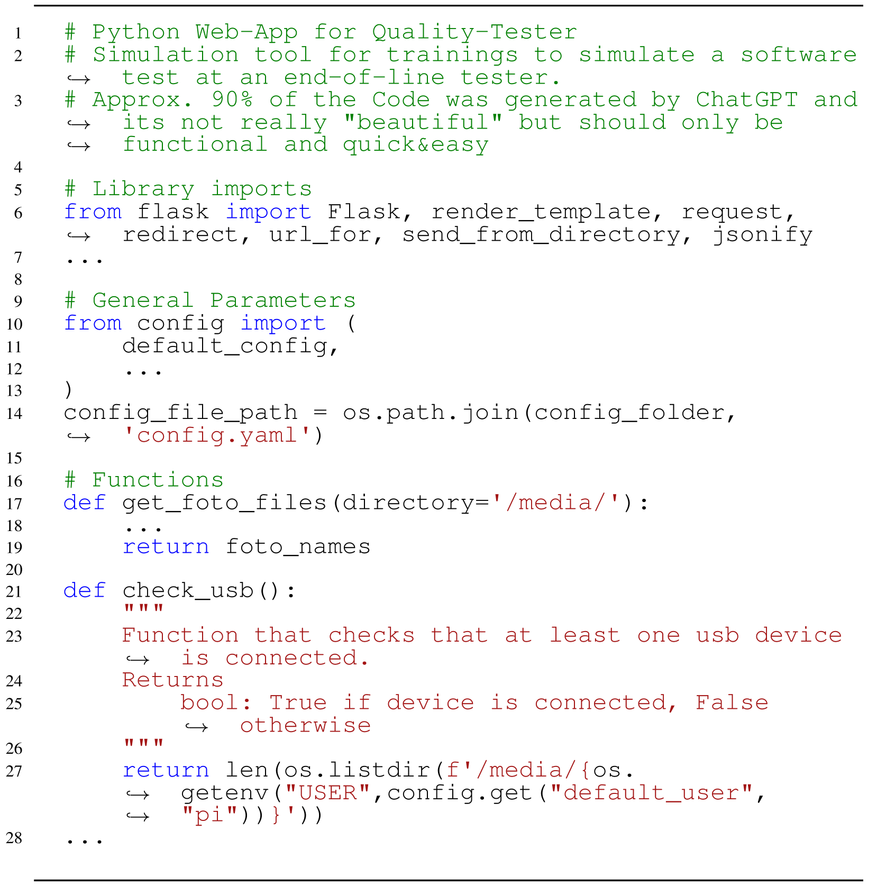
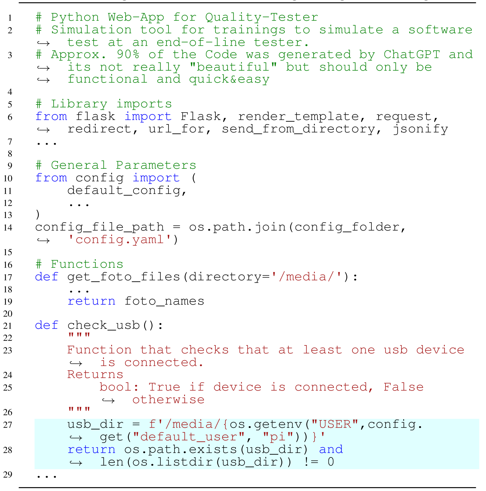
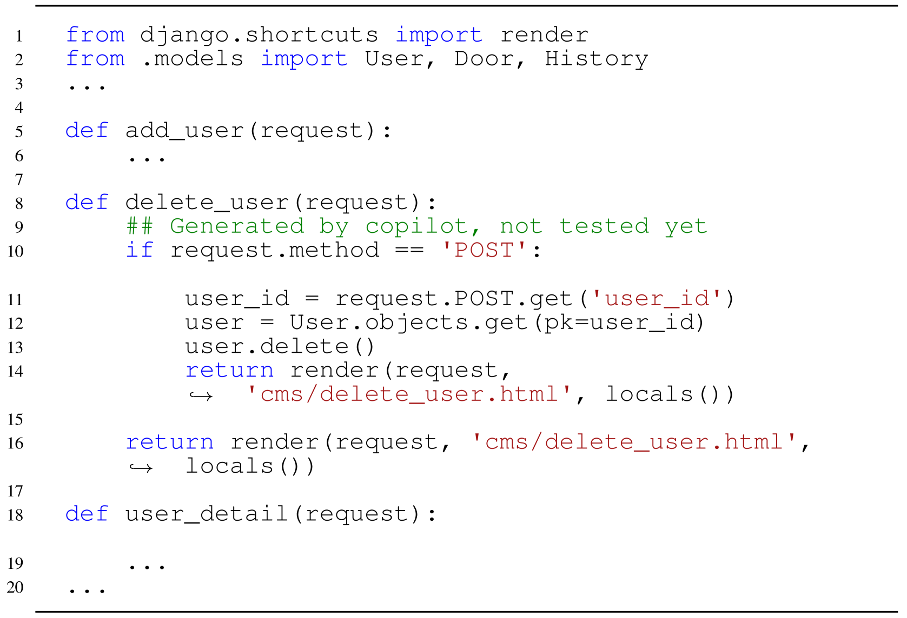
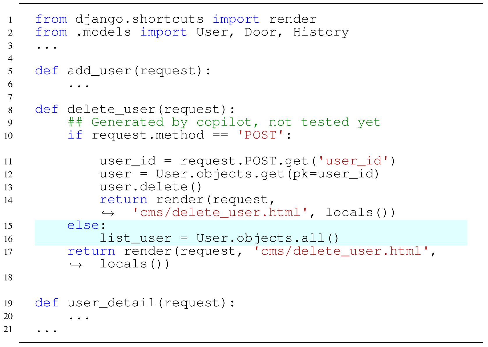
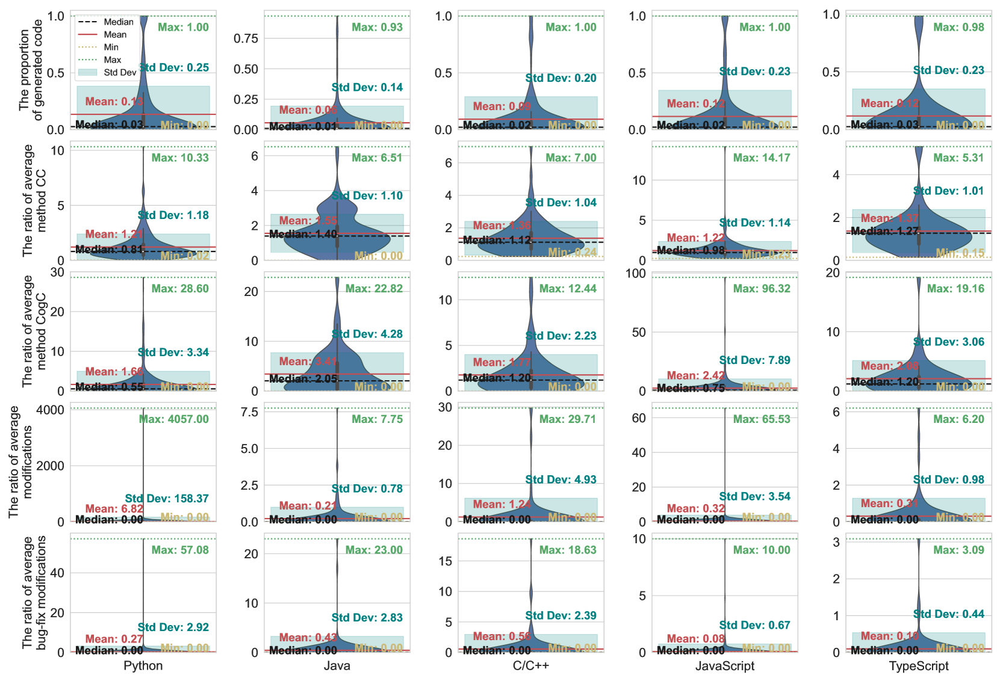

# GitHub 上的大型语言模型，它们在代码生成方面表现如何？

发布时间：2024年06月27日

`LLM应用` `软件开发` `人工智能`

> Where Are Large Language Models for Code Generation on GitHub?

# 摘要

> 随着大型语言模型（LLMs）在软件开发中的应用日益广泛，研究人员对其生成代码的质量给予了高度关注。然而，现有研究多聚焦于HumanEval等受控数据集，未能全面反映开发者实际使用LLMs代码生成能力的真实情况，也未能深入剖析LLM生成代码在实际开发中的特性。为此，我们深入研究了LLM生成代码及其在GitHub上的项目特性，并揭示了以下关键发现：（1）ChatGPT和Copilot在GitHub上生成代码的使用频率最高，而其他LLMs生成的代码则寥寥无几。（2）包含ChatGPT/Copilot代码的项目多为小型且知名度不高，通常由个人或小团队主导，但多数项目持续进化与完善。（3）ChatGPT/Copilot主要用于生成Python、Java和TypeScript等数据处理脚本，以及C/C++和JavaScript中的算法与用户界面代码，且生成的代码片段大多简短、复杂度较低。（4）相较于人工编写的代码，ChatGPT/Copilot生成的代码在项目中占比小，修改次数也较少，因错误而修改的比例仅在3%至8%之间。（5）关于ChatGPT/Copilot生成代码的评论大多简略，仅提及代码来源，未涉及具体提示、人工修改或测试情况。基于这些发现，我们进一步探讨了其对研究与实践的深远影响。

> The increasing use of Large Language Models (LLMs) in software development has garnered significant attention from researchers assessing the quality of the code they generate. However, much of the research focuses on controlled datasets such as HumanEval, which fail to adequately represent how developers actually utilize LLMs' code generation capabilities or clarify the characteristics of LLM-generated code in real-world development scenarios. To bridge this gap, our study investigates the characteristics of LLM-generated code and its corresponding projects hosted on GitHub. Our findings reveal several key insights: (1) ChatGPT and Copilot are the most frequently utilized for generating code on GitHub. In contrast, there is very little code generated by other LLMs on GitHub. (2) Projects containing ChatGPT/Copilot-generated code are often small and less known, led by individuals or small teams. Despite this, most projects are continuously evolving and improving. (3) ChatGPT/Copilot is mainly utilized for generating Python, Java, and TypeScript scripts for data processing and transformation. C/C++ and JavaScript code generation focuses on algorithm and data structure implementation and user interface code. Most ChatGPT/Copilot-generated code snippets are relatively short and exhibit low complexity. (4) Compared to human-written code, ChatGPT/Copilot-generated code exists in a small proportion of projects and generally undergoes fewer modifications. Additionally, modifications due to bugs are even fewer, ranging from just 3% to 8% across different languages. (5) Most comments on ChatGPT/Copilot-generated code lack detailed information, often only stating the code's origin without mentioning prompts, human modifications, or testing status. Based on these findings, we discuss the implications for researchers and practitioners.

[Arxiv](https://arxiv.org/abs/2406.19544)