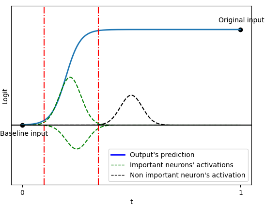
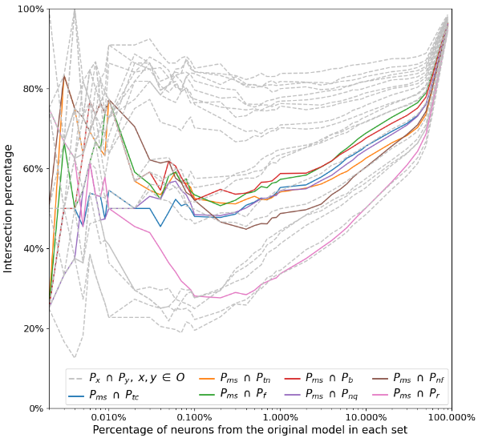
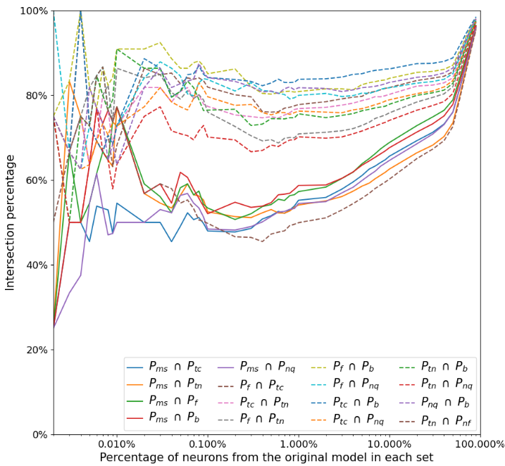
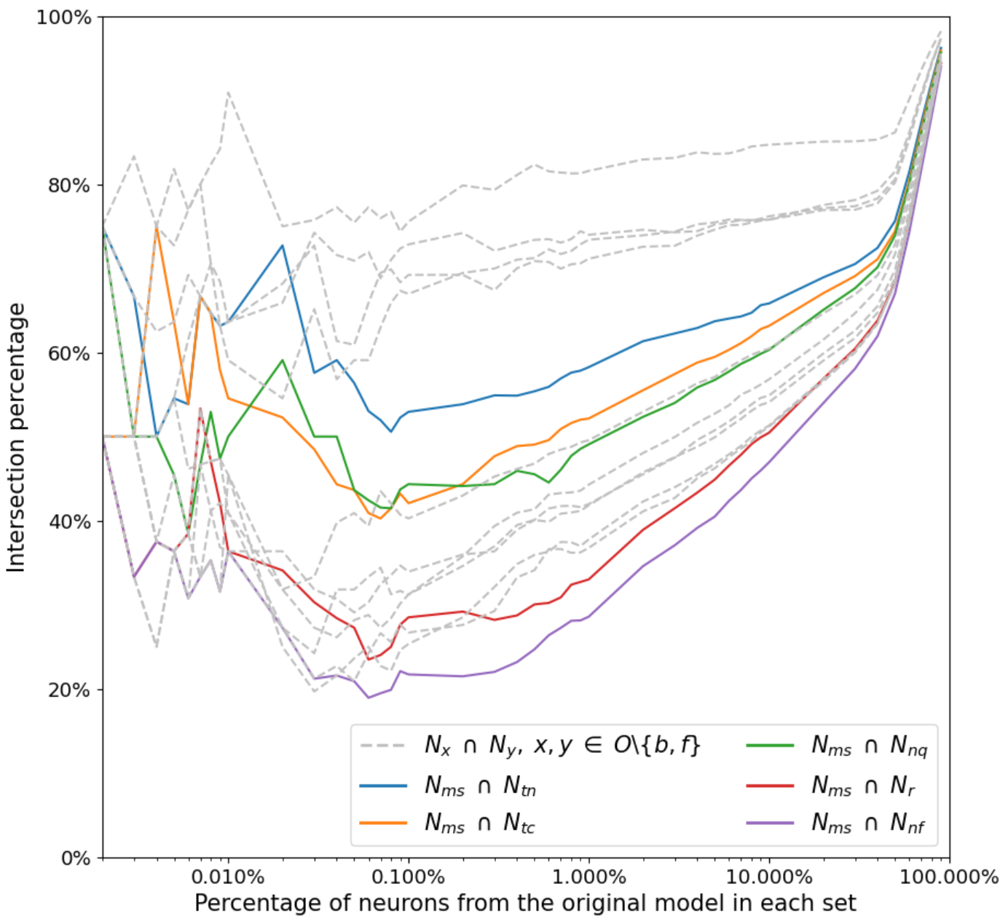
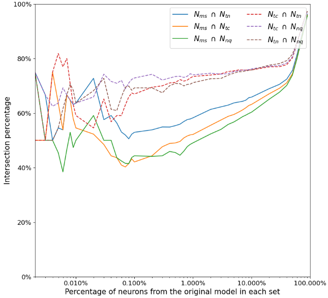
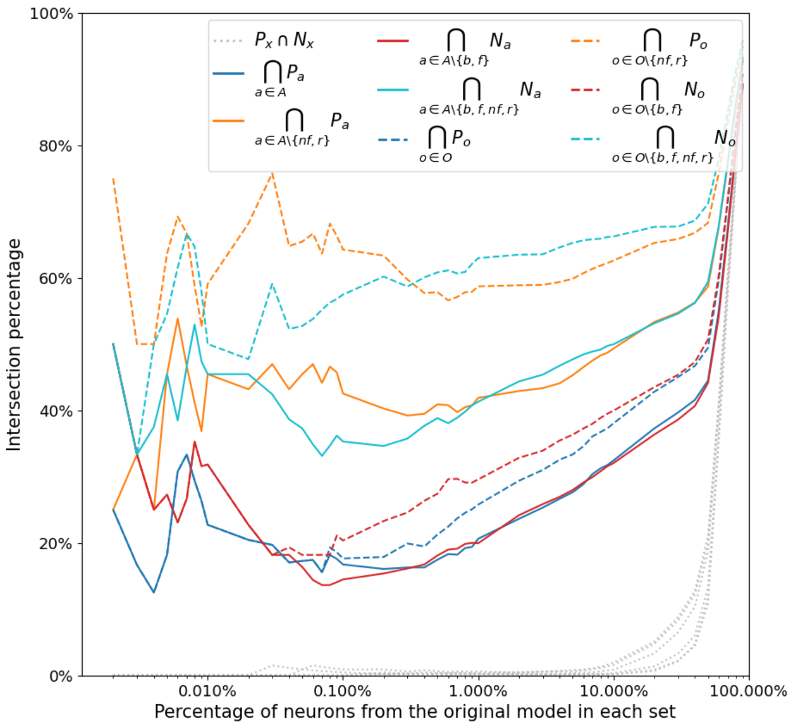
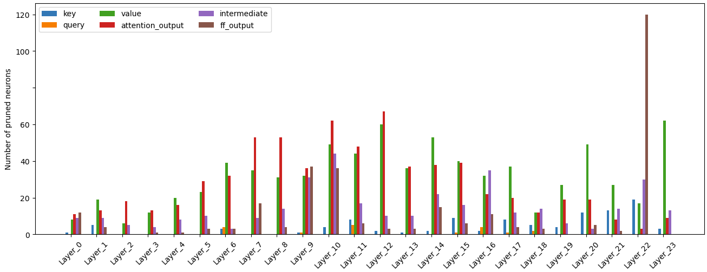

# 探究信息检索中的关键神经元：采用集成梯度方法解析交叉编码器的奥秘

发布时间：2024年06月27日

`RAG

这篇论文主要关注检索增强生成（RAG）技术中的信息检索（IR）模型，特别是探讨了神经元在IR模型中的作用，并通过剪枝实验来验证这些发现。因此，它属于RAG分类，因为它专注于RAG框架内的信息检索机制的研究和理解。` `信息检索` `机器学习`

> Which Neurons Matter in IR? Applying Integrated Gradients-based Methods to Understand Cross-Encoders

# 摘要

> 随着检索增强生成（RAG）的引入，信息检索（IR）的重要性与日俱增。然而，对于IR模型的内部运作机制，我们的理解仍显不足。本文中，我们尝试采用基于集成梯度的方法，在IR领域中揭示单个神经元的作用，特别是那些我们称之为“相关性”神经元的角色，以及它们如何应对未知数据。最后，我们通过详尽的剪枝实验来验证这些发现。

> With the recent addition of Retrieval-Augmented Generation (RAG), the scope and importance of Information Retrieval (IR) has expanded. As a result, the importance of a deeper understanding of IR models also increases. However, interpretability in IR remains under-explored, especially when it comes to the models' inner mechanisms. In this paper, we explore the possibility of adapting Integrated Gradient-based methods in an IR context to identify the role of individual neurons within the model. In particular, we provide new insights into the role of what we call "relevance" neurons, as well as how they deal with unseen data. Finally, we carry out an in-depth pruning study to validate our findings.

[Arxiv](https://arxiv.org/abs/2406.19309)