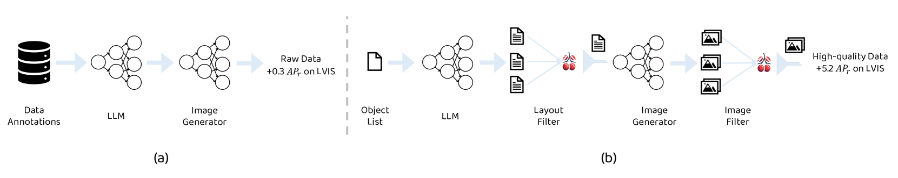
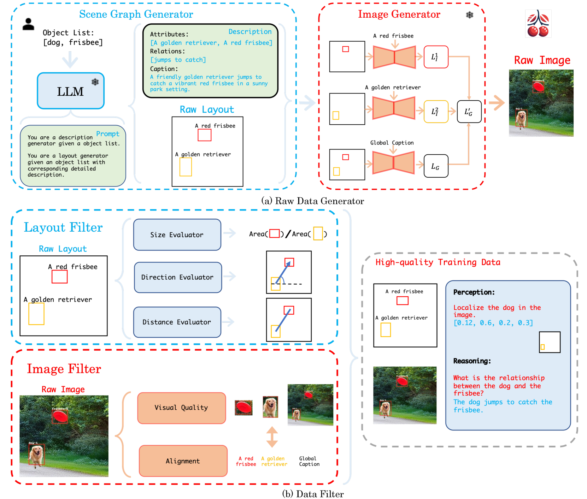

# 自动精选者：借助语言驱动的高质量生成数据进行学习

发布时间：2024年06月28日

`LLM应用` `视觉感知` `多模态语言模型`

> Auto Cherry-Picker: Learning from High-quality Generative Data Driven by Language

# 摘要

> 基于扩散的模型在生成多样化高质量图像方面潜力巨大，有助于下游感知任务。然而，完全自动的布局生成及多实例评估指标尚待深入探索。为此，我们推出Auto Cherry-Picker（ACP）框架，旨在通过自然语言概念列表驱动LLM，生成详尽描述与合理布局，进而利用文本到图像模型产出多幅图像，并借助精心设计的复合布局和图像分数（CLIS）指标优化生成质量。实验证实，ACP能显著提升模型性能，尤其在应对长尾分布与数据不平衡挑战时表现突出。此外，CLIS与性能提升间的正相关性揭示了其在视觉感知与多模态语言模型任务中的评估潜力。相关代码即将开放。

> Diffusion-based models have shown great potential in generating high-quality images with various layouts, which can benefit downstream perception tasks. However, a fully automatic layout generation driven only by language and a suitable metric for measuring multiple generated instances has not been well explored. In this work, we present Auto Cherry-Picker (ACP), a novel framework that generates high-quality multi-modal training examples to augment perception and multi-modal training. Starting with a simple list of natural language concepts, we prompt large language models (LLMs) to generate a detailed description and design reasonable layouts. Next, we use an off-the-shelf text-to-image model to generate multiple images. Then, the generated data are refined using a comprehensively designed metric to ensure quality. In particular, we present a new metric, Composite Layout and Image Score (CLIS), to evaluate the generated images fairly. Our synthetic high-quality examples boost performance in various scenarios by customizing the initial concept list, especially in addressing challenges associated with long-tailed distribution and imbalanced datasets. Experiment results on downstream tasks demonstrate that Auto Cherry-Picker can significantly improve the performance of existing models. In addition, we have thoroughly investigated the correlation between CLIS and performance gains in downstream tasks, and we find that a better CLIS score results in better performance. This finding shows the potential for evaluation metrics as the role for various visual perception and MLLM tasks. Code will be available.

[Arxiv](https://arxiv.org/abs/2406.20085)