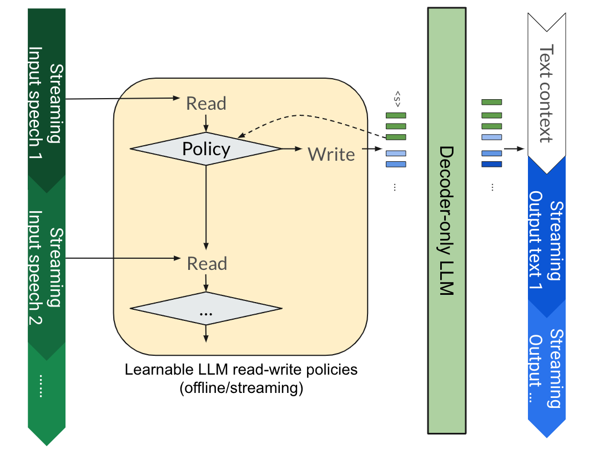
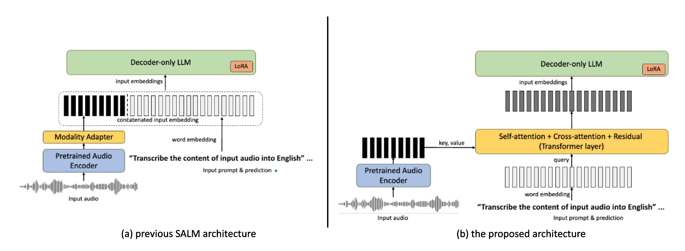
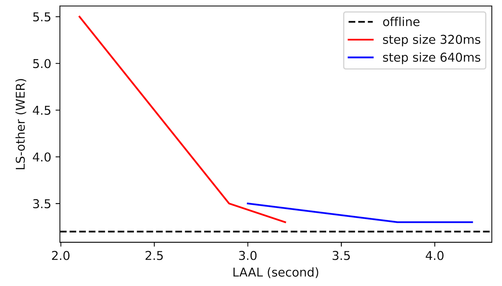
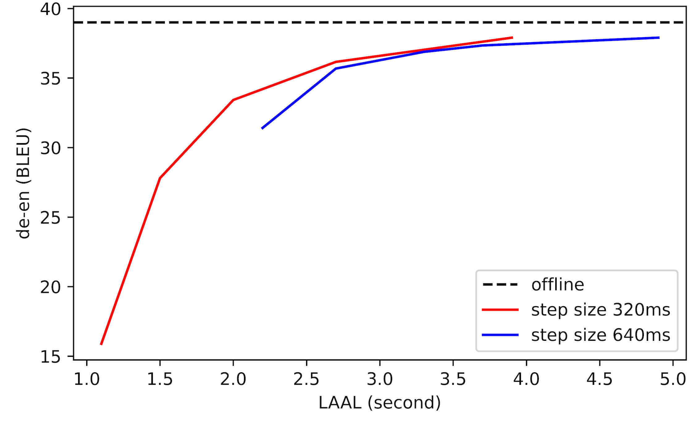

# BESTOW：融合 GPT 与 T5 双重优势，打造高效且支持流式传输的语音语言模型。

发布时间：2024年06月28日

`LLM应用` `语音识别` `人工智能`

> BESTOW: Efficient and Streamable Speech Language Model with the Best of Two Worlds in GPT and T5

# 摘要

> 将语音理解融入预训练大型语言模型已成为关键研究领域。过往架构如GPT风格和T5风格各有特点，但缺乏流式通用解决方案。我们创新的BESTOW架构，高效整合双世界精华，强化多任务处理。通过将流式SpeechLLM重塑为读写策略问题，BESTOW统一了研究范式，首次推出开源、支持大规模流式与多任务的SpeechLLM，性能卓越，成本效益高，并验证了LLM知识向语音领域的迁移能力。

> Incorporating speech understanding capabilities into pretrained large-language models has become a vital research direction (SpeechLLM). The previous architectures can be categorized as: i) GPT-style, prepend speech prompts to the text prompts as a sequence of LLM inputs like a decoder-only model; ii) T5-style, introduce speech cross-attention to each layer of the pretrained LLMs. We propose BESTOW architecture to bring the BESt features from TwO Worlds into a single model that is highly efficient and has strong multitask capabilities. Moreover, there is no clear streaming solution for either style, especially considering the solution should generalize to speech multitask. We reformulate streamable SpeechLLM as a read-write policy problem and unifies the offline and streaming research with BESTOW architecture. Hence we demonstrate the first open-source SpeechLLM solution that enables Streaming and Multitask at scale (beyond ASR) at the same time. This streamable solution achieves very strong performance on a wide range of speech tasks (ASR, AST, SQA, unseen DynamicSuperb). It is end-to-end optimizable, with lower training/inference cost, and demonstrates LLM knowledge transferability to speech.

[Arxiv](https://arxiv.org/abs/2406.19954)