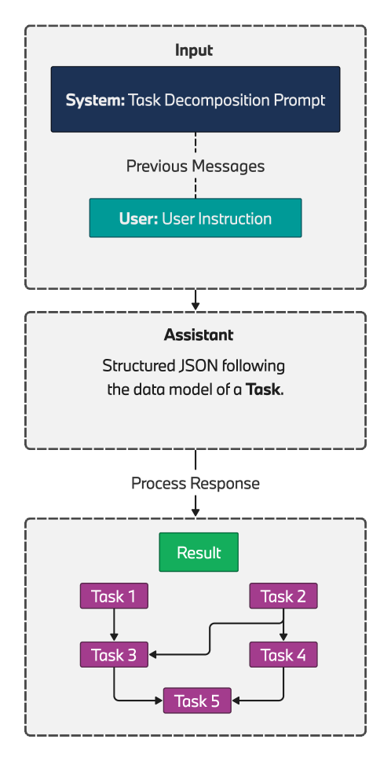

# BMW Agents 框架：通过多代理协作推动任务自动化

发布时间：2024年06月28日

`Agent` `自动化` `机器人流程自动化`

> BMW Agents -- A Framework For Task Automation Through Multi-agent Collaboration

# 摘要

> 摘要：大型语言模型（LLM）驱动的自主代理展现了自动化领域的巨大潜力。早期技术展示包括代理解决复杂任务、与外部系统互动以丰富知识及触发行动。特别是，多代理协作解决复杂任务的工作流程，突显了它们在非严格定义环境中的运作能力。因此，多代理方法在从复杂知识检索到下一代机器人流程自动化的众多工业应用中，具有成为核心架构的潜力。鉴于LLM的推理能力，复杂过程需采用包含模块化任务计划的逐步方法。任务执行可由单一代理或代理群组完成，视复杂度而定。本研究聚焦于设计一个灵活的代理工程框架，注重规划与执行，以应对跨领域的复杂应用。该框架旨在确保工业应用的可靠性，并提供技术支持，实现多自主代理间的可扩展、灵活及协作的工作流程。

> 
Abstract:Autonomous agents driven by Large Language Models (LLMs) offer enormous potential for automation. Early proof of this technology can be found in various demonstrations of agents solving complex tasks, interacting with external systems to augment their knowledge, and triggering actions. In particular, workflows involving multiple agents solving complex tasks in a collaborative fashion exemplify their capacity to operate in less strict and less well-defined environments. Thus, a multi-agent approach has great potential for serving as a backbone in many industrial applications, ranging from complex knowledge retrieval systems to next generation robotic process automation. Given the reasoning abilities within the current generation of LLMs, complex processes require a multi-step approach that includes a plan of well-defined and modular tasks. Depending on the level of complexity, these tasks can be executed either by a single agent or a group of agents. In this work, we focus on designing a flexible agent engineering framework with careful attention to planning and execution, capable of handling complex use case applications across various domains. The proposed framework provides reliability in industrial applications and presents techniques to ensure a scalable, flexible, and collaborative workflow for multiple autonomous agents working together towards solving tasks.
    

[Arxiv](https://arxiv.org//pdf/2406.20041)