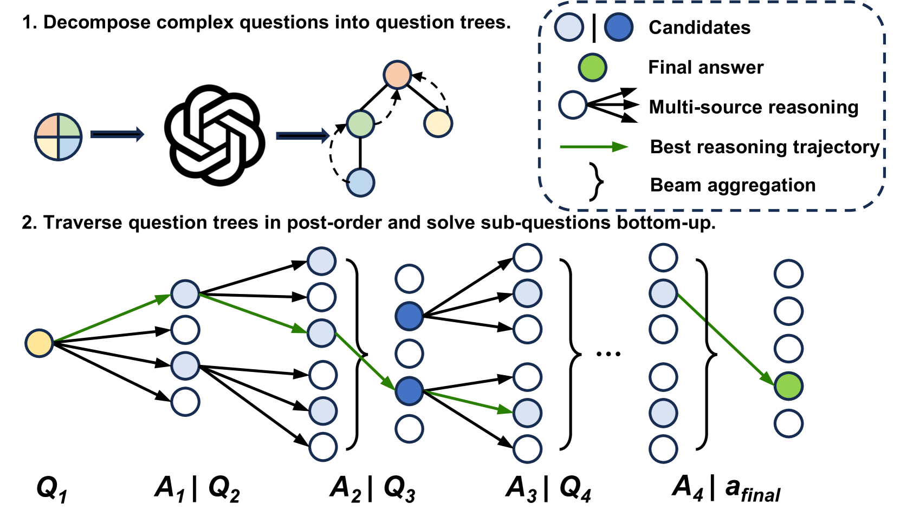
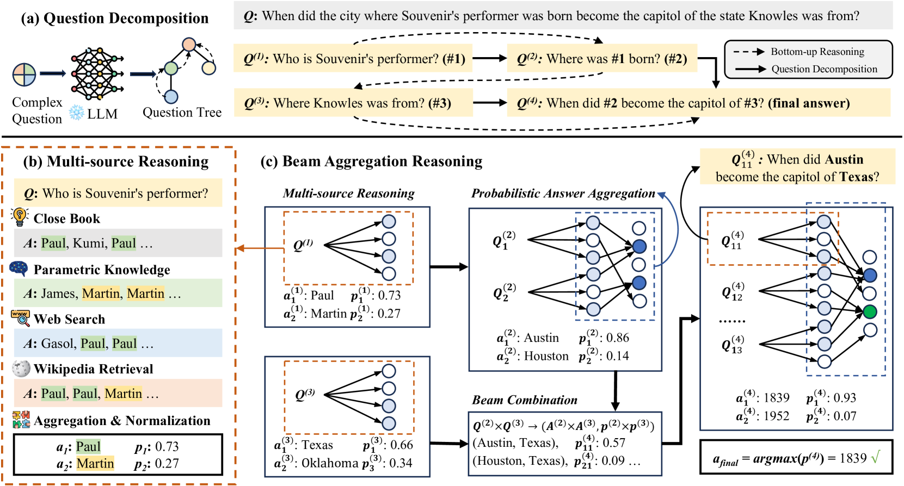
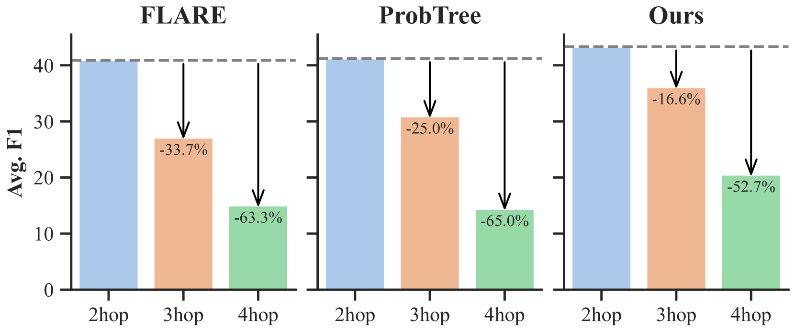
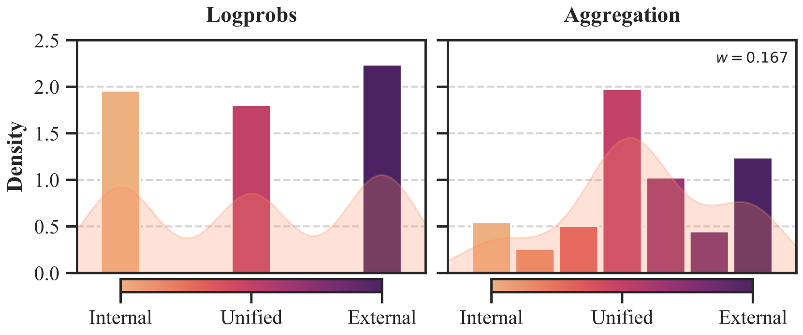
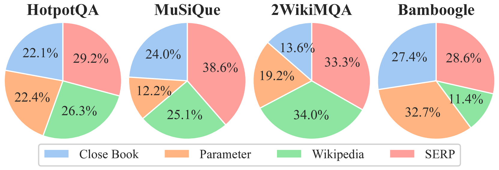
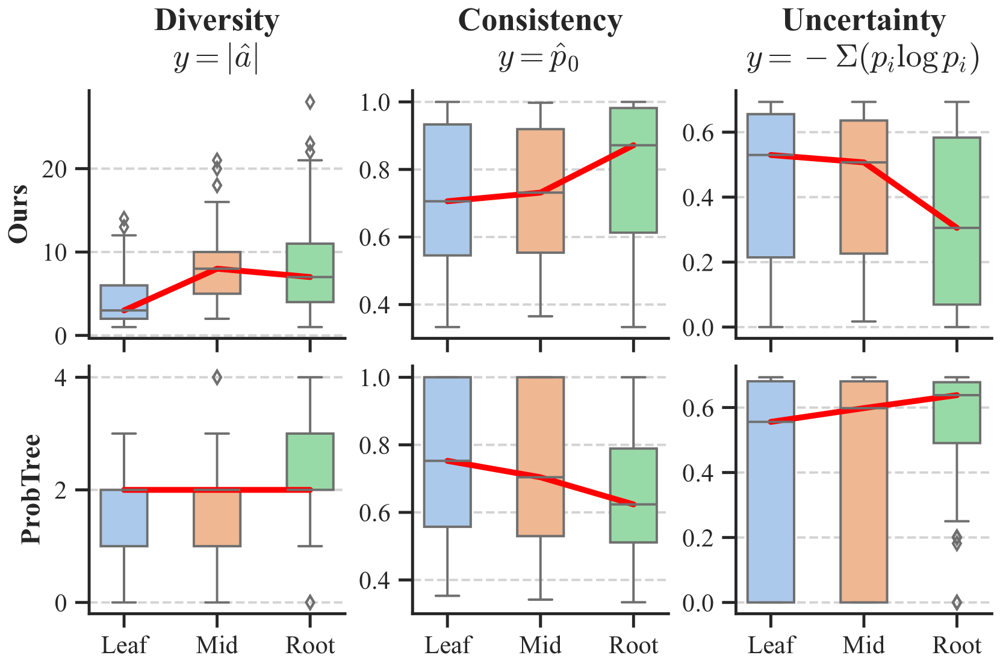
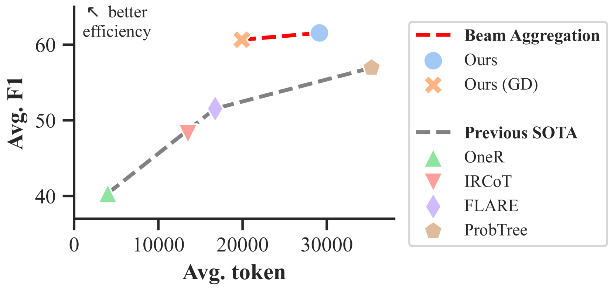

# BeamAggR：多源知识驱动下的多跳问答光束聚合推理

发布时间：2024年06月28日

`LLM应用` `问答系统` `人工智能`

> BeamAggR: Beam Aggregation Reasoning over Multi-source Knowledge for Multi-hop Question Answering

# 摘要

> 尽管大型语言模型 (LLM) 在推理方面表现出色，但在处理知识密集型任务时仍会出现事实错误。为此，我们提出了 Beam Aggregation Reasoning (BeamAggR)，这是一种针对知识密集型多跳问答的推理框架。BeamAggR 通过将复杂问题分解为树状结构，并采用自底向上的推理方法，有效探索并优先考虑每个问题环节中的潜在答案。实验结果显示，我们的方法在四个开放域多跳推理数据集上显著超越了现有技术水平，提升了 8.5%。分析进一步表明，BeamAggR 能更有效地促进知识间的协作与答案的聚合。

> Large language models (LLMs) have demonstrated strong reasoning capabilities. Nevertheless, they still suffer from factual errors when tackling knowledge-intensive tasks. Retrieval-augmented reasoning represents a promising approach. However, significant challenges still persist, including inaccurate and insufficient retrieval for complex questions, as well as difficulty in integrating multi-source knowledge. To address this, we propose Beam Aggregation Reasoning, BeamAggR, a reasoning framework for knowledge-intensive multi-hop QA. BeamAggR explores and prioritizes promising answers at each hop of question. Concretely, we parse the complex questions into trees, which include atom and composite questions, followed by bottom-up reasoning. For atomic questions, the LLM conducts reasoning on multi-source knowledge to get answer candidates. For composite questions, the LLM combines beam candidates, explores multiple reasoning paths through probabilistic aggregation, and prioritizes the most promising trajectory. Extensive experiments on four open-domain multi-hop reasoning datasets show that our method significantly outperforms SOTA methods by 8.5%. Furthermore, our analysis reveals that BeamAggR elicits better knowledge collaboration and answer aggregation.

[Arxiv](https://arxiv.org/abs/2406.19820)