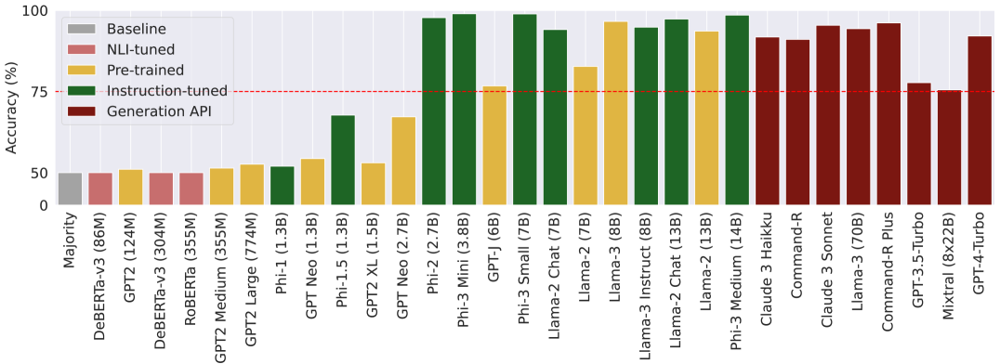
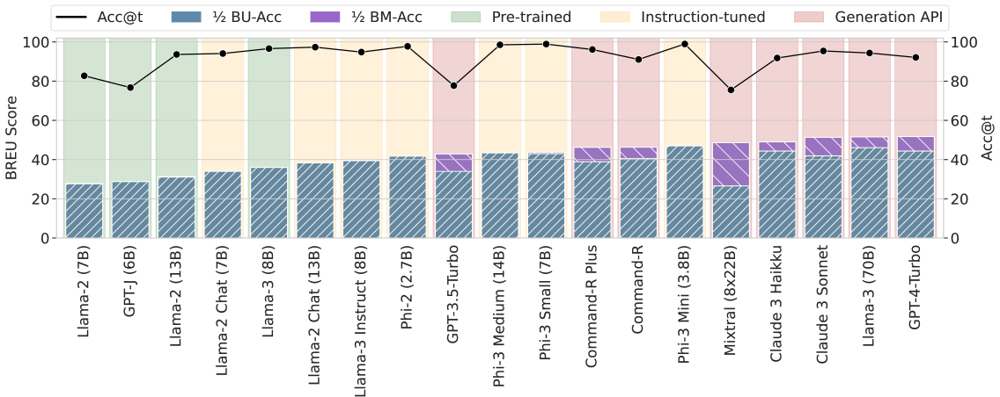
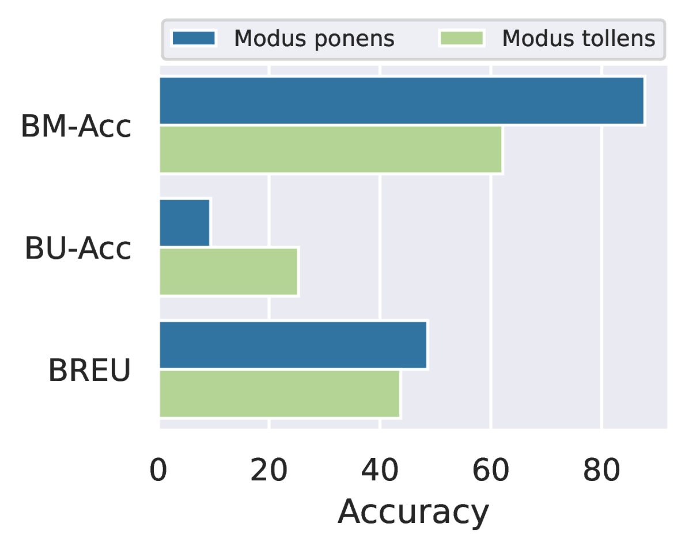
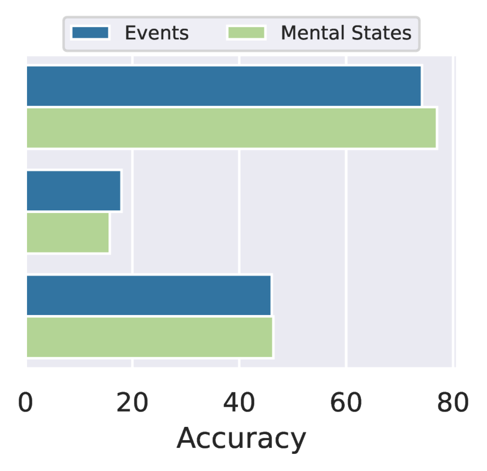
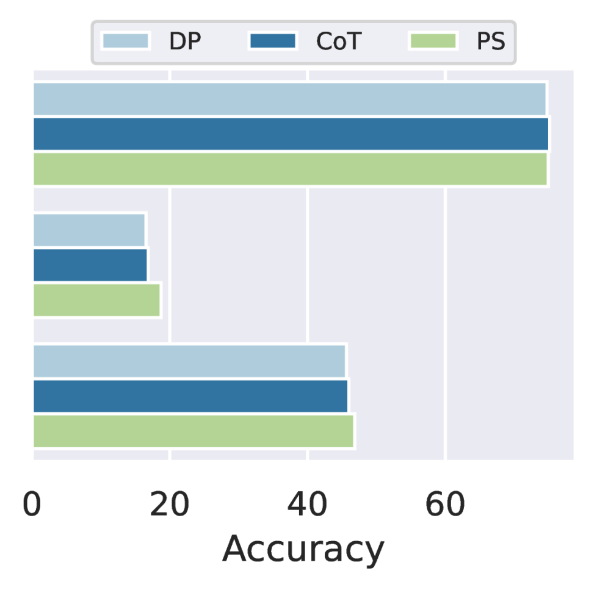
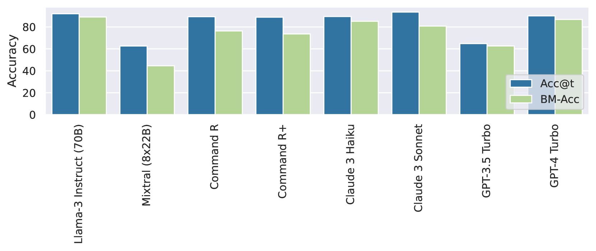

# 信念修正是大型语言模型推理适应性的关键，它使模型能够灵活调整其推理过程以适应新的信息或环境变化。

发布时间：2024年06月28日

`LLM应用` `人工智能`

> Belief Revision: The Adaptability of Large Language Models Reasoning

# 摘要

> 在现实NLP应用中，从文本中推理的能力至关重要。面对不完整或变化的数据，人们会更新自己的信念和理解。然而，现有评估多假设语言模型（LMs）在一致信息下运作。为此，我们推出了Belief-R数据集，测试LMs在新证据下的信念修正能力。该任务在delta推理（$ΔR$）框架内进行，模拟了LMs需重新考虑先前结论的场景。我们评估了约30个LMs，发现它们普遍难以根据新信息适当修正信念。同时，擅长更新的模型在不需更新的场景中表现不佳，凸显了适应性与准确性之间的权衡。这强调了提升LMs对变化信息的适应性的重要性，是构建更可靠AI系统的重要一步。

> The capability to reason from text is crucial for real-world NLP applications. Real-world scenarios often involve incomplete or evolving data. In response, individuals update their beliefs and understandings accordingly. However, most existing evaluations assume that language models (LMs) operate with consistent information. We introduce Belief-R, a new dataset designed to test LMs' belief revision ability when presented with new evidence. Inspired by how humans suppress prior inferences, this task assesses LMs within the newly proposed delta reasoning ($ΔR$) framework. Belief-R features sequences of premises designed to simulate scenarios where additional information could necessitate prior conclusions drawn by LMs. We evaluate $\sim$30 LMs across diverse prompting strategies and found that LMs generally struggle to appropriately revise their beliefs in response to new information. Further, models adept at updating often underperformed in scenarios without necessary updates, highlighting a critical trade-off. These insights underscore the importance of improving LMs' adaptiveness to changing information, a step toward more reliable AI systems.

[Arxiv](https://arxiv.org/abs/2406.19764)