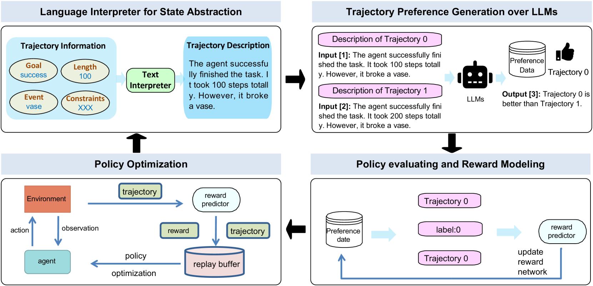
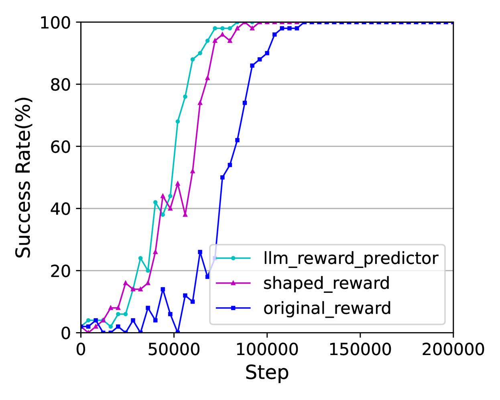
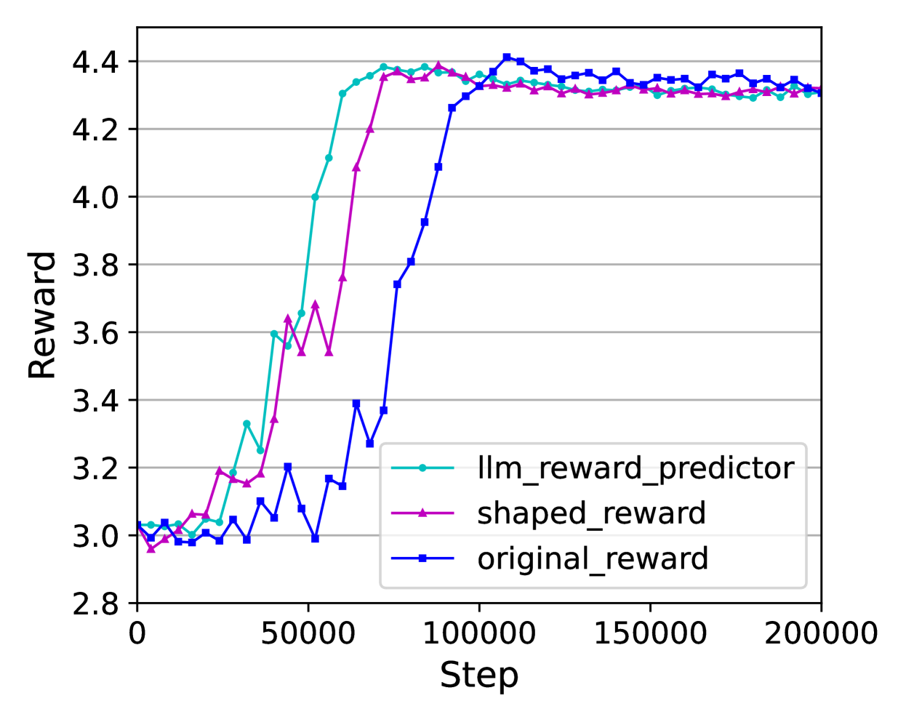
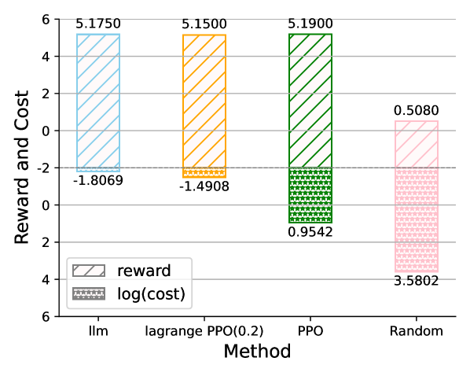
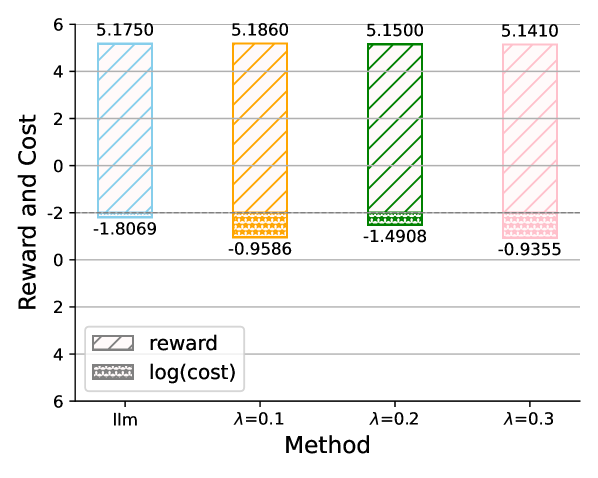
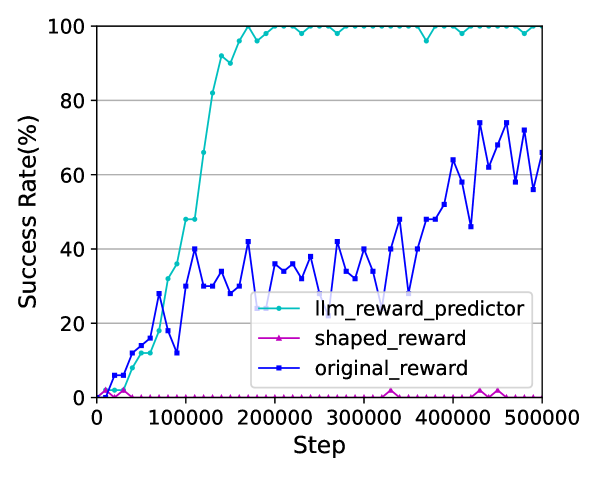
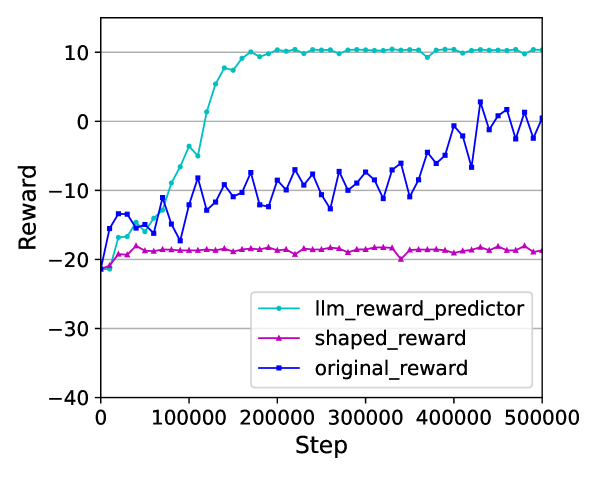

# 探索超越人类偏好的领域，利用 LLMs 对强化学习轨迹进行评估与提升。

发布时间：2024年06月28日

`LLM应用` `人工智能`

> Beyond Human Preferences: Exploring Reinforcement Learning Trajectory Evaluation and Improvement through LLMs

# 摘要

> 强化学习在复杂游戏任务中评估策略轨迹时，因难以设计精确的奖励函数而受限。基于偏好的强化学习通过利用人类偏好作为奖励信号，避免了精细的奖励设计。但获取专家偏好数据成本高昂且效率低下。为此，我们提出了 LLM4PG 框架，利用大型语言模型自动生成偏好，优化奖励函数，加速学习进程。实验表明，该方法有效提升了强化学习在复杂任务中的表现，减少了对专业知识的依赖，展现了 LLMs 在复杂环境中增强 RL 效能的潜力。

> Reinforcement learning (RL) faces challenges in evaluating policy trajectories within intricate game tasks due to the difficulty in designing comprehensive and precise reward functions. This inherent difficulty curtails the broader application of RL within game environments characterized by diverse constraints. Preference-based reinforcement learning (PbRL) presents a pioneering framework that capitalizes on human preferences as pivotal reward signals, thereby circumventing the need for meticulous reward engineering. However, obtaining preference data from human experts is costly and inefficient, especially under conditions marked by complex constraints. To tackle this challenge, we propose a LLM-enabled automatic preference generation framework named LLM4PG , which harnesses the capabilities of large language models (LLMs) to abstract trajectories, rank preferences, and reconstruct reward functions to optimize conditioned policies. Experiments on tasks with complex language constraints demonstrated the effectiveness of our LLM-enabled reward functions, accelerating RL convergence and overcoming stagnation caused by slow or absent progress under original reward structures. This approach mitigates the reliance on specialized human knowledge and demonstrates the potential of LLMs to enhance RL's effectiveness in complex environments in the wild.

[Arxiv](https://arxiv.org/abs/2406.19644)