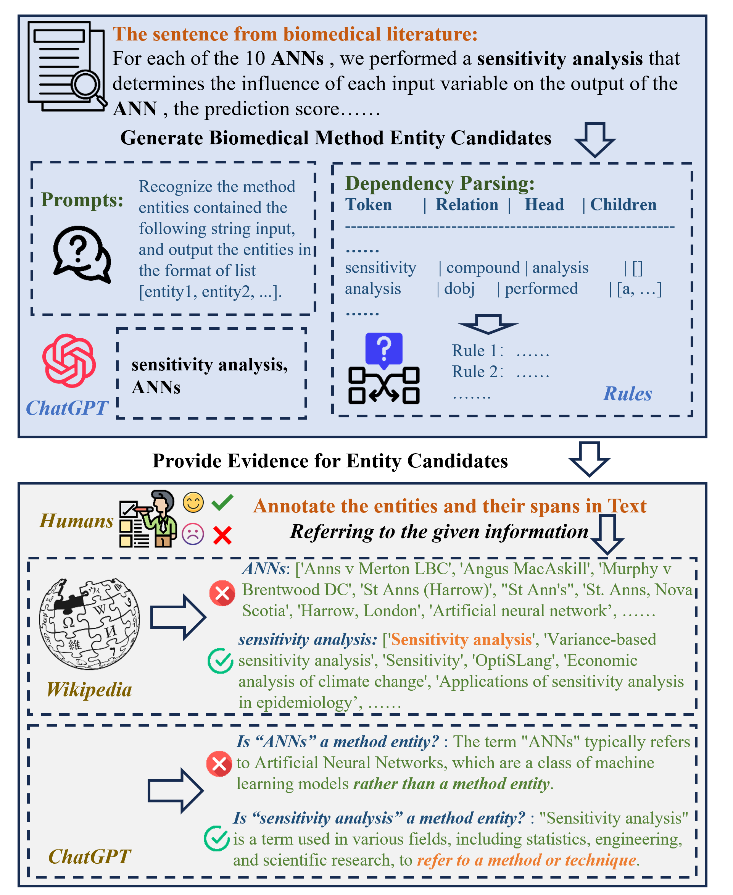
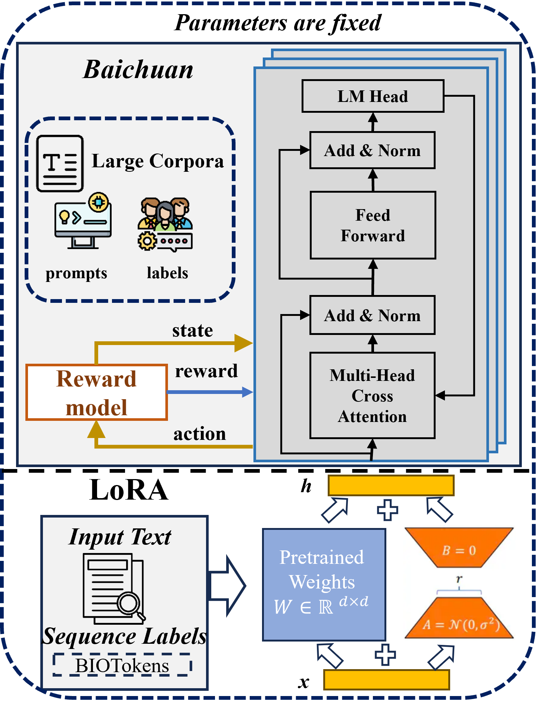

# BioMNER：专为生物医学方法实体识别设计的数据集

发布时间：2024年06月28日

`LLM应用` `生物医学`

> BioMNER: A Dataset for Biomedical Method Entity Recognition

# 摘要

> 命名实体识别（NER）是自然语言处理中的核心任务，尤其在生物医学领域，由于专业术语的不断涌现，这一任务更具挑战性。当前生物医学方法NER研究因方法概念的复杂性而资源稀缺。为此，我们创建了一个新的数据集，并利用自动化系统辅助人工标注。同时，我们探索了多种NER方法，包括定制的大型语言模型。实验表明，大型模型参数反而不利于生物医学方法实体的提取，而结合CRF的小型ALBERT模型则达到了顶尖性能。

> Named entity recognition (NER) stands as a fundamental and pivotal task within the realm of Natural Language Processing. Particularly within the domain of Biomedical Method NER, this task presents notable challenges, stemming from the continual influx of domain-specific terminologies in scholarly literature. Current research in Biomedical Method (BioMethod) NER suffers from a scarcity of resources, primarily attributed to the intricate nature of methodological concepts, which necessitate a profound understanding for precise delineation. In this study, we propose a novel dataset for biomedical method entity recognition, employing an automated BioMethod entity recognition and information retrieval system to assist human annotation. Furthermore, we comprehensively explore a range of conventional and contemporary open-domain NER methodologies, including the utilization of cutting-edge large-scale language models (LLMs) customised to our dataset. Our empirical findings reveal that the large parameter counts of language models surprisingly inhibit the effective assimilation of entity extraction patterns pertaining to biomedical methods. Remarkably, the approach, leveraging the modestly sized ALBERT model (only 11MB), in conjunction with conditional random fields (CRF), achieves state-of-the-art (SOTA) performance.

[Arxiv](https://arxiv.org/abs/2406.20038)