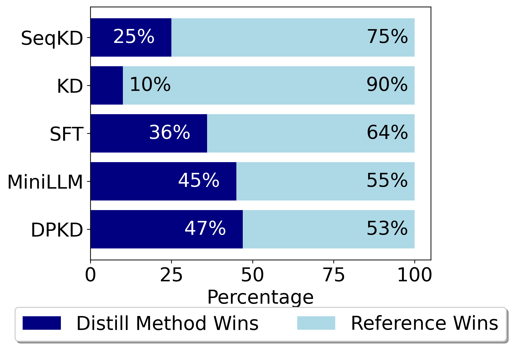
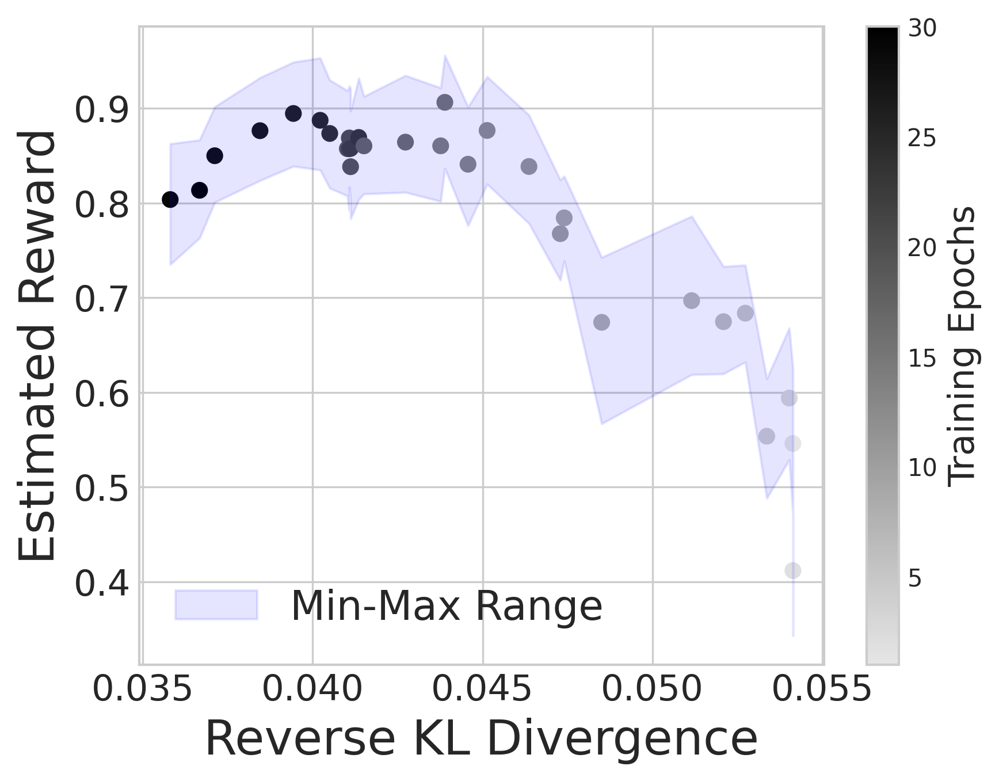
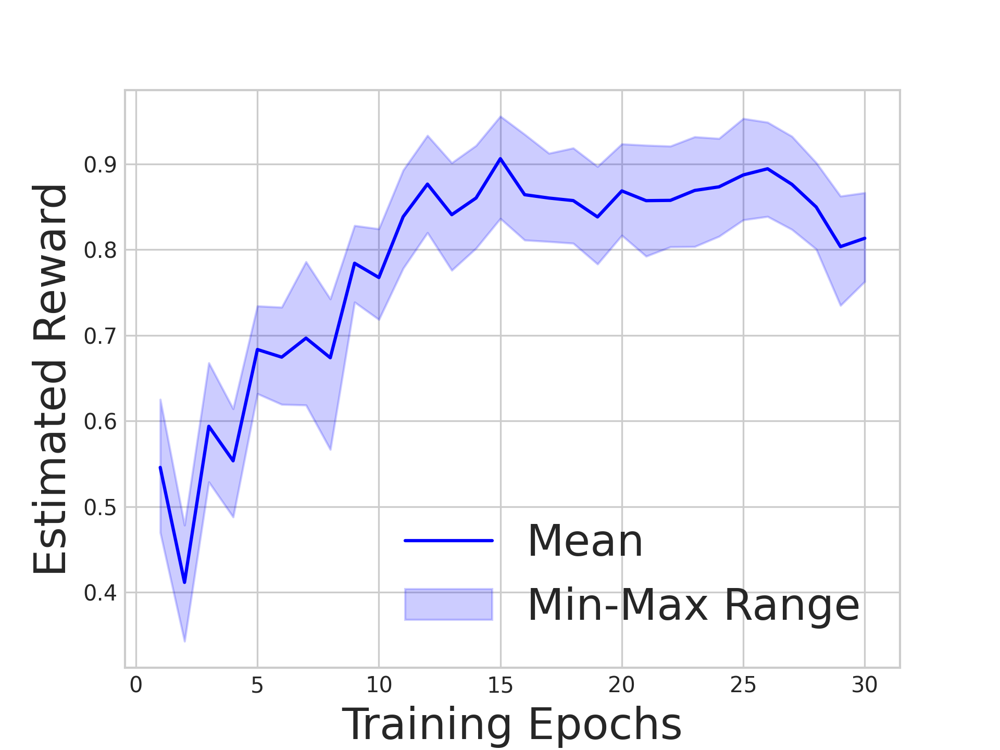
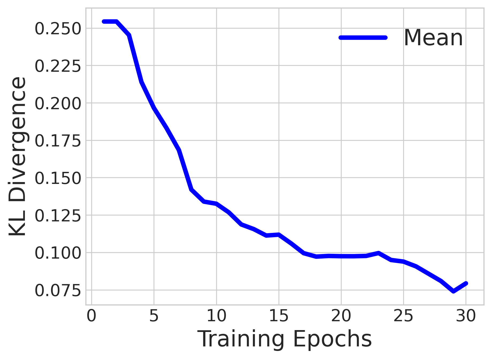
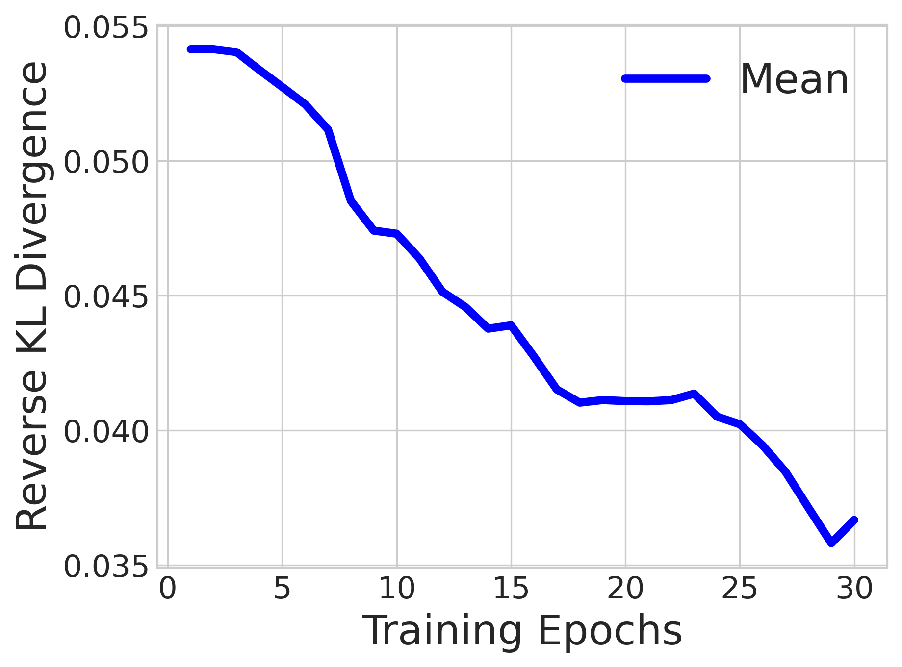
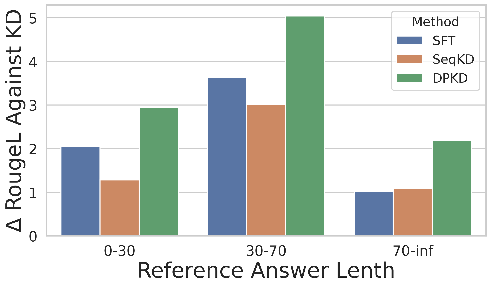

# 大型语言模型的直接偏好知识蒸馏

发布时间：2024年06月28日

`LLM理论` `人工智能`

> Direct Preference Knowledge Distillation for Large Language Models

# 摘要

> 在大型语言模型领域，知识蒸馏技术至关重要，但现有方法在效率和测量能力上存在局限。我们提出直接偏好知识蒸馏 (DPKD)，通过分布散度优化隐式奖励和输出偏好，显著提升模型性能。实验证明，DPKD 在多个数据集上表现优异，代码和数据已公开。

> In the field of large language models (LLMs), Knowledge Distillation (KD) is a critical technique for transferring capabilities from teacher models to student models. However, existing KD methods face limitations and challenges in distillation of LLMs, including efficiency and insufficient measurement capabilities of traditional KL divergence. It is shown that LLMs can serve as an implicit reward function, which we define as a supplement to KL divergence. In this work, we propose Direct Preference Knowledge Distillation (DPKD) for LLMs. DPKD utilizes distribution divergence to represent the preference loss and implicit reward function. We re-formulate KD of LLMs into two stages: first optimizing and objective consisting of implicit reward and reverse KL divergence and then improving the preference probability of teacher outputs over student outputs. We conducted experiments and analysis on various datasets with LLM parameters ranging from 120M to 13B and demonstrate the broad applicability and effectiveness of our DPKD approach. Meanwhile, we prove the value and effectiveness of the introduced implicit reward and output preference in KD through experiments and theoretical analysis. The DPKD method outperforms the baseline method in both output response precision and exact match percentage. Code and data are available at https://aka.ms/dpkd.

[Arxiv](https://arxiv.org/abs/2406.19774)