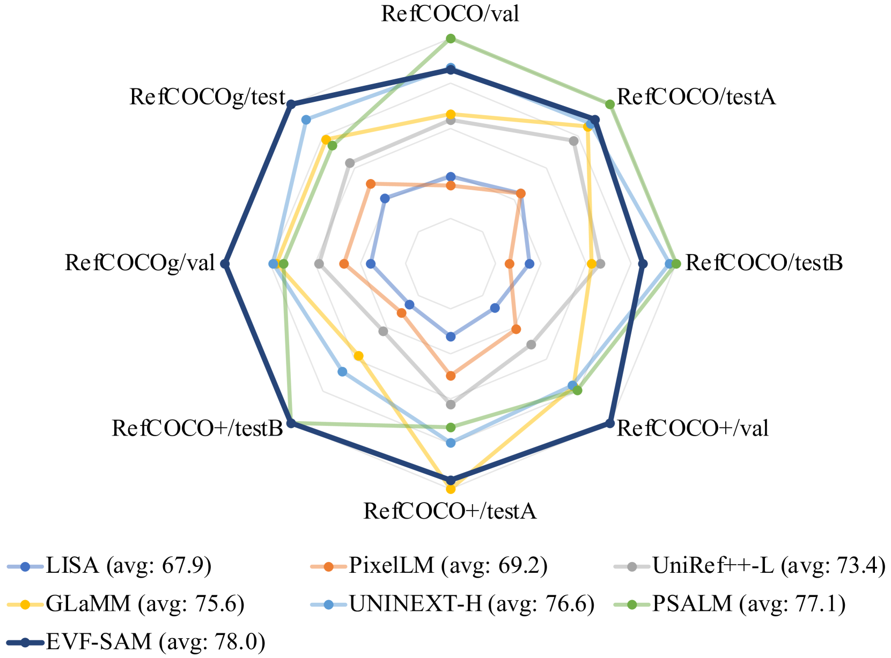
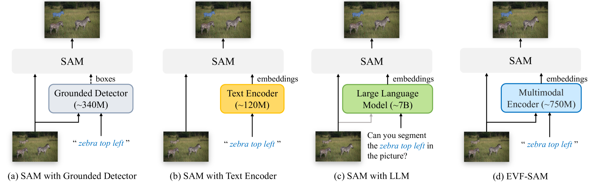
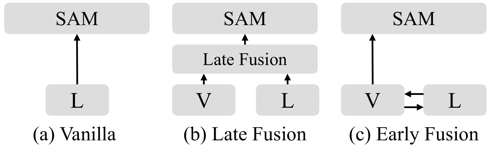
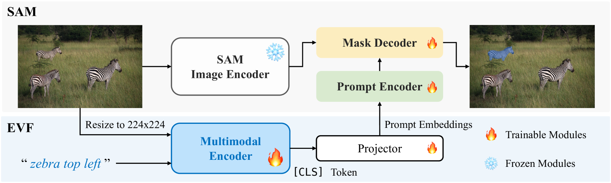

# EVF-SAM：针对文本提示分割模型，采用早期视觉与语言融合技术

发布时间：2024年06月28日

`LLM应用` `计算机视觉`

> EVF-SAM: Early Vision-Language Fusion for Text-Prompted Segment Anything Model

# 摘要

> SAM 模型因其出色的视觉提示交互分割能力而广受瞩目，但文本提示方面的研究尚显不足。本文通过实证研究，探讨了哪些文本提示编码器（如 CLIP 或 LLM）能有效提升 SAM 在指代表达分割中的表现，并提出了基于早期视觉语言融合的 SAM（EVF-SAM）。EVF-SAM 利用图像与文本的多模态提示，结合预训练的视觉语言模型生成指代提示，再由 SAM 模型完成分割，简单而高效。我们发现，多模态提示与早期融合的视觉语言模型（如 BEIT-3）能显著提升 SAM 的指代分割精度。实验证明，基于 BEIT-3 的 EVF-SAM 在 RefCOCO/+/g 数据集上达到了业界领先水平，并凸显了早期视觉语言融合在提升 SAM 性能方面的优势。此外，EVF-SAM 在大幅减少参数（约 82%）的同时，性能显著提升，参数规模为 1.32B，远超以往基于大型多模态模型的 SAM 方法。

> Segment Anything Model (SAM) has attracted widespread attention for its superior interactive segmentation capabilities with visual prompts while lacking further exploration of text prompts. In this paper, we empirically investigate what text prompt encoders (e.g., CLIP or LLM) are good for adapting SAM for referring expression segmentation and introduce the Early Vision-language Fusion-based SAM (EVF-SAM). EVF-SAM is a simple yet effective referring segmentation method which exploits multimodal prompts (i.e., image and text) and comprises a pre-trained vision-language model to generate referring prompts and a SAM model for segmentation. Surprisingly, we observe that: (1) multimodal prompts and (2) vision-language models with early fusion (e.g., BEIT-3) are beneficial for prompting SAM for accurate referring segmentation. Our experiments show that the proposed EVF-SAM based on BEIT-3 can obtain state-of-the-art performance on RefCOCO/+/g for referring expression segmentation and demonstrate the superiority of prompting SAM with early vision-language fusion. In addition, the proposed EVF-SAM with 1.32B parameters achieves remarkably higher performance while reducing nearly 82% of parameters compared to previous SAM methods based on large multimodal models.

[Arxiv](https://arxiv.org/abs/2406.20076)