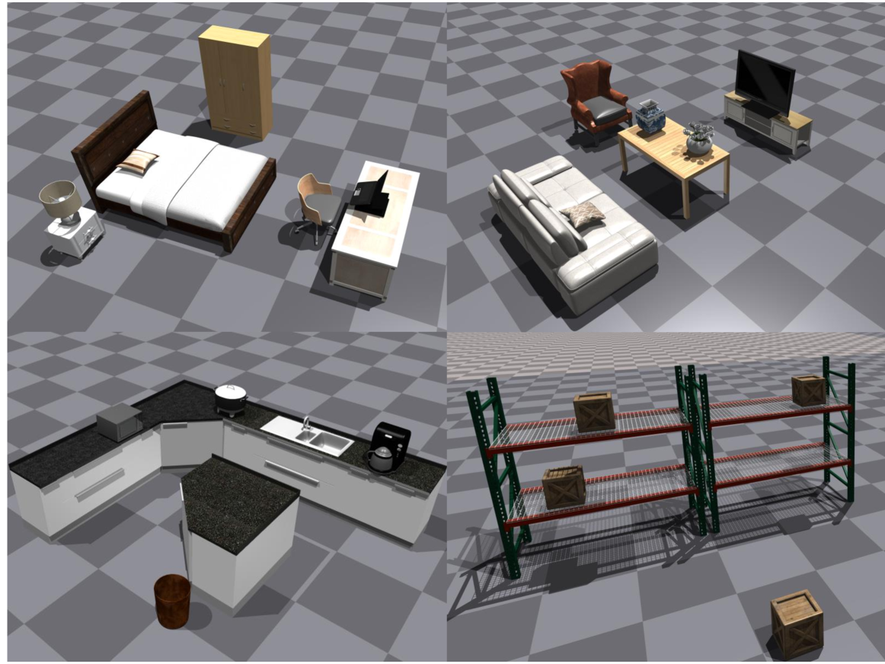

# HumanVLA 项目旨在通过物理人形机器人，实现视觉与语言共同引导的物体重新排列。

发布时间：2024年06月28日

`Agent` `机器人` `人工智能`

> HumanVLA: Towards Vision-Language Directed Object Rearrangement by Physical Humanoid

# 摘要

> 物理人-场景交互 (HSI) 在众多领域中至关重要。然而，现有技术受限于特定物体动态和特权信息，限制了更广泛应用的发展。为此，我们推出了 HumanVLA，一个由视觉和语言引导的通用物体重新排列系统。我们采用教师-学生框架，首先通过目标条件强化学习和对抗性运动先验训练教师策略，再通过行为克隆将其转化为视觉-语言-动作模型。我们还提出了关键见解，以优化大规模学习。为支持人形机器人进行多样化的物体重新排列，我们创建了 Human-in-the-Room 数据集。通过详尽的实验和分析，我们验证了该方法的有效性。

> Physical Human-Scene Interaction (HSI) plays a crucial role in numerous applications.
  However, existing HSI techniques are limited to specific object dynamics and privileged information, which prevents the development of more comprehensive applications.
  To address this limitation, we introduce HumanVLA for general object rearrangement directed by practical vision and language.
  A teacher-student framework is utilized to develop HumanVLA.
  A state-based teacher policy is trained first using goal-conditioned reinforcement learning and adversarial motion prior.
  Then, it is distilled into a vision-language-action model via behavior cloning.
  We propose several key insights to facilitate the large-scale learning process.
  To support general object rearrangement by physical humanoid, we introduce a novel Human-in-the-Room dataset encompassing various rearrangement tasks.
  Through extensive experiments and analysis, we demonstrate the effectiveness of the proposed approach.

[Arxiv](https://arxiv.org/abs/2406.19972)