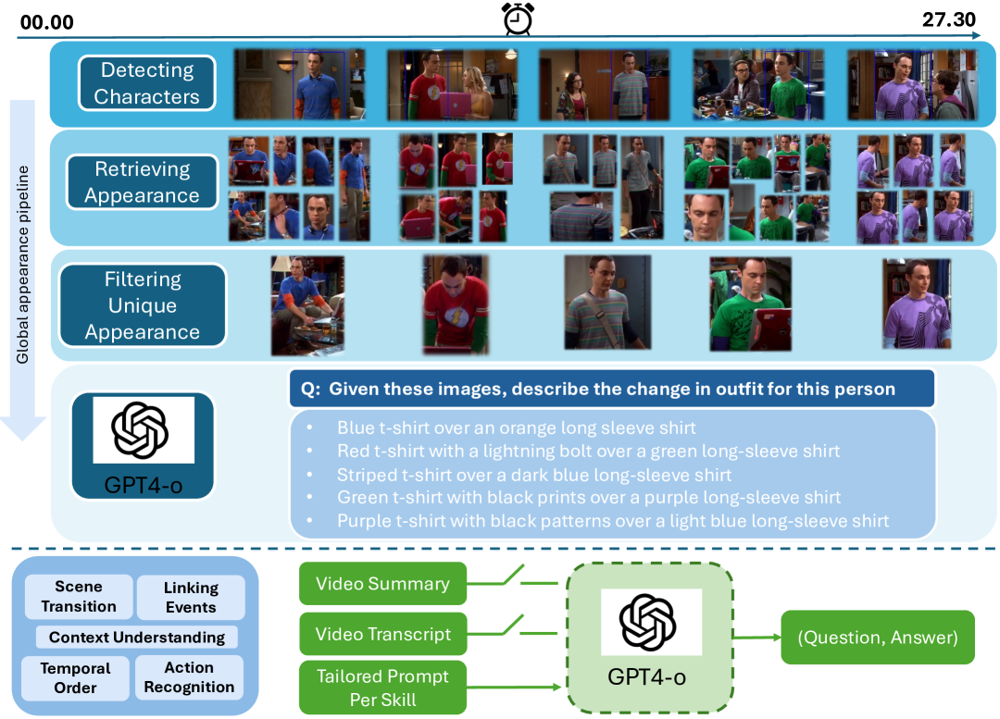
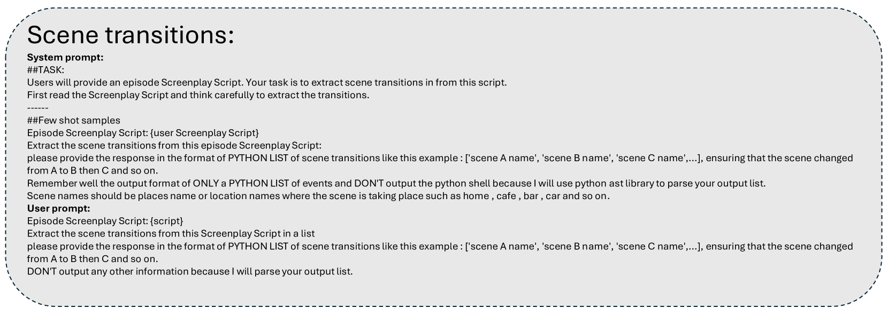

# InfiniBench：一项全面的综合基准，旨在评估大型多模态模型在超长视频理解领域的性能。

发布时间：2024年06月28日

`LLM应用` `视频理解` `人工智能`

> InfiniBench: A Comprehensive Benchmark for Large Multimodal Models in Very Long Video Understanding

# 摘要

> 理解长视频（从数十分钟到数小时）在视频理解领域带来了独特挑战。尽管长视频内容日益重要，但现有基准多聚焦于短片段。为此，我们推出了InfiniBench，一个全面的长视频理解基准，涵盖最长视频时长（平均76.34分钟）、最多问答对（108.2K）、问题多样性（考察九种技能，含选择题与开放式问题），以及人本设计（视频源自电影与日常节目，如需批判思维的电影剧透题）。我们利用InfiniBench全面评估了多模态大型模型（LMMs），包括商业与开源模型，发现其在我们基准上表现不佳，最佳AI模型平均准确率仅42.72%，平均得分2.71（满分5）。我们期待此基准能推动LMMs社区深入长视频与人类级别理解的研究。基准链接：https://vision-cair.github.io/InfiniBench/。

> Understanding long videos, ranging from tens of minutes to several hours, presents unique challenges in video comprehension. Despite the increasing importance of long-form video content, existing benchmarks primarily focus on shorter clips. To address this gap, we introduce InfiniBench a comprehensive benchmark for very long video understanding which presents 1)The longest video duration, averaging 76.34 minutes; 2) The largest number of question-answer pairs, 108.2K; 3) Diversity in questions that examine nine different skills and include both multiple-choice questions and open-ended questions; 4) Humancentric, as the video sources come from movies and daily TV shows, with specific human-level question designs such as Movie Spoiler Questions that require critical thinking and comprehensive understanding. Using InfiniBench, we comprehensively evaluate existing Large MultiModality Models (LMMs) on each skill, including the commercial model Gemini 1.5 Flash and the open-source models. The evaluation shows significant challenges in our benchmark.Our results show that the best AI models such Gemini struggles to perform well with 42.72% average accuracy and 2.71 out of 5 average score. We hope this benchmark will stimulate the LMMs community towards long video and human-level understanding. Our benchmark can be accessed at https://vision-cair.github.io/InfiniBench/

[Arxiv](https://arxiv.org/abs/2406.19875)