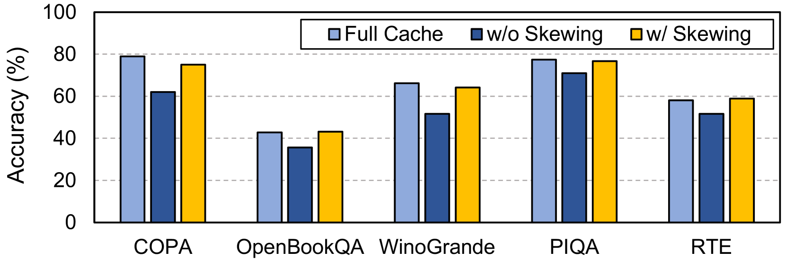
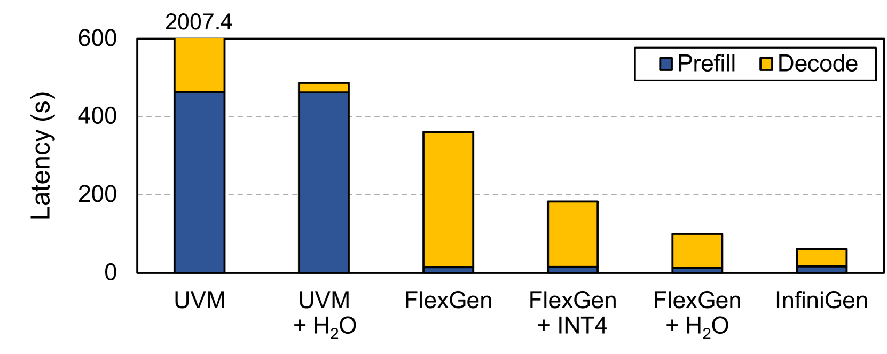

# InfiniGen：利用动态KV缓存管理技术，提升大型语言模型生成推理的效率

发布时间：2024年06月28日

`LLM应用` `文本生成`

> InfiniGen: Efficient Generative Inference of Large Language Models with Dynamic KV Cache Management

# 摘要

> 基于Transformer的LLMs在多种NLP任务中表现卓越。然而，生成长内容时的LLM推理因KV缓存的大内存需求而受限。本文介绍的InfiniGen框架，专为长文本生成设计，与现代卸载系统协同，通过最小演练预测关键令牌，仅预取必要缓存，大幅提升系统性能至3倍，同时保持高模型准确性。

> Transformer-based large language models (LLMs) demonstrate impressive performance across various natural language processing tasks. Serving LLM inference for generating long contents, however, poses a challenge due to the enormous memory footprint of the transient state, known as the key-value (KV) cache, which scales with the sequence length and batch size. In this paper, we present InfiniGen, a novel KV cache management framework tailored for long-text generation, which synergistically works with modern offloading-based inference systems. InfiniGen leverages the key insight that a few important tokens that are essential for computing the subsequent attention layer in the Transformer can be speculated by performing a minimal rehearsal with the inputs of the current layer and part of the query weight and key cache of the subsequent layer. This allows us to prefetch only the essential KV cache entries (without fetching them all), thereby mitigating the fetch overhead from the host memory in offloading-based LLM serving systems. Our evaluation on several representative LLMs shows that InfiniGen improves the overall performance of a modern offloading-based system by up to 3.00x compared to prior KV cache management methods while offering substantially better model accuracy.

[Arxiv](https://arxiv.org/abs/2406.19707)