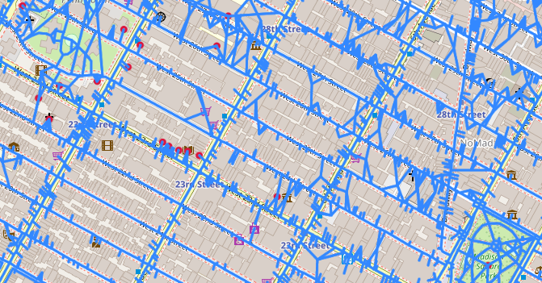
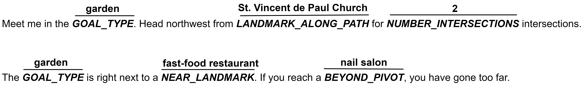
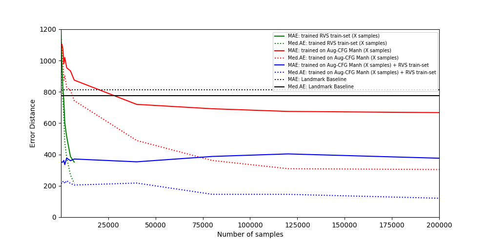
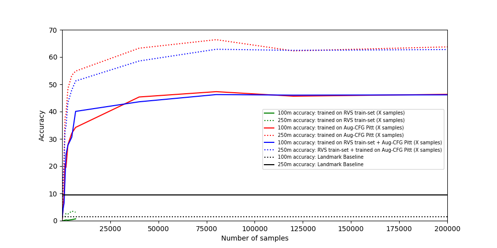
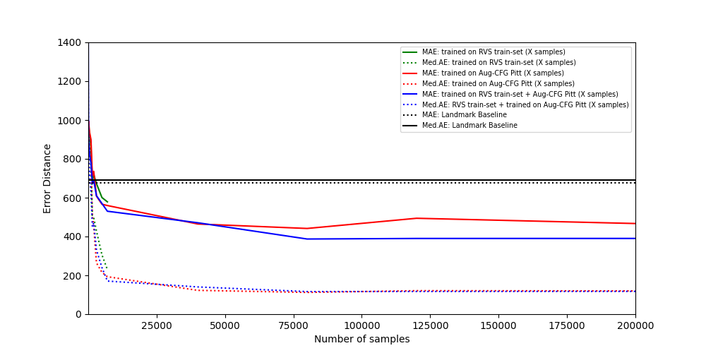
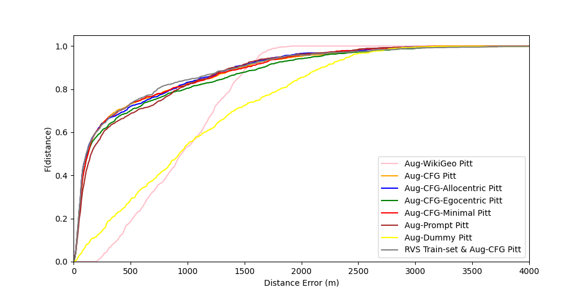
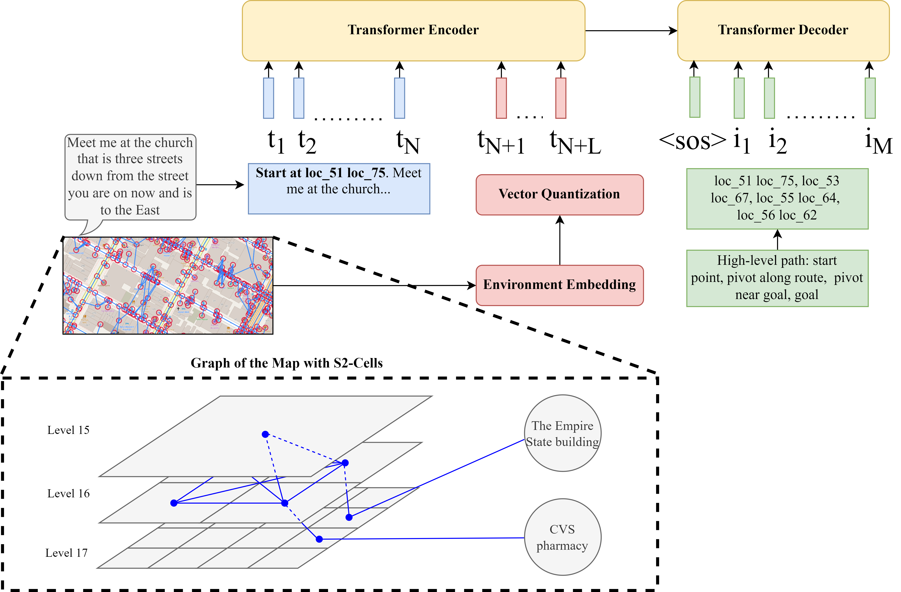

# 探索未知：为新环境打造地理空间描述

发布时间：2024年06月28日

`LLM应用` `地理信息系统` `人工智能`

> Into the Unknown: Generating Geospatial Descriptions for New Environments

# 摘要

> 类似于视觉-语言导航任务，新提出的 Rendezvous 任务需要利用非顺序指令和地图，对独立于观察者视角的空间关系进行推理。然而，在新环境中，缺乏训练数据导致性能大幅下降。我们利用带有坐标的开源描述（如维基百科）提供训练数据，但受限于空间文本的不足，地理位置分辨率较低。为此，我们提出了一种大规模数据增强方法，利用现有地理空间数据为新环境生成高质量合成数据。该方法构建了一个基于知识的图谱，捕捉实体间的空间关系。通过生成大量上下文无关文法模板并结合大型语言模型，我们能够生成具体的导航指令。实验表明，我们的方法在不熟悉环境中将导航精度提高了45.83%。此外，基于上下文无关文法的增强方法在未见和已见环境中均优于基于大型语言模型的增强方法。这表明，在处理基于文本的地理空间推理时，明确结构化空间信息对于解锁数据稀缺场景具有重要意义。

> Similar to vision-and-language navigation (VLN) tasks that focus on bridging the gap between vision and language for embodied navigation, the new Rendezvous (RVS) task requires reasoning over allocentric spatial relationships (independent of the observer's viewpoint) using non-sequential navigation instructions and maps. However, performance substantially drops in new environments with no training data. Using opensource descriptions paired with coordinates (e.g., Wikipedia) provides training data but suffers from limited spatially-oriented text resulting in low geolocation resolution. We propose a large-scale augmentation method for generating high-quality synthetic data for new environments using readily available geospatial data. Our method constructs a grounded knowledge-graph, capturing entity relationships. Sampled entities and relations (`shop north of school') generate navigation instructions via (i) generating numerous templates using context-free grammar (CFG) to embed specific entities and relations; (ii) feeding the entities and relation into a large language model (LLM) for instruction generation. A comprehensive evaluation on RVS, showed that our approach improves the 100-meter accuracy by 45.83% on unseen environments. Furthermore, we demonstrate that models trained with CFG-based augmentation achieve superior performance compared with those trained with LLM-based augmentation, both in unseen and seen environments. These findings suggest that the potential advantages of explicitly structuring spatial information for text-based geospatial reasoning in previously unknown, can unlock data-scarce scenarios.

[Arxiv](https://arxiv.org/abs/2406.19967)