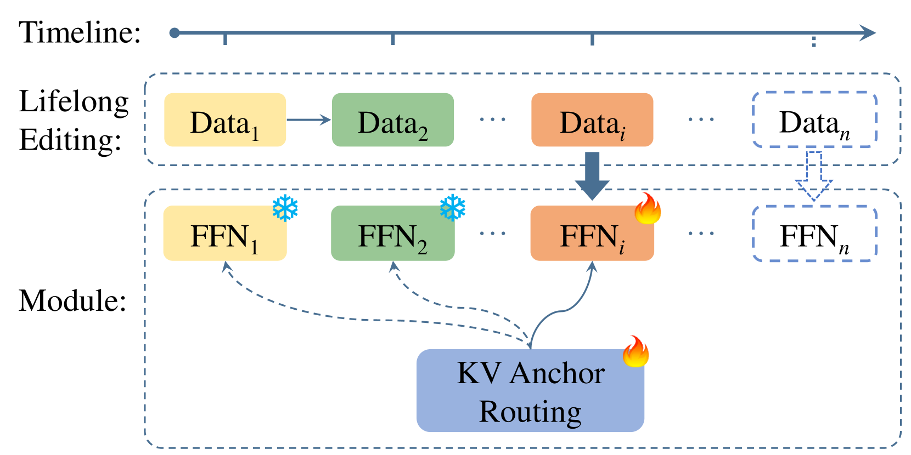
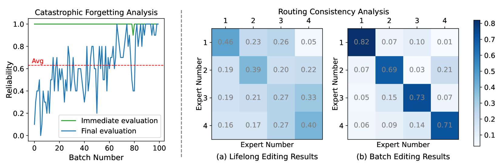
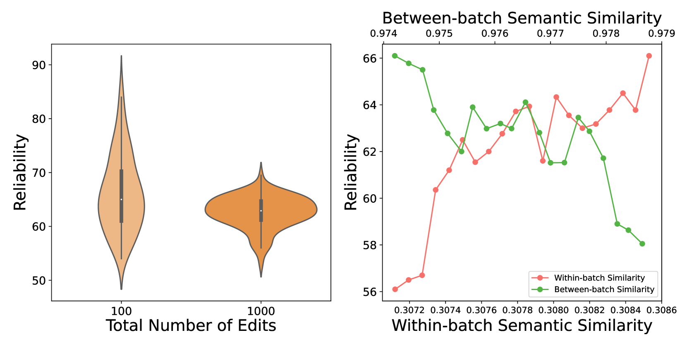
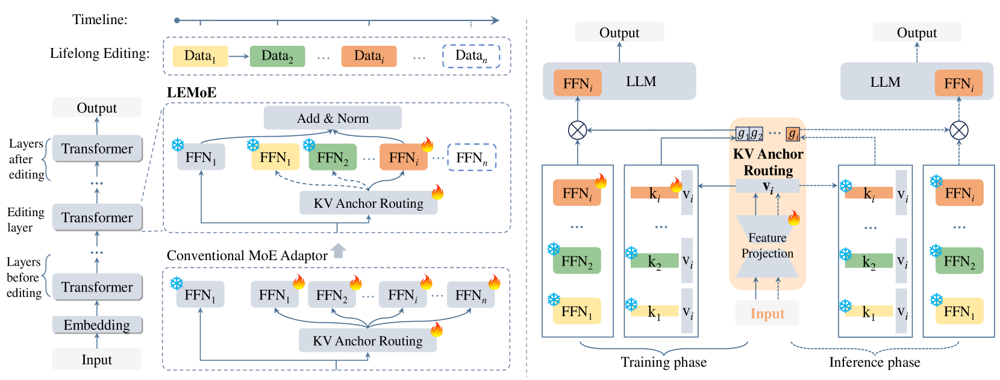
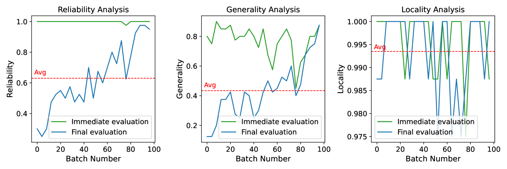

# LEMoE：专为大型语言模型设计的终身编辑工具，采用先进的多专家混合适配技术。

发布时间：2024年06月28日

`LLM应用` `人工智能` `软件开发`

> LEMoE: Advanced Mixture of Experts Adaptor for Lifelong Model Editing of Large Language Models

# 摘要

> 为了跟上瞬息万变的世界，大型语言模型 (LLM) 需要不断更新知识，这催生了终身模型编辑任务。尽管已有多种编辑技术，但在终身编辑场景中，它们往往力不从心。为此，我们推出了 LEMoE，一种创新的专家混合 (MoE) 适配器，专为终身编辑设计。我们深入剖析了传统 MoE 适配器在终身编辑中的局限，如灾难性遗忘、路由不一致及顺序敏感等问题。基于此，我们提出了一种定制化的模块插入策略，通过引入 KV 锚路由提升训练与推理阶段的路由一致性，并采用基于聚类的编辑顺序规划，简洁高效。实验证明，我们的方法在终身编辑领域表现卓越，不仅超越了现有技术，还在批量编辑任务中展现了出色的性能。相关代码即将开放。

> Large language models (LLMs) require continual knowledge updates to stay abreast of the ever-changing world facts, prompting the formulation of lifelong model editing task. While recent years have witnessed the development of various techniques for single and batch editing, these methods either fail to apply or perform sub-optimally when faced with lifelong editing. In this paper, we introduce LEMoE, an advanced Mixture of Experts (MoE) adaptor for lifelong model editing. We first analyze the factors influencing the effectiveness of conventional MoE adaptor in lifelong editing, including catastrophic forgetting, inconsistent routing and order sensitivity. Based on these insights, we propose a tailored module insertion method to achieve lifelong editing, incorporating a novel KV anchor routing to enhance routing consistency between training and inference stage, along with a concise yet effective clustering-based editing order planning. Experimental results demonstrate the effectiveness of our method in lifelong editing, surpassing previous model editing techniques while maintaining outstanding performance in batch editing task. Our code will be available.

[Arxiv](https://arxiv.org/abs/2406.20030)