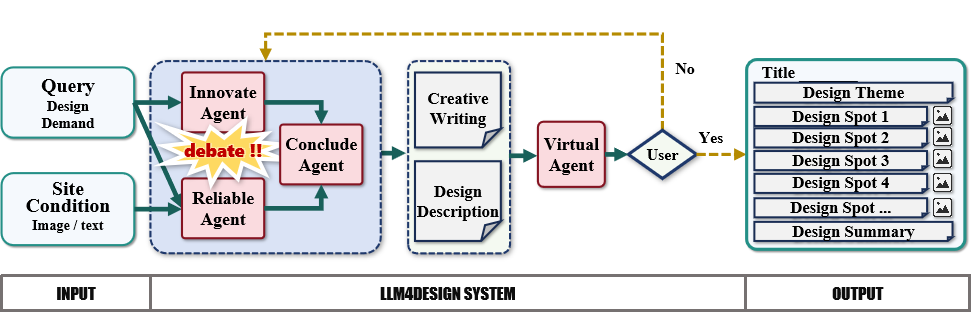

# LLM4DESIGN：建筑与环境设计的自动化多模态解决方案

发布时间：2024年06月28日

`LLM应用` `建筑设计` `城市规划`

> LLM4DESIGN: An Automated Multi-Modal System for Architectural and Environmental Design

# 摘要

> 本研究推出 LLM4DESIGN，一个高度自动化的设计提案生成系统。该系统仅依赖场地条件和设计要求，通过多代理系统激发创造力，利用检索增强生成确保设计现实性，并借助视觉语言模型同步所有信息，产出连贯且多元的设计方案。LLM4DESIGN 不仅满足叙事与绘图的双重需求，其创新性与实用性也通过广泛实验得到验证，尤其在城市更新设计领域表现卓越。此外，我们还建立了首个跨模态设计方案数据集，涵盖建筑、景观、室内及城市设计，为未来研究提供丰富资源。

> This study introduces LLM4DESIGN, a highly automated system for generating architectural and environmental design proposals. LLM4DESIGN, relying solely on site conditions and design requirements, employs Multi-Agent systems to foster creativity, Retrieval Augmented Generation (RAG) to ground designs in realism, and Visual Language Models (VLM) to synchronize all information. This system resulting in coherent, multi-illustrated, and multi-textual design schemes. The system meets the dual needs of narrative storytelling and objective drawing presentation in generating architectural and environmental design proposals. Extensive comparative and ablation experiments confirm the innovativeness of LLM4DESIGN's narrative and the grounded applicability of its plans, demonstrating its superior performance in the field of urban renewal design. Lastly, we have created the first cross-modal design scheme dataset covering architecture, landscape, interior, and urban design, providing rich resources for future research.

[Arxiv](https://arxiv.org/abs/2407.12025)