# LLaRA：为视觉-语言策略注入强大动力的机器人学习数据

发布时间：2024年06月28日

`Agent` `机器人技术` `人工智能`

> LLaRA: Supercharging Robot Learning Data for Vision-Language Policy

# 摘要

> 本文提出 LLaRA 框架，通过将机器人行动策略转化为对话形式，并利用辅助数据提升响应质量，展示了大型语言模型在处理跨领域任务时的强大能力。特别是视觉语言模型，能够结合视觉信息生成策略决策。我们通过自动化流程，从现有数据中提取高质量指令，进一步优化了机器人任务的表现。实验证明，LLaRA 在多环境中的表现卓越。相关资源已公开在 GitHub 上。

> Large Language Models (LLMs) equipped with extensive world knowledge and strong reasoning skills can tackle diverse tasks across domains, often by posing them as conversation-style instruction-response pairs. In this paper, we propose LLaRA: Large Language and Robotics Assistant, a framework which formulates robot action policy as conversations, and provides improved responses when trained with auxiliary data that complements policy learning. LLMs with visual inputs, i.e., Vision Language Models (VLMs), have the capacity to process state information as visual-textual prompts and generate optimal policy decisions in text. To train such action policy VLMs, we first introduce an automated pipeline to generate diverse high-quality robotics instruction data from existing behavior cloning data. A VLM finetuned with the resulting collection of datasets based on a conversation-style formulation tailored for robotics tasks, can generate meaningful robot action policy decisions. Our experiments across multiple simulated and real-world environments demonstrate the state-of-the-art performance of the proposed LLaRA framework. The code, datasets, and pretrained models are available at https://github.com/LostXine/LLaRA.

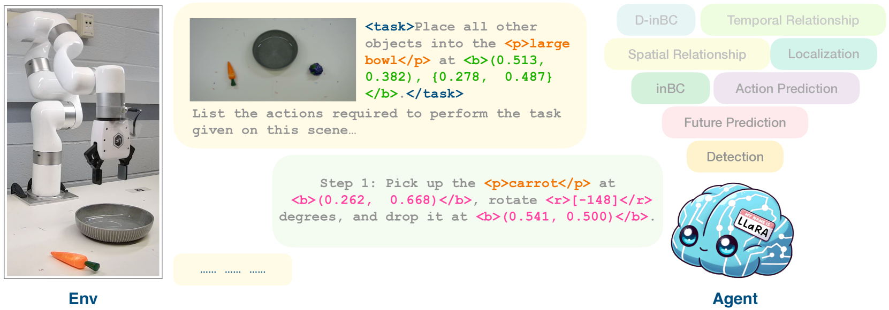

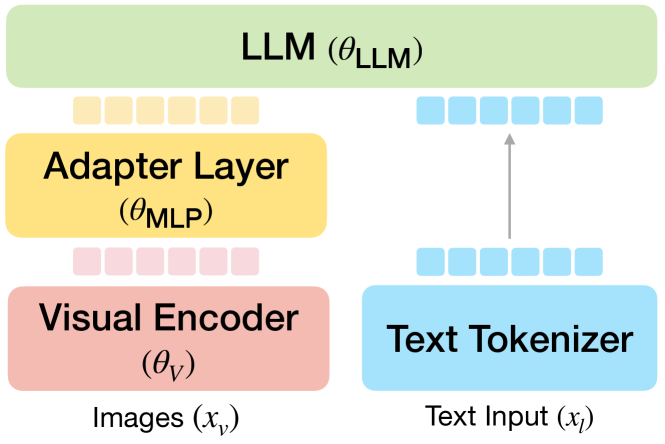

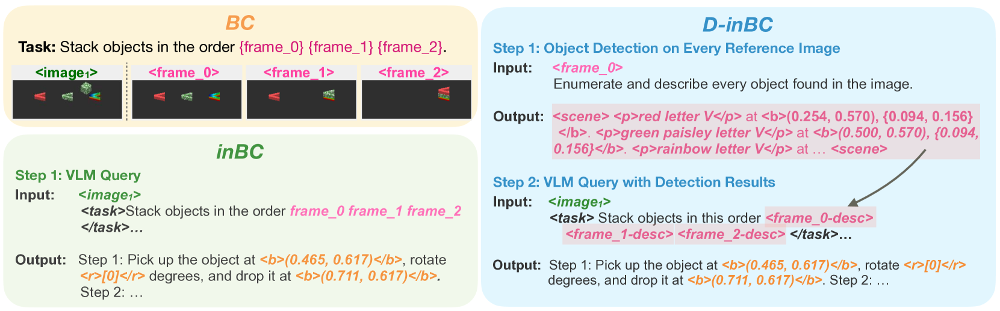

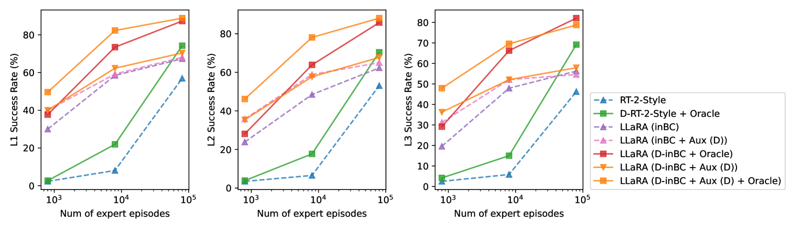

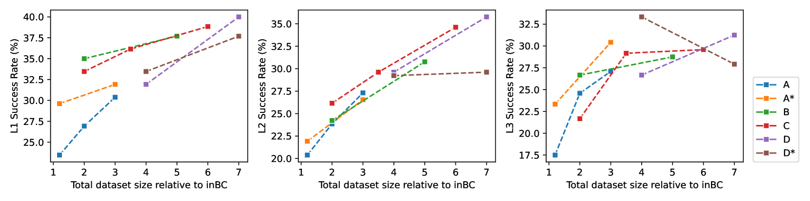

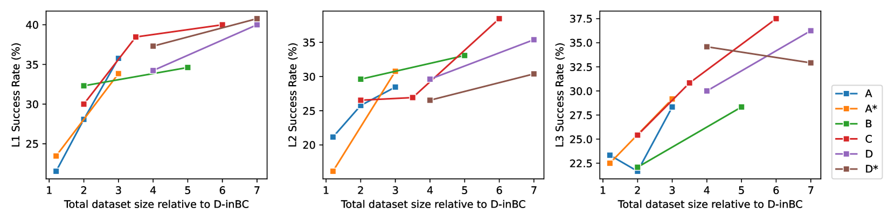

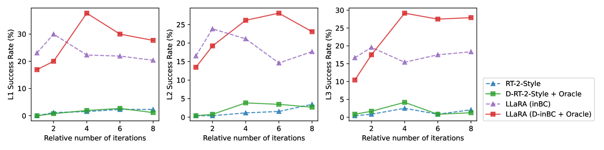

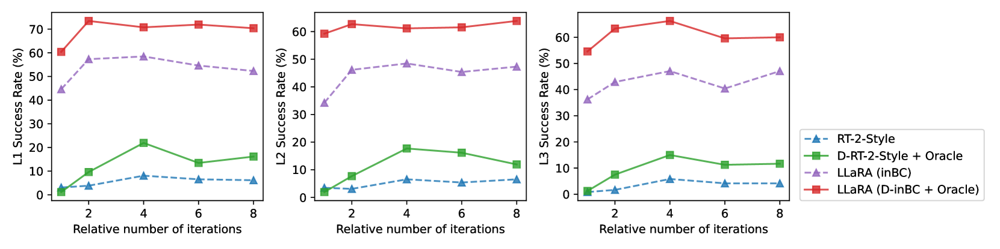

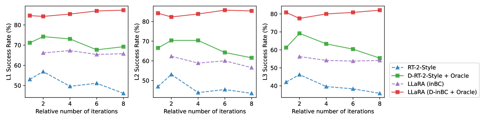

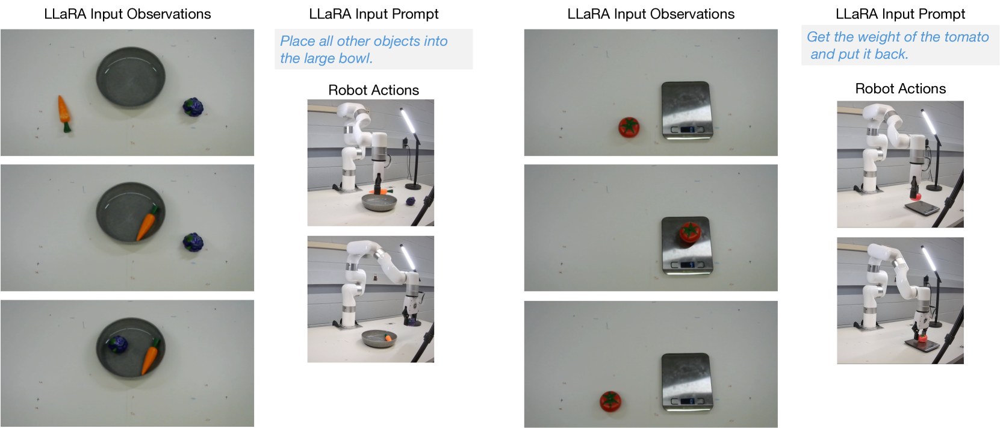

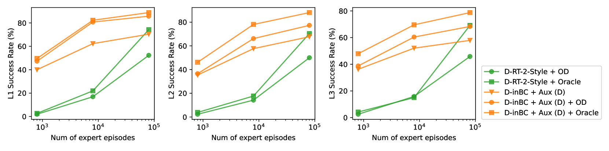

[Arxiv](https://arxiv.org/abs/2406.20095)