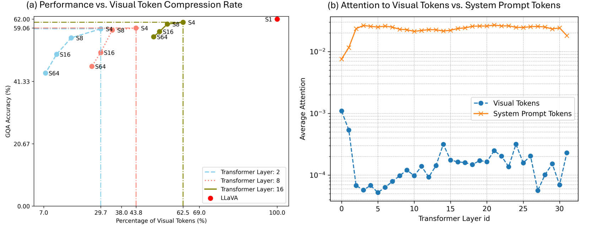
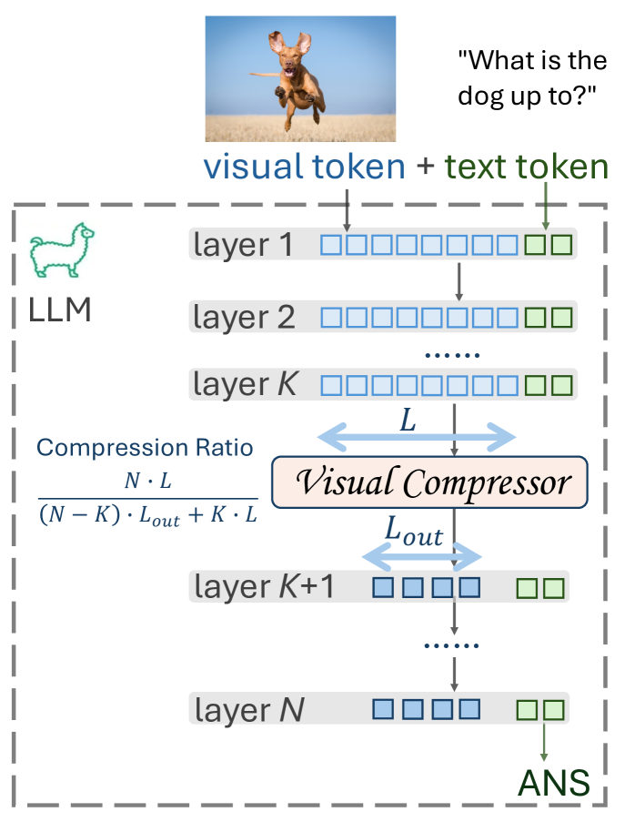
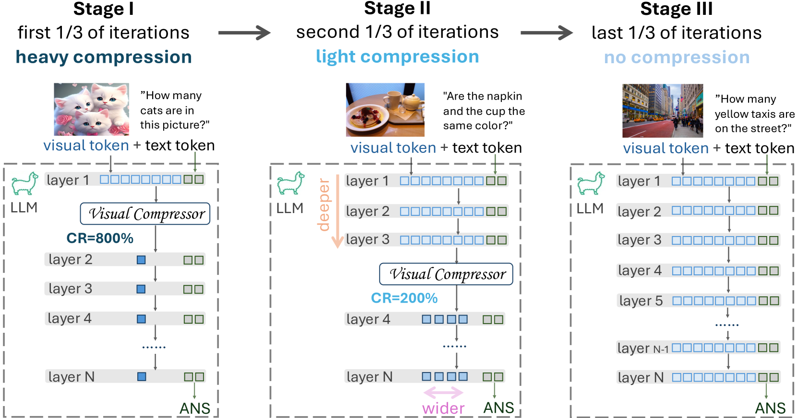

# LLaVolta：采用阶段式视觉上下文压缩技术，打造高效多模态模型。

发布时间：2024年06月28日

`LLM应用` `多模态学习` `计算机视觉`

> LLaVolta: Efficient Multi-modal Models via Stage-wise Visual Context Compression

# 摘要

> 尽管文本嵌入的压缩在大型语言模型中取得了显著进展，但视觉令牌的压缩在大型多模态模型中仍被忽视。我们研究发现，通过简单平均池化，测试阶段可消除高达70%的视觉令牌，仅轻微影响GQA基准上的视觉问答准确性，揭示了视觉上下文的冗余。为此，我们设计了视觉上下文压缩器，通过在训练中减少视觉令牌来提升效率，同时不损性能。为避免压缩导致的信息损失，我们创新了LLaVolta轻量训练方案，采用渐进式压缩，确保训练结束时无压缩，测试无信息丢失。实验证明，我们的方法不仅大幅降低训练成本，还显著提升了多模态模型在图像与视频语言理解上的性能。代码已公开在GitHub。

> While significant advancements have been made in compressed representations for text embeddings in large language models (LLMs), the compression of visual tokens in large multi-modal models (LMMs) has remained a largely overlooked area. In this work, we present the study on the analysis of redundancy concerning visual tokens and efficient training within these models. Our initial experiments show that eliminating up to 70% of visual tokens at the testing stage by simply average pooling only leads to a minimal 3% reduction in visual question answering accuracy on the GQA benchmark, indicating significant redundancy in visual context. Addressing this, we introduce Visual Context Compressor, which reduces the number of visual tokens during training to enhance training efficiency without sacrificing performance. To minimize information loss caused by the compression on visual tokens while maintaining training efficiency, we develop LLaVolta as a lite training scheme. LLaVolta incorporates stage-wise visual context compression to progressively compress the visual tokens from heavily to lightly, and finally no compression at the end of training, yielding no loss of information when testing. Extensive experiments demonstrate that our approach enhances the performance of MLLMs in both image-language and video-language understanding, while also significantly cutting training costs. Code is available at https://github.com/Beckschen/LLaVolta

[Arxiv](https://arxiv.org/abs/2406.20092)