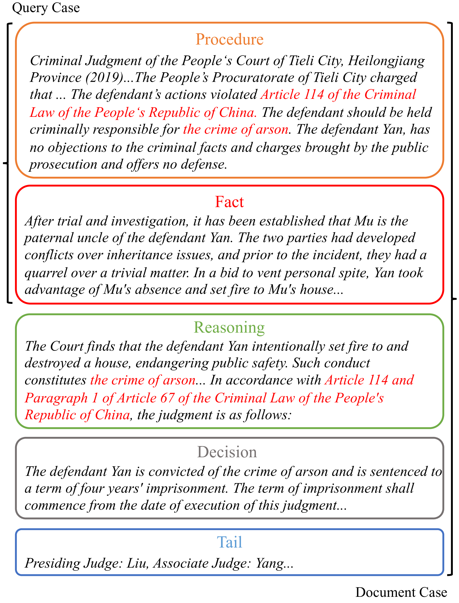
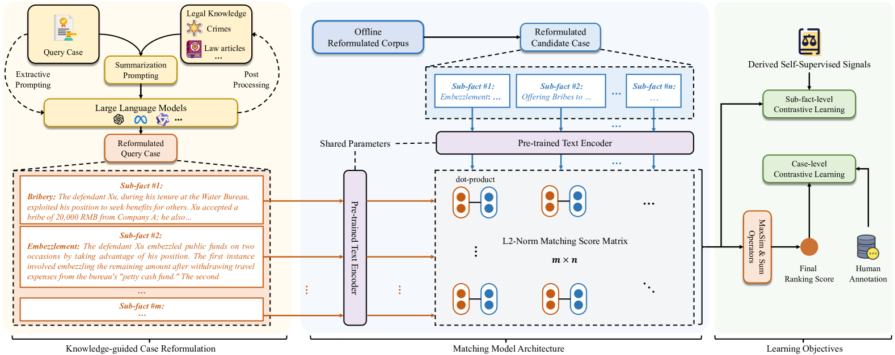
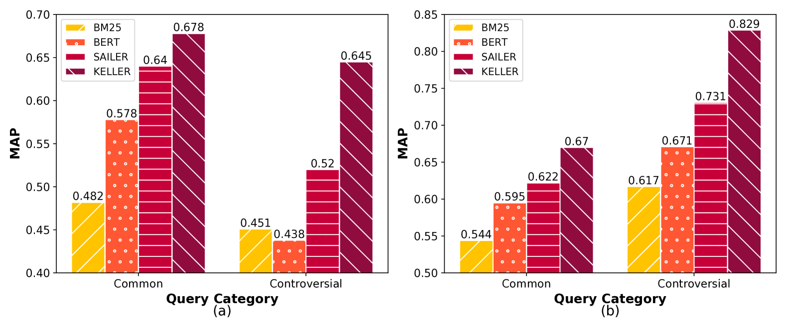
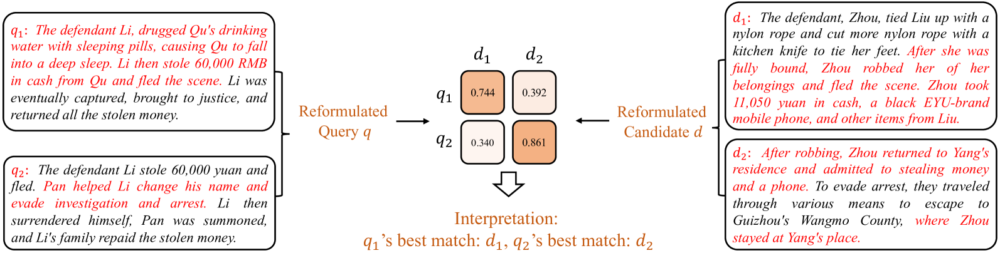
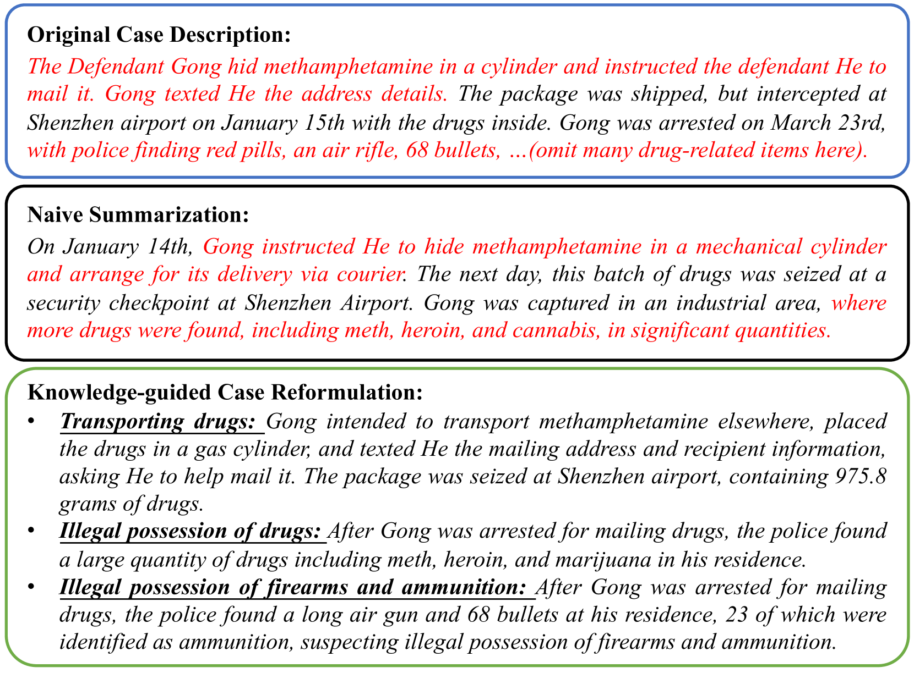
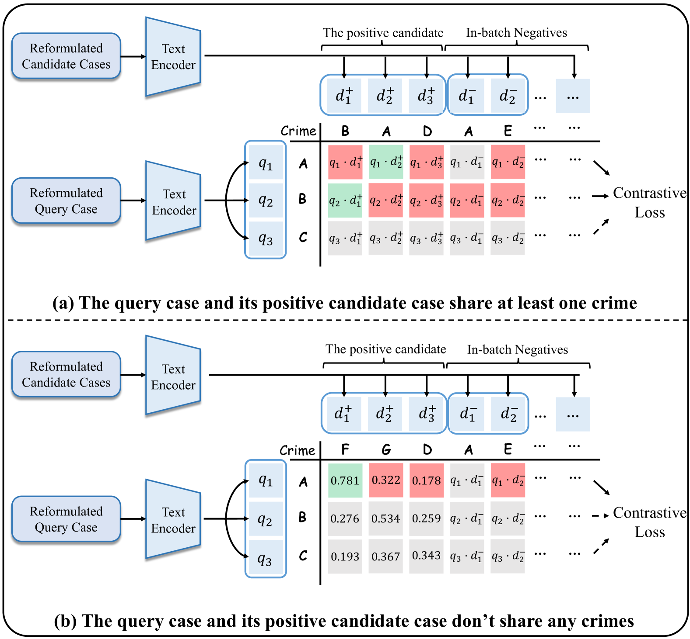
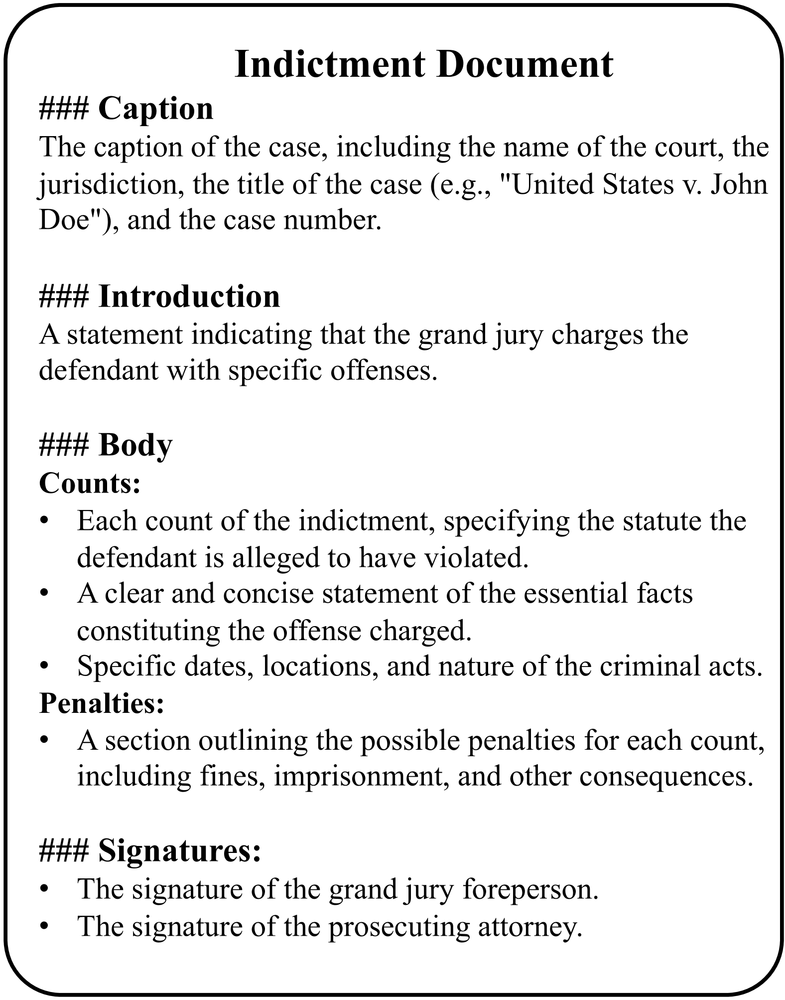
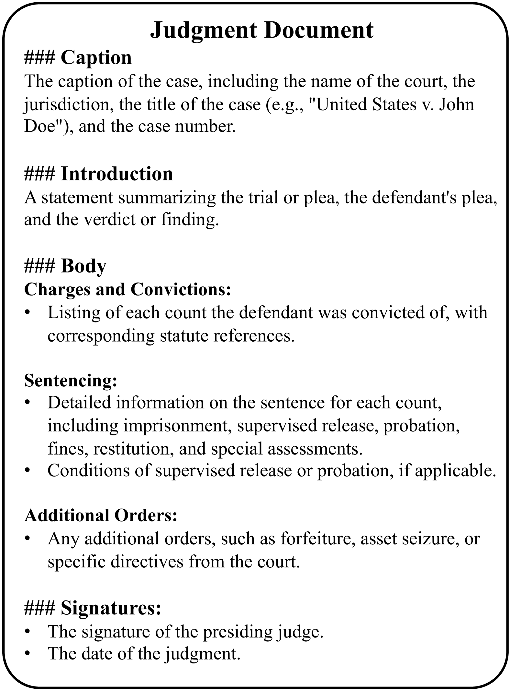

# 利用知识引导的案例重构，实现法律案例检索的可解释性学习

发布时间：2024年06月28日

`LLM应用`

> Learning Interpretable Legal Case Retrieval via Knowledge-Guided Case Reformulation

# 摘要

> 在维护司法公正中，法律案例检索至关重要。不同于普通网页搜索，法律案例检索需处理冗长、复杂的专业文件。现有方法常忽略法律专家知识的重要性，影响检索效果。本文提出KELLER，一种基于LLM的法律知识引导案例重构方法，通过整合专业法律知识，将案例精炼为关键子事实，显著提升检索性能和鲁棒性。实验证明，KELLER在复杂查询中表现卓越。

> Legal case retrieval for sourcing similar cases is critical in upholding judicial fairness. Different from general web search, legal case retrieval involves processing lengthy, complex, and highly specialized legal documents. Existing methods in this domain often overlook the incorporation of legal expert knowledge, which is crucial for accurately understanding and modeling legal cases, leading to unsatisfactory retrieval performance. This paper introduces KELLER, a legal knowledge-guided case reformulation approach based on large language models (LLMs) for effective and interpretable legal case retrieval. By incorporating professional legal knowledge about crimes and law articles, we enable large language models to accurately reformulate the original legal case into concise sub-facts of crimes, which contain the essential information of the case. Extensive experiments on two legal case retrieval benchmarks demonstrate superior retrieval performance and robustness on complex legal case queries of KELLER over existing methods.

[Arxiv](https://arxiv.org/abs/2406.19760)