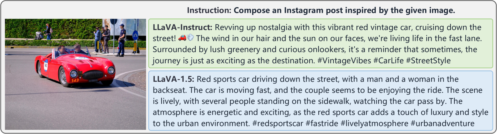

# MM-Instruct：打造视觉指令，助力大型多模态模型精准对齐

发布时间：2024年06月28日

`LLM应用` `人工智能` `计算机视觉`

> MM-Instruct: Generated Visual Instructions for Large Multimodal Model Alignment

# 摘要

> 本文推出 MM-Instruct，一个大规模、多样且高质量的视觉指令数据集，旨在提升大型多模态模型（LMMs）的指令遵循能力。现有视觉指令数据集多聚焦于问答，难以适应创意写作、摘要或图像分析等更广泛场景。为此，我们创新构建 MM-Instruct，借助现有 LLMs 的强大指令遵循能力，从传统图像字幕数据集中生成新视觉指令数据。MM-Instruct 先利用 ChatGPT 从小规模种子指令中自动生成多样化指令，再与图像匹配，并借助开源 LLM 生成连贯答案，确保指令数据一致性。此外，我们基于此数据集设立基准，评估 LMMs 的指令遵循能力。实验证明，基于 MM-Instruct 训练的 LLaVA-Instruct 模型在指令遵循能力上显著优于 LLaVA-1.5。MM-Instruct 数据集、基准及预训练模型已开放于 https://github.com/jihaonew/MM-Instruct。

> This paper introduces MM-Instruct, a large-scale dataset of diverse and high-quality visual instruction data designed to enhance the instruction-following capabilities of large multimodal models (LMMs). While existing visual instruction datasets often focus on question-answering, they struggle to generalize to broader application scenarios such as creative writing, summarization, or image analysis. To address these limitations, we propose a novel approach to constructing MM-Instruct that leverages the strong instruction-following capabilities of existing LLMs to generate novel visual instruction data from large-scale but conventional image captioning datasets. MM-Instruct first leverages ChatGPT to automatically generate diverse instructions from a small set of seed instructions through augmenting and summarization. It then matches these instructions with images and uses an open-sourced large language model (LLM) to generate coherent answers to the instruction-image pairs. The LLM is grounded by the detailed text descriptions of images in the whole answer generation process to guarantee the alignment of the instruction data. Moreover, we introduce a benchmark based on the generated instruction data to evaluate the instruction-following capabilities of existing LMMs. We demonstrate the effectiveness of MM-Instruct by training a LLaVA-1.5 model on the generated data, denoted as LLaVA-Instruct, which exhibits significant improvements in instruction-following capabilities compared to LLaVA-1.5 models. The MM-Instruct dataset, benchmark, and pre-trained models are available at https://github.com/jihaonew/MM-Instruct.

[Arxiv](https://arxiv.org/abs/2406.19736)