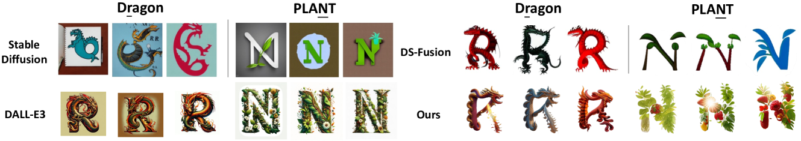
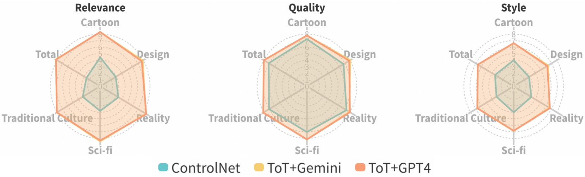

# MetaDesigner：借助 AI 技术，以用户为中心，实现多语言艺术字体的创新合成，推动字体艺术的进步。

发布时间：2024年06月28日

`Agent` `艺术设计` `用户体验`

> MetaDesigner: Advancing Artistic Typography through AI-Driven, User-Centric, and Multilingual WordArt Synthesis

# 摘要

> MetaDesigner 借助 LLM 的力量，创新了艺术字体设计，聚焦于提升用户参与度。其核心的多代理系统，包括 Pipeline、Glyph 和 Texture，共同打造出从语义到纹理都个性化的 WordArt。通过整合多模态模型和用户反馈的全面机制，MetaDesigner 不断优化设计，精准调整参数以贴合用户的风格与主题需求，创作出既符合又超越期待的视觉作品。实证显示，MetaDesigner 在多样化的 WordArt 应用中，始终如一地输出美观且贴合情境的成果。

> MetaDesigner revolutionizes artistic typography synthesis by leveraging the strengths of Large Language Models (LLMs) to drive a design paradigm centered around user engagement. At the core of this framework lies a multi-agent system comprising the Pipeline, Glyph, and Texture agents, which collectively enable the creation of customized WordArt, ranging from semantic enhancements to the imposition of complex textures. MetaDesigner incorporates a comprehensive feedback mechanism that harnesses insights from multimodal models and user evaluations to refine and enhance the design process iteratively. Through this feedback loop, the system adeptly tunes hyperparameters to align with user-defined stylistic and thematic preferences, generating WordArt that not only meets but exceeds user expectations of visual appeal and contextual relevance. Empirical validations highlight MetaDesigner's capability to effectively serve diverse WordArt applications, consistently producing aesthetically appealing and context-sensitive results.

[Arxiv](https://arxiv.org/abs/2406.19859)