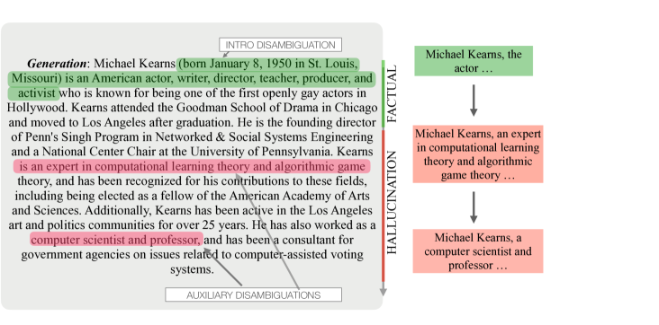

# 分子事实：LLM 事实验证中的去上下文化需求

发布时间：2024年06月28日

`LLM应用` `信息验证` `人工智能`

> Molecular Facts: Desiderata for Decontextualization in LLM Fact Verification

# 摘要

> 随着对抗幻觉的需求增加，大型语言模型生成的自动事实验证应用日益广泛。然而，事实检查的粒度问题成为研究焦点：大段文本难以验证，而过于细碎的事实又可能缺乏必要的上下文。本研究聚焦于原子事实中的上下文作用，提出“分子事实”概念，强调其独立性和信息量的最小化。通过量化分析和基准方法的开发，我们旨在找到信息量与验证准确性的最佳平衡点，为复杂情境下的自动事实验证提供新思路。

> Automatic factuality verification of large language model (LLM) generations is becoming more and more widely used to combat hallucinations. A major point of tension in the literature is the granularity of this fact-checking: larger chunks of text are hard to fact-check, but more atomic facts like propositions may lack context to interpret correctly. In this work, we assess the role of context in these atomic facts. We argue that fully atomic facts are not the right representation, and define two criteria for molecular facts: decontextuality, or how well they can stand alone, and minimality, or how little extra information is added to achieve decontexuality. We quantify the impact of decontextualization on minimality, then present a baseline methodology for generating molecular facts automatically, aiming to add the right amount of information. We compare against various methods of decontextualization and find that molecular facts balance minimality with fact verification accuracy in ambiguous settings.

[Arxiv](https://arxiv.org/abs/2406.20079)