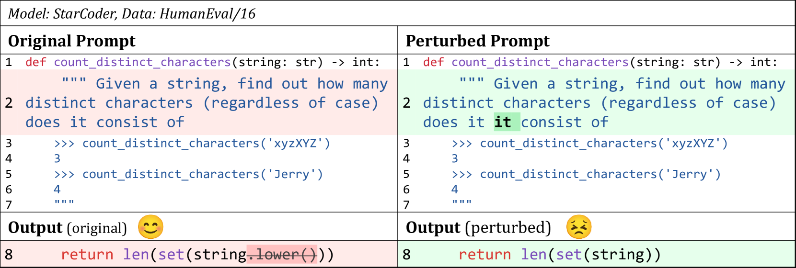
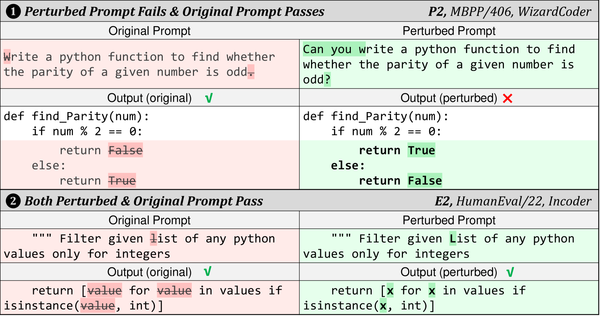

# NLPerturbator：探究代码 LLM 在自然语言变异中的稳健性

发布时间：2024年06月28日

`LLM应用` `软件开发` `人工智能`

> NLPerturbator: Studying the Robustness of Code LLMs to Natural Language Variations

# 摘要

> 大型语言模型（LLM）在根据自然语言描述生成代码方面表现出色，已广泛应用于开源和商业产品中，助力日常编程。然而，提示中的自然语言描述对模型理解用户意图至关重要，且模型对提示的微小变化极为敏感。现实中，这些描述常因格式、语法或用词不同而异。以往研究多基于随机扰动，但这些扰动在现实中未必发生。本文深入探讨了代码LLM在实际应用中对自然语言描述变化的鲁棒性，总结了18种扰动类型及3种组合，并提出了自动化框架NLPerturbator。实验表明，扰动提示可显著影响代码生成性能，凸显了提升LLM鲁棒性和精心设计提示的重要性。

> Large language models (LLMs) achieve promising results in code generation based on a given natural language description. They have been integrated into open-source projects and commercial products to facilitate daily coding activities. The natural language description in the prompt is crucial for LLMs to comprehend users' requirements. Prior studies uncover that LLMs are sensitive to the changes in the prompts, including slight changes that look inconspicuous. However, the natural language descriptions often vary in real-world scenarios (e.g., different formats, grammar, and wording). Prior studies on the robustness of LLMs are often based on random perturbations and such perturbations may not actually happen. In this paper, we conduct a comprehensive study to investigate how are code LLMs robust to variations of natural language description in real-world scenarios. We summarize 18 categories of perturbations of natural language and 3 combinations of co-occurred categories based on our literature review and an online survey with practitioners. We propose an automated framework, NLPerturbator, which can perform perturbations of each category given a set of prompts. Through a series of experiments on code generation using six code LLMs, we find that the perturbed prompts can decrease the performance of code generation by a considerable margin (e.g., up to 21.2%, and 4.8% to 6.1% on average). Our study highlights the importance of enhancing the robustness of LLMs to real-world variations in the prompts, as well as the essentiality of attentively constructing the prompts.

[Arxiv](https://arxiv.org/abs/2406.19783)