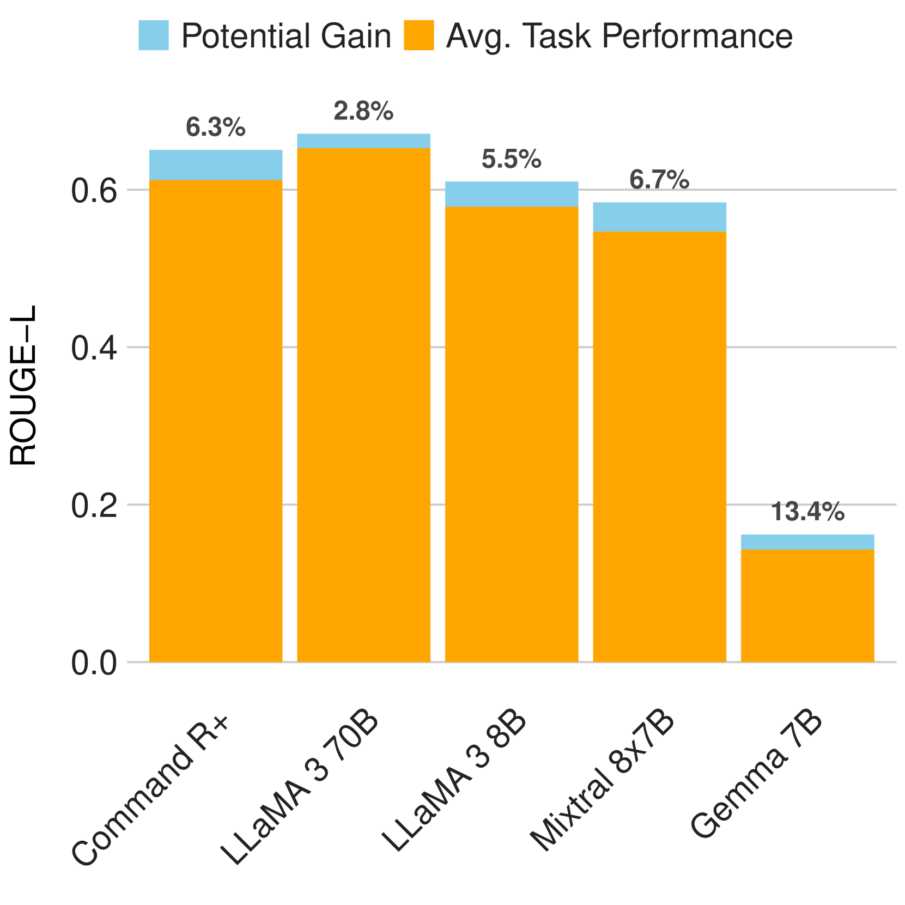
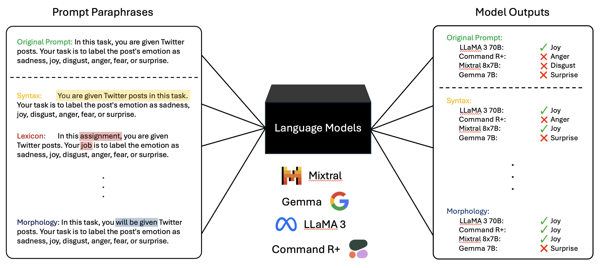
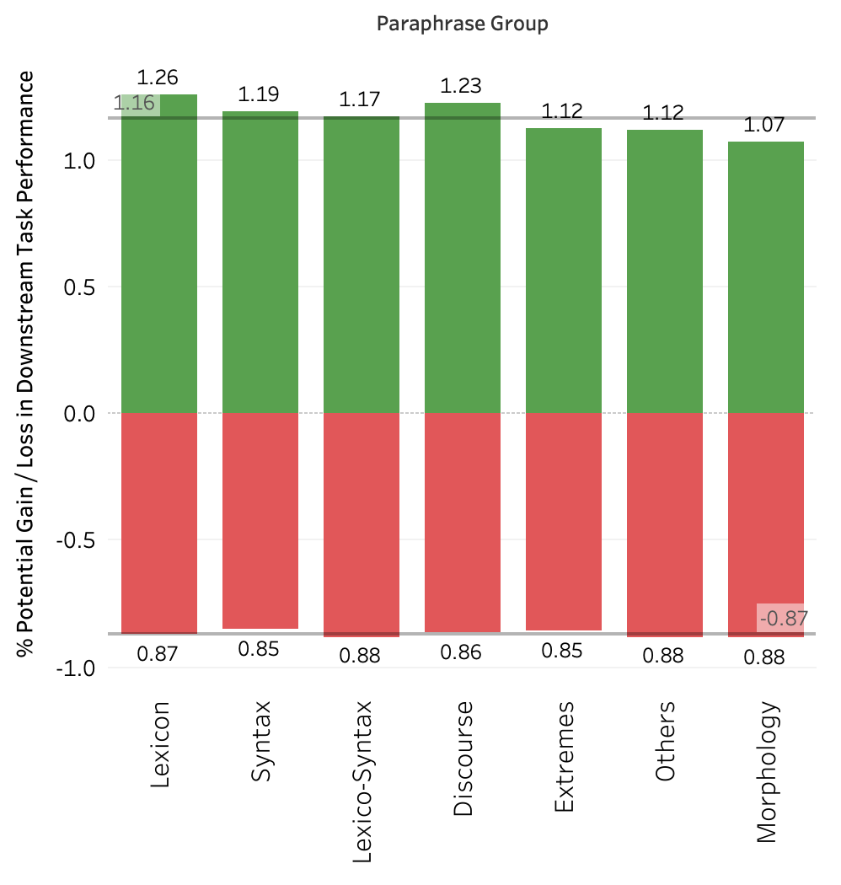
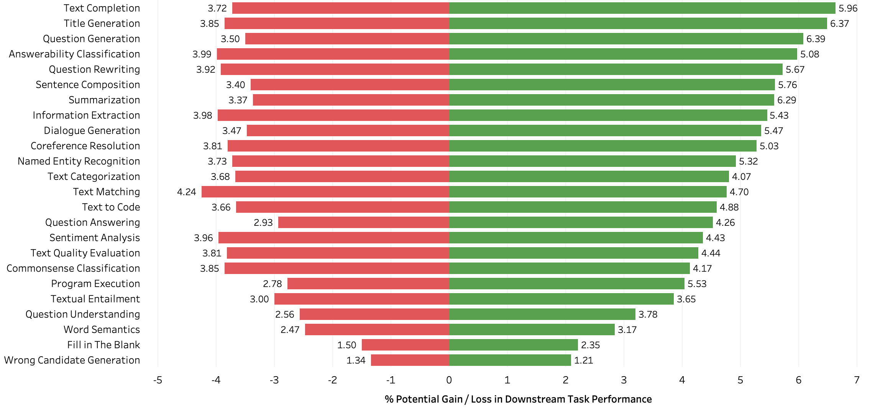
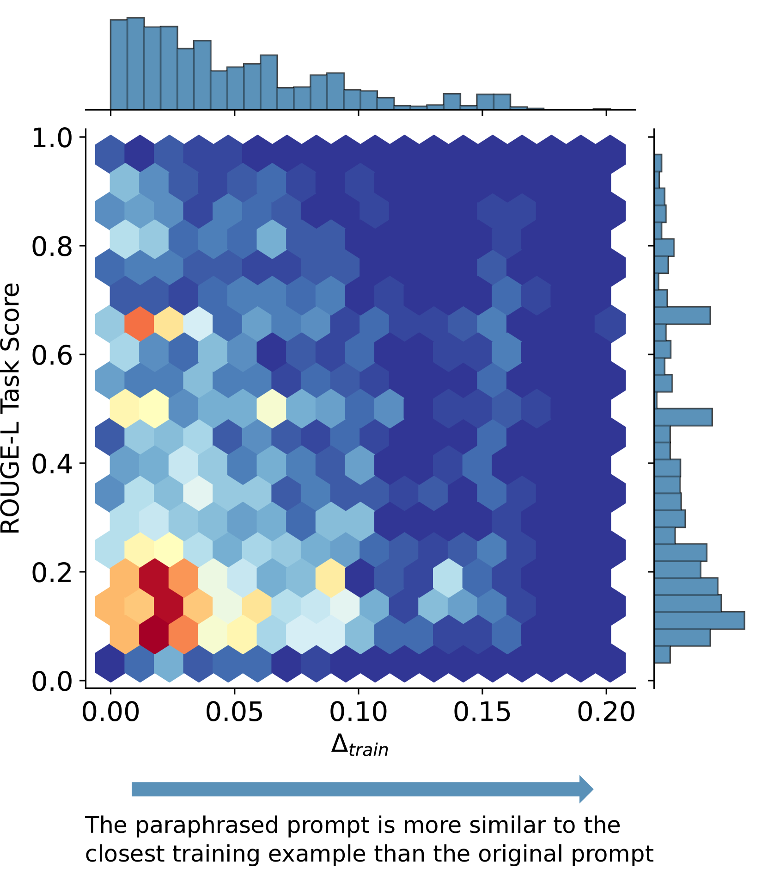
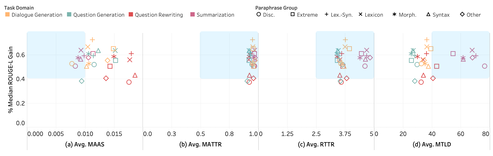
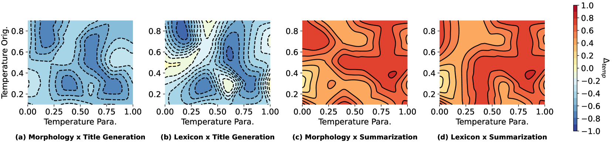
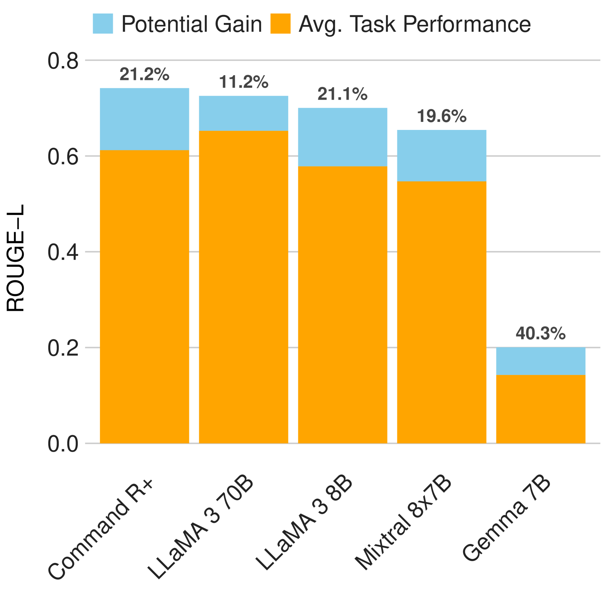
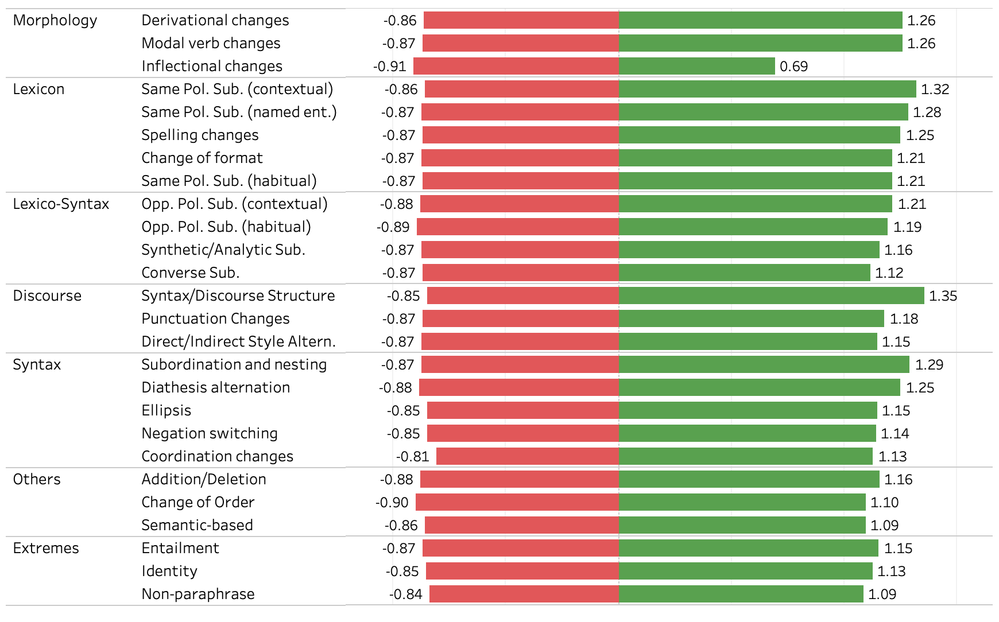
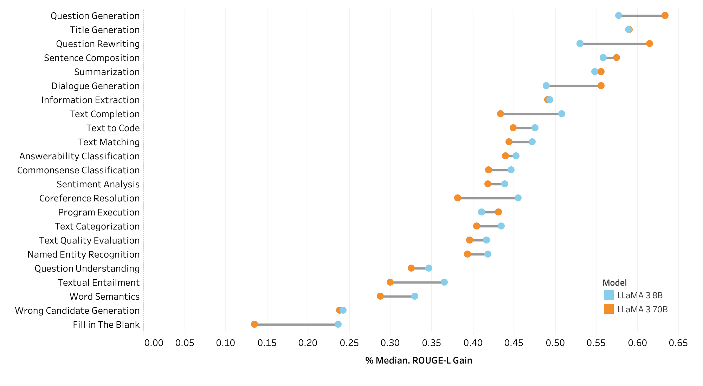

# 释义类型激发了提示工程的潜能

发布时间：2024年06月28日

`LLM理论` `人工智能`

> Paraphrase Types Elicit Prompt Engineering Capabilities

# 摘要

> 现代语言模型的成功很大程度上依赖于找到合适的提示来指导模型。然而，提示的语言表达变化如何影响模型至今仍是个谜。本研究通过分析120个任务和六种释义类型，系统地探索了语言特征对模型的影响。我们发现，当提示采用特定的释义类型时，模型性能有所提升，尤其是在形态学和词汇方面的变化。这些发现为构建更强大的语言模型提供了新思路，使其能更好地应对语言表达的多样性。

> Much of the success of modern language models depends on finding a suitable prompt to instruct the model. Until now, it has been largely unknown how variations in the linguistic expression of prompts affect these models. This study systematically and empirically evaluates which linguistic features influence models through paraphrase types, i.e., different linguistic changes at particular positions. We measure behavioral changes for five models across 120 tasks and six families of paraphrases (i.e., morphology, syntax, lexicon, lexico-syntax, discourse, and others). We also control for other prompt engineering factors (e.g., prompt length, lexical diversity, and proximity to training data). Our results show a potential for language models to improve tasks when their prompts are adapted in specific paraphrase types (e.g., 6.7% median gain in Mixtral 8x7B; 5.5% in LLaMA 3 8B). In particular, changes in morphology and lexicon, i.e., the vocabulary used, showed promise in improving prompts. These findings contribute to developing more robust language models capable of handling variability in linguistic expression.

[Arxiv](https://arxiv.org/abs/2406.19898)