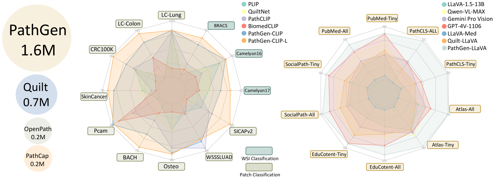
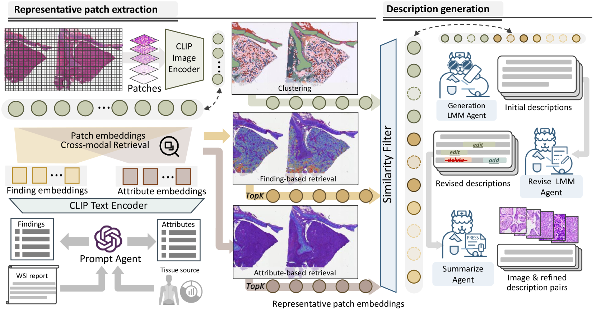
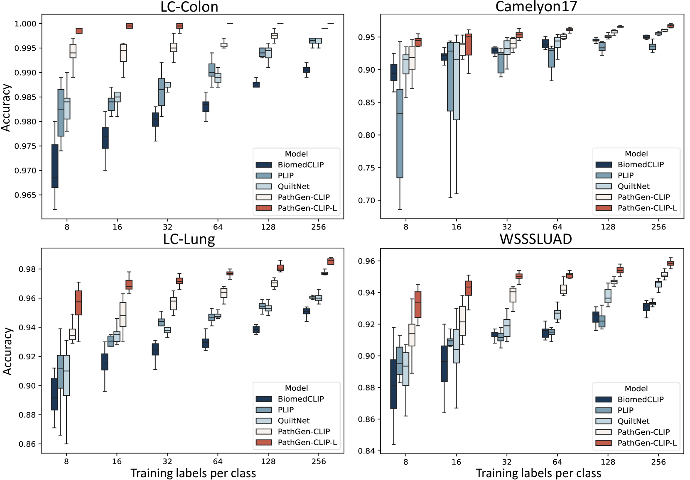

# PathGen-1.6M：借助多代理协作，成功生成160万对病理图像与文本。

发布时间：2024年06月28日

`LLM应用` `病理学`

> PathGen-1.6M: 1.6 Million Pathology Image-text Pairs Generation through Multi-agent Collaboration

# 摘要

> CLIP等视觉语言模型在病理学领域备受瞩目，不仅支撑着零-shot图像分类和全切片图像分析等应用，还能与大型语言模型结合，拓展更多功能。然而，现有病理学VLMs的训练数据多来自PubMed、YouTube和Twitter，数据量有限且质量参差不齐。我们通过利用TCGA等大规模WSI数据集，提取高质量图像块，并训练多模态模型生成标题，构建了PathGen-1.6M数据集，包含160万对高质量图像-标题。通过多代理模型协作，我们进一步提升了图像-文本对的质量。实验证明，结合这些高质量数据训练的PathGen-CLIP模型，在多项病理学图像分析任务中表现卓越。此外，我们还构建了20万条指令调优数据，将PathGen-CLIP与Vicuna LLM结合，通过指令调优提升多模态模型的性能。这一研究不仅为病理学领域提供了高质量数据生成的可扩展途径，也为未来通用病理学模型的发展奠定了基础。

> Vision Language Models (VLMs) like CLIP have attracted substantial attention in pathology, serving as backbones for applications such as zero-shot image classification and Whole Slide Image (WSI) analysis. Additionally, they can function as vision encoders when combined with large language models (LLMs) to support broader capabilities. Current efforts to train pathology VLMs rely on pathology image-text pairs from platforms like PubMed, YouTube, and Twitter, which provide limited, unscalable data with generally suboptimal image quality. In this work, we leverage large-scale WSI datasets like TCGA to extract numerous high-quality image patches. We then train a large multimodal model to generate captions for these images, creating PathGen-1.6M, a dataset containing 1.6 million high-quality image-caption pairs. Our approach involves multiple agent models collaborating to extract representative WSI patches, generating and refining captions to obtain high-quality image-text pairs. Extensive experiments show that integrating these generated pairs with existing datasets to train a pathology-specific CLIP model, PathGen-CLIP, significantly enhances its ability to analyze pathological images, with substantial improvements across nine pathology-related zero-shot image classification tasks and three whole-slide image tasks. Furthermore, we construct 200K instruction-tuning data based on PathGen-1.6M and integrate PathGen-CLIP with the Vicuna LLM to create more powerful multimodal models through instruction tuning. Overall, we provide a scalable pathway for high-quality data generation in pathology, paving the way for next-generation general pathology models.

[Arxiv](https://arxiv.org/abs/2407.00203)