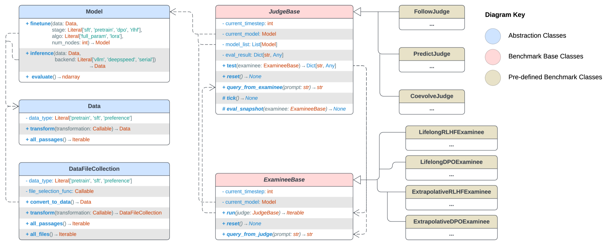

# ProgressGym：与千年道德进步的同步发展

发布时间：2024年06月28日

`LLM理论` `人工智能` `道德伦理`

> ProgressGym: Alignment with a Millennium of Moral Progress

# 摘要

> 前沿AI系统，尤其是大型语言模型（LLMs），正日益影响人类用户的认识论。这种影响可能强化社会主流价值观，甚至可能导致错误道德信念的固化，进而广泛延续有问题的道德实践。为应对这一风险，我们提出了“进步对齐”技术方案。该方案通过学习人类道德进步的机制，有效解决了现有对齐方法对当代道德盲点的敏感问题。为推动这一研究，我们开发了ProgressGym实验框架，该框架允许从历史中学习道德进步机制，助力未来现实世界道德决策的进步。通过整合9个世纪的历史文本和18个历史LLMs，ProgressGym将现实世界的进步对齐挑战具体化为基准。我们特别提出了三个核心挑战：跟踪价值演变（PG-Follow），预先预测道德进步（PG-Predict），以及调节人类与AI价值转变间的反馈回路（PG-Coevolve）。针对这些挑战，我们提出了终身学习和外推算法作为基线方法，并设立了一个开放的排行榜，征集创新算法和挑战。ProgressGym框架和排行榜详情可分别访问https://github.com/PKU-Alignment/ProgressGym和https://huggingface.co/spaces/PKU-Alignment/ProgressGym-LeaderBoard。

> Frontier AI systems, including large language models (LLMs), hold increasing influence over the epistemology of human users. Such influence can reinforce prevailing societal values, potentially contributing to the lock-in of misguided moral beliefs and, consequently, the perpetuation of problematic moral practices on a broad scale. We introduce progress alignment as a technical solution to mitigate this imminent risk. Progress alignment algorithms learn to emulate the mechanics of human moral progress, thereby addressing the susceptibility of existing alignment methods to contemporary moral blindspots. To empower research in progress alignment, we introduce ProgressGym, an experimental framework allowing the learning of moral progress mechanics from history, in order to facilitate future progress in real-world moral decisions. Leveraging 9 centuries of historical text and 18 historical LLMs, ProgressGym enables codification of real-world progress alignment challenges into concrete benchmarks. Specifically, we introduce three core challenges: tracking evolving values (PG-Follow), preemptively anticipating moral progress (PG-Predict), and regulating the feedback loop between human and AI value shifts (PG-Coevolve). Alignment methods without a temporal dimension are inapplicable to these tasks. In response, we present lifelong and extrapolative algorithms as baseline methods of progress alignment, and build an open leaderboard soliciting novel algorithms and challenges. The framework and the leaderboard are available at https://github.com/PKU-Alignment/ProgressGym and https://huggingface.co/spaces/PKU-Alignment/ProgressGym-LeaderBoard respectively.

[Arxiv](https://arxiv.org/abs/2406.20087)