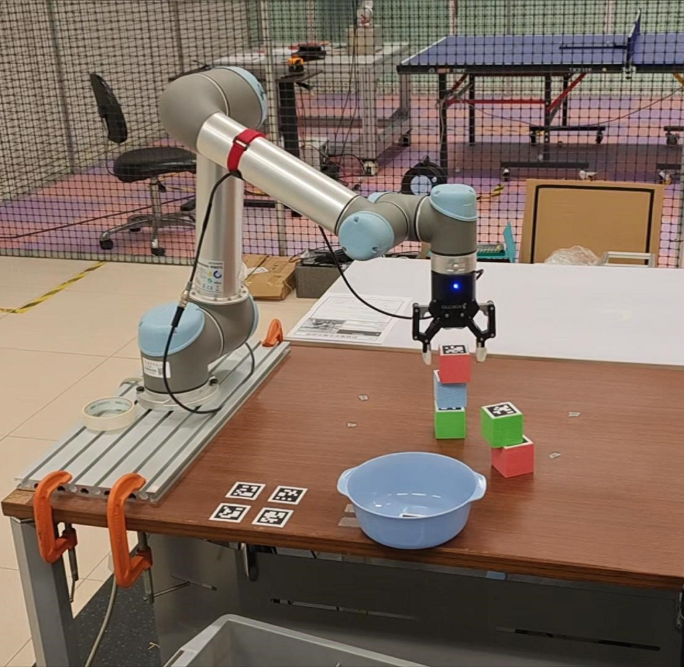
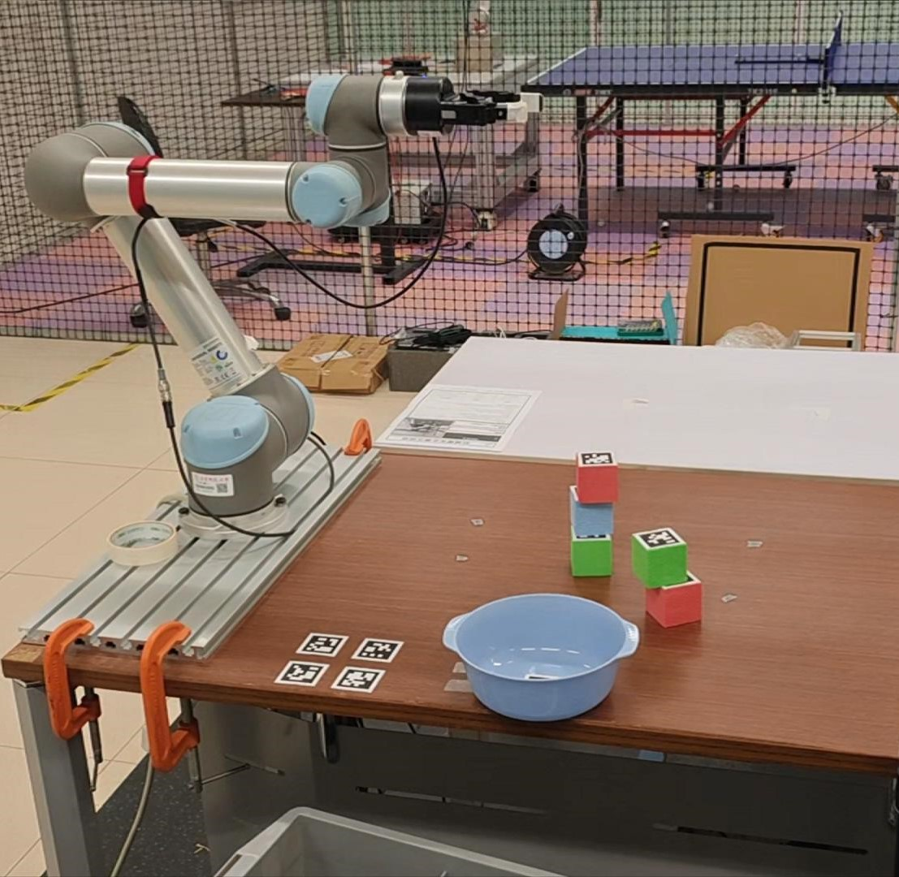
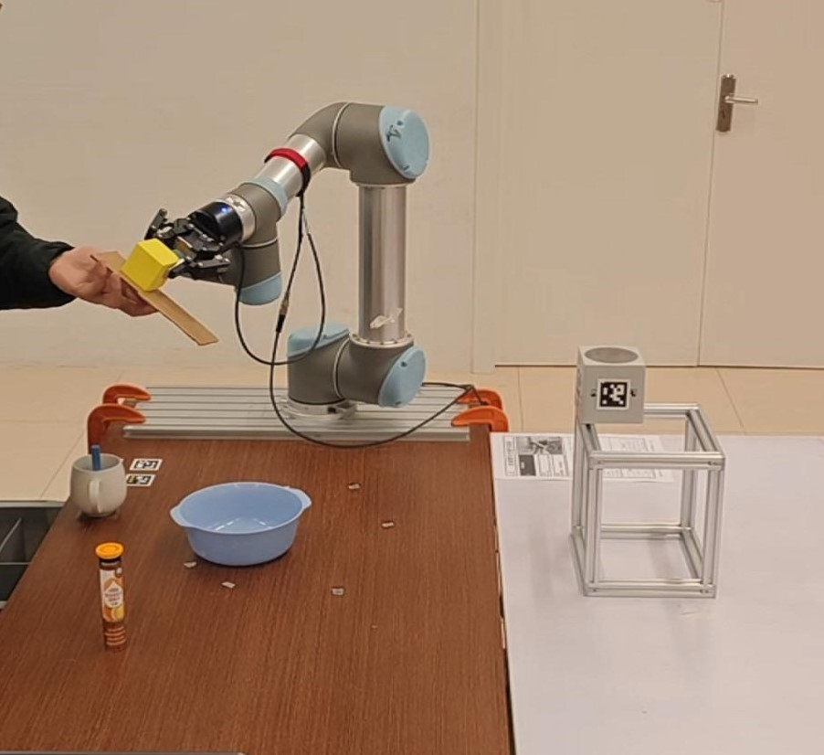

# ROS-LLM：一款集任务反馈与结构化推理于一体的具身AI ROS框架

发布时间：2024年06月28日

`Agent` `机器人技术` `人工智能`

> ROS-LLM: A ROS framework for embodied AI with task feedback and structured reasoning

# 摘要

> 我们开发了一个直观的机器人编程框架，让非专业人士也能轻松上手，通过自然语言提示和ROS的上下文信息来实现。该系统融合了大型语言模型（LLMs），用户只需通过聊天界面描述任务需求。框架亮点包括：ROS与AI代理的结合，后者连接了丰富的开源和商业LLMs；自动从LLM输出中提炼行为并执行ROS指令；支持序列、行为树和状态机三种行为模式；通过模仿学习扩充机器人动作库；以及基于人机环境反馈的LLM自我反思。经过广泛测试，该框架在长时任务、桌面整理和远程监控等多种场景中表现出色，兼具鲁棒性、可扩展性和灵活性。为推动应用和结果复现，我们已将代码公开，详情请访问：https://github.com/huawei-noah/HEBO/tree/master/ROSLLM。

> We present a framework for intuitive robot programming by non-experts, leveraging natural language prompts and contextual information from the Robot Operating System (ROS). Our system integrates large language models (LLMs), enabling non-experts to articulate task requirements to the system through a chat interface. Key features of the framework include: integration of ROS with an AI agent connected to a plethora of open-source and commercial LLMs, automatic extraction of a behavior from the LLM output and execution of ROS actions/services, support for three behavior modes (sequence, behavior tree, state machine), imitation learning for adding new robot actions to the library of possible actions, and LLM reflection via human and environment feedback. Extensive experiments validate the framework, showcasing robustness, scalability, and versatility in diverse scenarios, including long-horizon tasks, tabletop rearrangements, and remote supervisory control. To facilitate the adoption of our framework and support the reproduction of our results, we have made our code open-source. You can access it at: https://github.com/huawei-noah/HEBO/tree/master/ROSLLM.

[Arxiv](https://arxiv.org/abs/2406.19741)