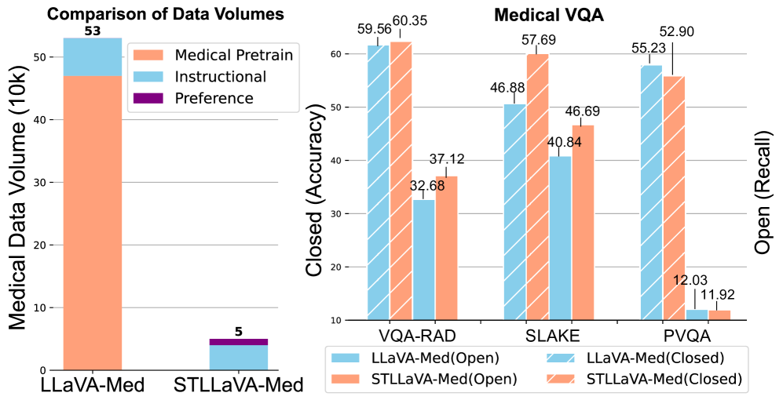
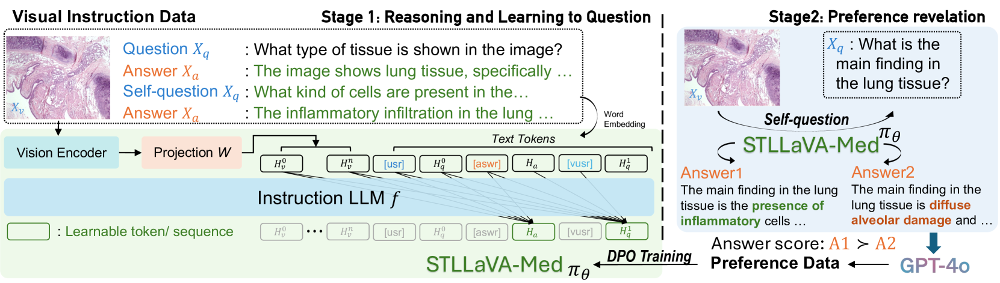
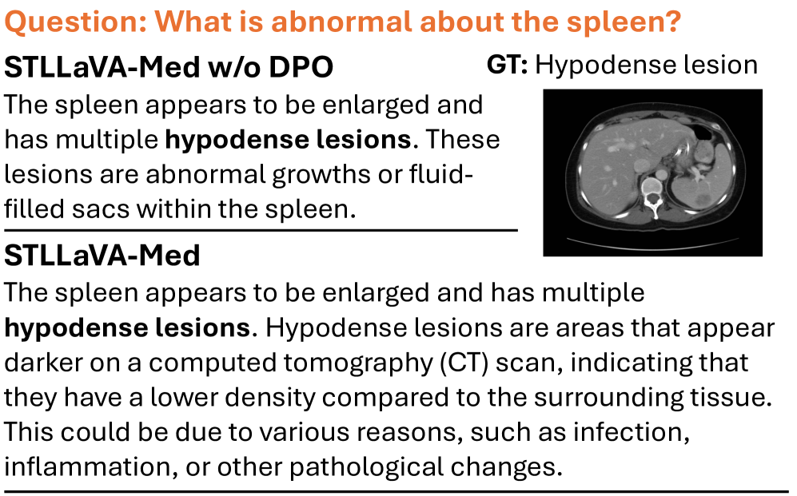
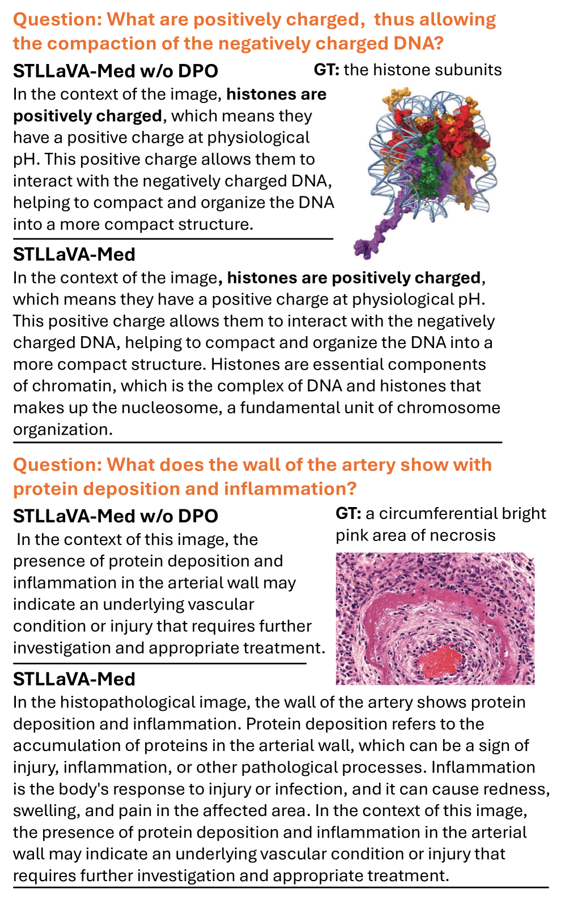
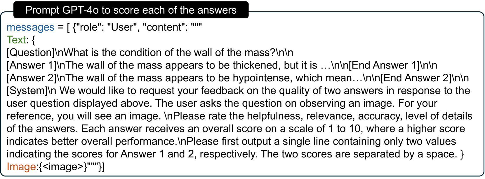
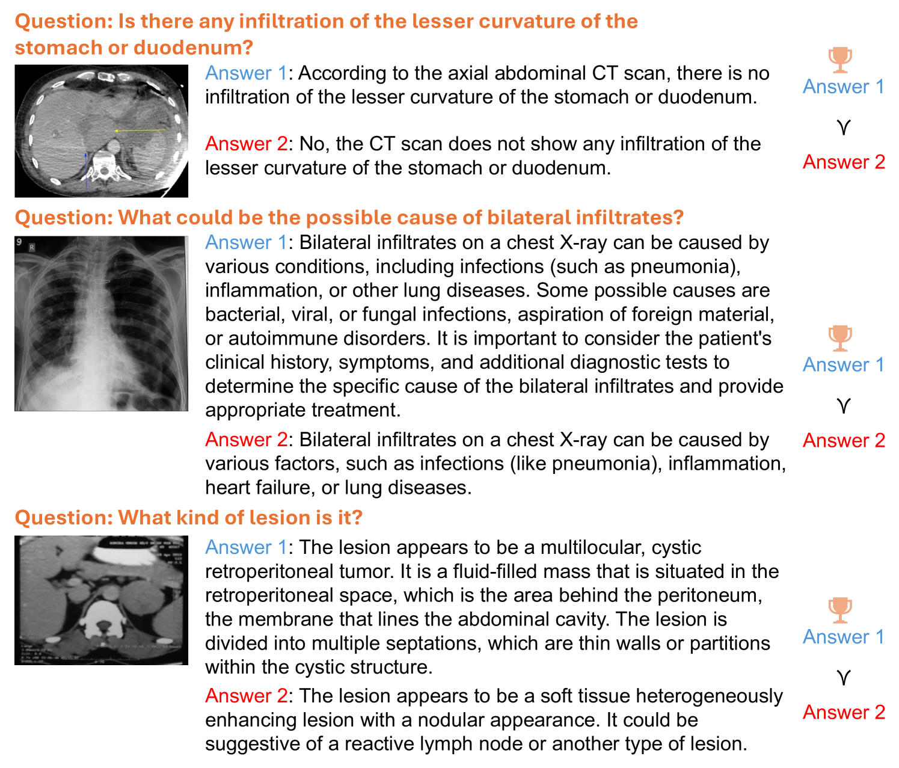

# STLLaVA-Med：医学领域的自训练大型语言与视觉助手

发布时间：2024年06月28日

`LLM应用` `人工智能`

> STLLaVA-Med: Self-Training Large Language and Vision Assistant for Medical

# 摘要

> 大型视觉-语言模型 (LVLMs) 在辅助医疗诊断方面潜力巨大，但医疗图像理解和推理的进步依赖于高质量视觉指导数据的构建，这在医疗领域尤为昂贵且劳动密集。为此，我们推出了自训练大型语言与视觉助手用于医疗 (STLLaVA-Med)，旨在通过直接偏好优化 (DPO) 引导，训练策略模型自动生成医疗视觉指导数据，提高数据效率。我们引入更强大的 LVLM (如 GPT-4o) 作为生物医学专家，监督策略模型与人类偏好高效对齐。实验证明，STLLaVA-Med 在三大医疗 VQA 基准上表现优异，仅用 9% 的医疗数据即展现出竞争性的零-shot 性能。

> Large Vision-Language Models (LVLMs) have shown significant potential in assisting medical diagnosis by leveraging extensive biomedical datasets. However, the advancement of medical image understanding and reasoning critically depends on building high-quality visual instruction data, which is costly and labor-intensive to obtain, particularly in the medical domain. To mitigate this data-starving issue, we introduce Self-Training Large Language and Vision Assistant for Medical (STLLaVA-Med). The proposed method is designed to train a policy model (an LVLM) capable of auto-generating medical visual instruction data to improve data efficiency, guided through Direct Preference Optimization (DPO). Specifically, a more powerful and larger LVLM (e.g., GPT-4o) is involved as a biomedical expert to oversee the DPO fine-tuning process on the auto-generated data, encouraging the policy model to align efficiently with human preferences. We validate the efficacy and data efficiency of STLLaVA-Med across three major medical Visual Question Answering (VQA) benchmarks, demonstrating competitive zero-shot performance with the utilization of only 9% of the medical data.

[Arxiv](https://arxiv.org/abs/2406.19973)