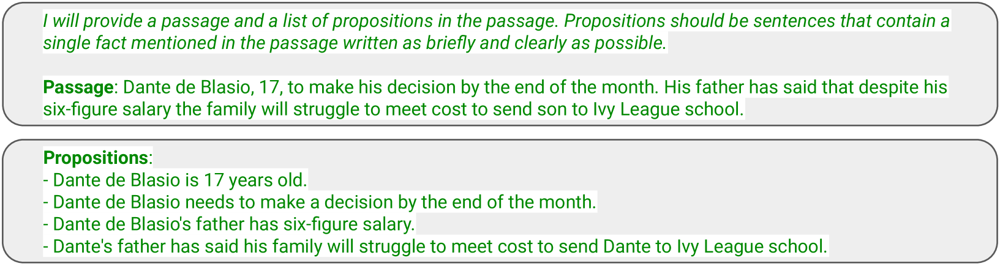
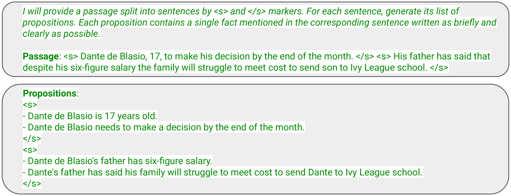

# 可扩展且跨领域的抽象命题分割技术

发布时间：2024年06月28日

`LLM应用` `人工智能`

> Scalable and Domain-General Abstractive Proposition Segmentation

# 摘要

> 细粒度文本分割对NLP应用至关重要，但传统的句子分割常显不足。我们专注于抽象命题分割，旨在将文本转化为简洁、自包含的句子。尽管近期研究显示命题分割在下游任务中的潜力，但其扩展性和完整性仍有限。本文中，我们首先定义了评估指标，随后提出了一种高效且可扩展的命题分割模型。通过监督学习，我们在注释数据集上训练LLM，显著提升性能。此外，我们利用微调LLM生成大量合成数据，训练小型模型，实现相似效果。实验证明，该技术在未见领域同样有效。最后，我们提供了一个便捷的API，助力NLP实践。

> Segmenting text into fine-grained units of meaning is important to a wide range of NLP applications. The default approach of segmenting text into sentences is often insufficient, especially since sentences are usually complex enough to include multiple units of meaning that merit separate treatment in the downstream task. We focus on the task of abstractive proposition segmentation: transforming text into simple, self-contained, well-formed sentences. Several recent works have demonstrated the utility of proposition segmentation with few-shot prompted LLMs for downstream tasks such as retrieval-augmented grounding and fact verification. However, this approach does not scale to large amounts of text and may not always extract all the facts from the input text. In this paper, we first introduce evaluation metrics for the task to measure several dimensions of quality. We then propose a scalable, yet accurate, proposition segmentation model. We model proposition segmentation as a supervised task by training LLMs on existing annotated datasets and show that training yields significantly improved results. We further show that by using the fine-tuned LLMs as teachers for annotating large amounts of multi-domain synthetic distillation data, we can train smaller student models with results similar to the teacher LLMs. We then demonstrate that our technique leads to effective domain generalization, by annotating data in two domains outside the original training data and evaluating on them. Finally, as a key contribution of the paper, we share an easy-to-use API for NLP practitioners to use.

[Arxiv](https://arxiv.org/abs/2406.19803)