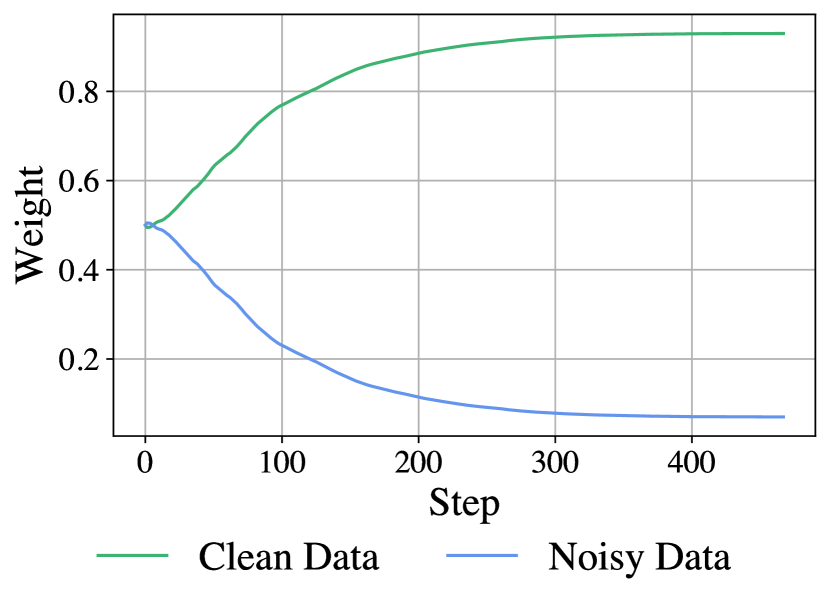
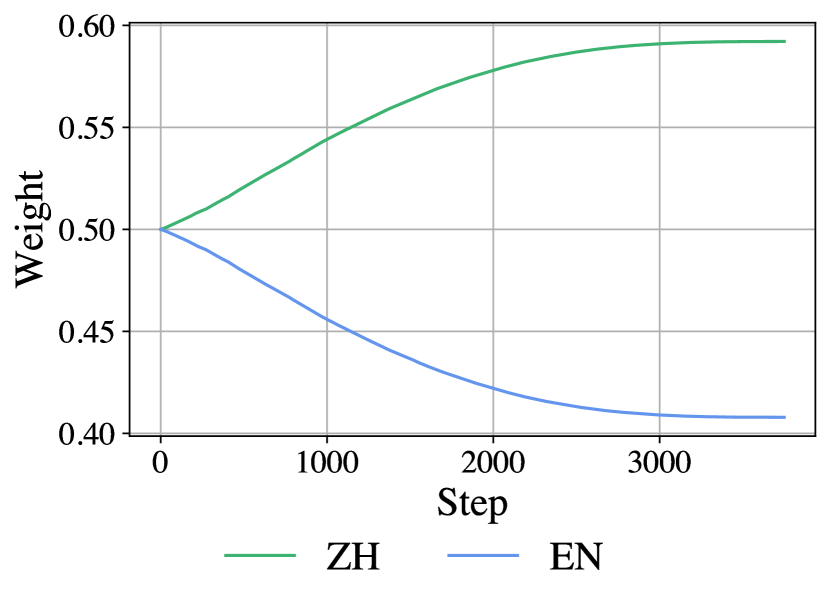
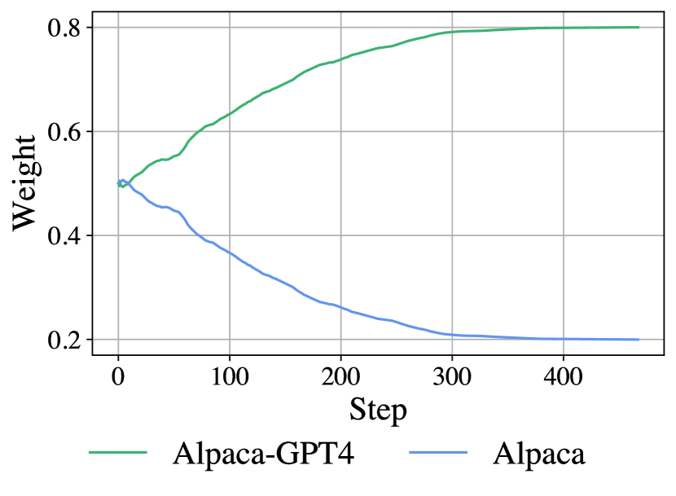
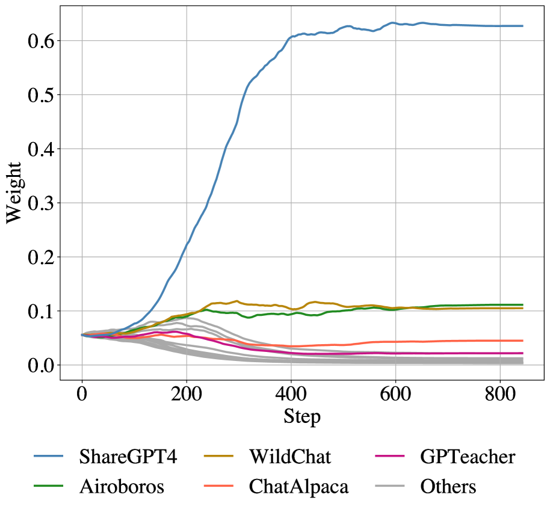

# ScaleBiO：为 LLM 数据重加权提供可扩展的双层优化方案

发布时间：2024年06月28日

`LLM应用` `机器学习` `大规模数据处理`

> ScaleBiO: Scalable Bilevel Optimization for LLM Data Reweighting

# 摘要

> 双层优化在机器学习领域展现出广泛应用，但多数算法依赖二阶信息，限制了其扩展性。近期，一阶算法范式崭露头角，有效应对双层优化挑战。本文首创可扩展实例ScaleBiO，聚焦于大规模LLM数据重权重的双层优化。结合高效训练技术LISA，新算法在八块A40 GPU上成功扩展至340亿参数LLM，首次在实际场景中应用双层优化。实证实验表明，ScaleBiO对不同规模模型如GPT-2、LLaMA-3-8B、GPT-NeoX-20B和Yi-34B均有效，成功筛选关键数据。理论层面，ScaleBiO确保数据权重最优，并提供与传统一阶范式相匹配的收敛保证，适用于平滑且强凸目标函数。

> Bilevel optimization has shown its utility across various machine learning settings, yet most algorithms in practice require second-order information, making it challenging to scale them up. Only recently, a paradigm of first-order algorithms emerged, capable of effectively addressing bilevel optimization problems. Nevertheless, the practical efficiency of this paradigm remains unverified, particularly in the context of large language models (LLMs). This paper introduces the first scalable instantiation of this paradigm called ScaleBiO, focusing on bilevel optimization for large-scale LLM data reweighting. By combining with a recently proposed memory-efficient training technique called LISA, our novel algorithm allows the paradigm to scale to 34-billion-parameter LLMs on eight A40 GPUs, marking the first successful application of bilevel optimization under practical scenarios for large-sized LLMs. Empirically, extensive experiments on data reweighting verify the effectiveness of ScaleBiO for different-scaled models, including GPT-2, LLaMA-3-8B, GPT-NeoX-20B, and Yi-34B, where bilevel optimization succeeds in filtering irrelevant data samples and selecting informative samples. Theoretically, ScaleBiO ensures the optimality of the learned data weights, along with a convergence guarantee matching the conventional first-order bilevel optimization paradigm on smooth and strongly convex objectives.

[Arxiv](https://arxiv.org/abs/2406.19976)