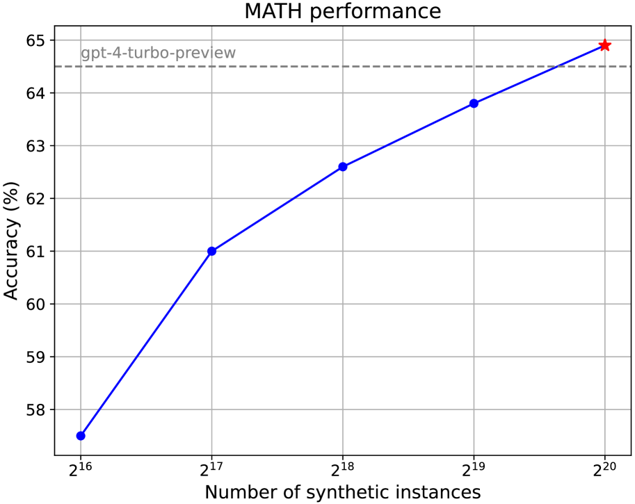

# 利用十亿个人设扩展合成数据生成

发布时间：2024年06月28日

`LLM应用` `人工智能` `数据科学`

> Scaling Synthetic Data Creation with 1,000,000,000 Personas

# 摘要

> 我们创新性地提出了一种基于人格驱动的数据合成方法，该方法通过大型语言模型（LLM）中的多重视角，生成多样化的合成数据。为了实现这一方法的大规模应用，我们创建了Persona Hub，这是一个包含10亿多样化人格的集合，这些人格从网络数据中自动筛选而来，相当于世界人口的13%。这些人格作为知识的分布式载体，能够触及LLM中的几乎所有视角，从而助力大规模多样化合成数据的生成，广泛适用于各种场景。通过实例展示Persona Hub在生成高质量数学和逻辑问题、用户指令、知识密集型文本、游戏角色和工具等方面的大规模应用，我们证实了基于人格的数据合成方法的多功能性、可扩展性、灵活性和易用性，有望引领合成数据领域的范式变革，对LLM的研究与开发产生深远影响。

> 
Abstract:We propose a novel persona-driven data synthesis methodology that leverages various perspectives within a large language model (LLM) to create diverse synthetic data. To fully exploit this methodology at scale, we introduce Persona Hub -- a collection of 1 billion diverse personas automatically curated from web data. These 1 billion personas (~13% of the world's total population), acting as distributed carriers of world knowledge, can tap into almost every perspective encapsulated within the LLM, thereby facilitating the creation of diverse synthetic data at scale for various scenarios. By showcasing Persona Hub's use cases in synthesizing high-quality mathematical and logical reasoning problems, instructions (i.e., user prompts), knowledge-rich texts, game NPCs and tools (functions) at scale, we demonstrate persona-driven data synthesis is versatile, scalable, flexible, and easy to use, potentially driving a paradigm shift in synthetic data creation and applications in practice, which may have a profound impact on LLM research and development.
    

[Arxiv](https://arxiv.org//pdf/2406.20094)