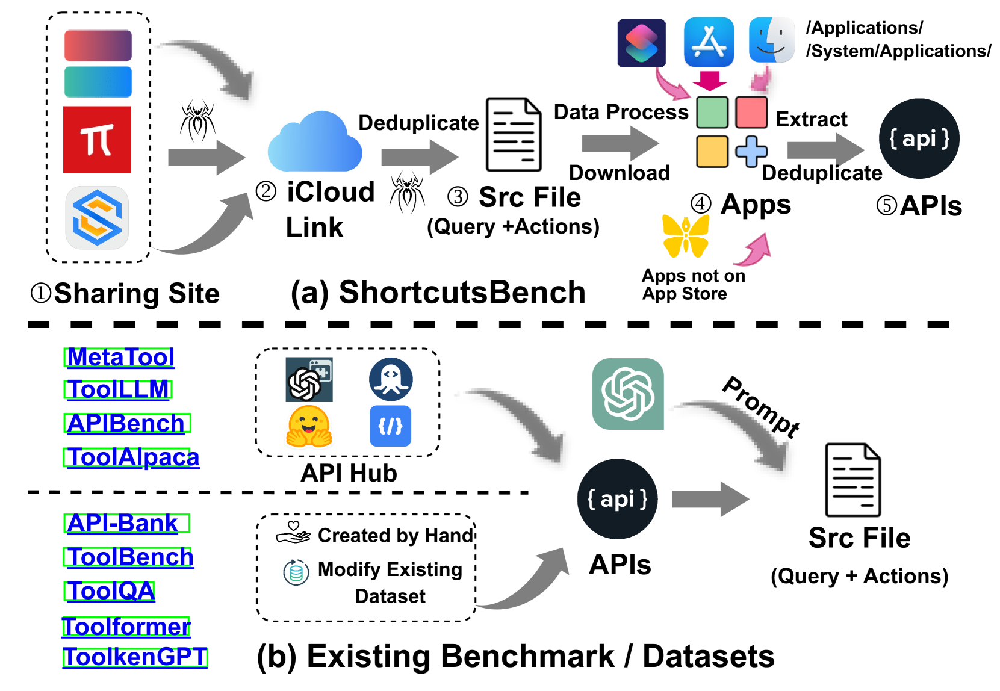

# ShortcutsBench：一款大型真实世界基准，专为基于 API 的代理设计。

发布时间：2024年06月28日

`Agent` `软件开发` `人工智能`

> ShortcutsBench: A Large-Scale Real-world Benchmark for API-based Agents

# 摘要

> 近年来，大型语言模型（LLMs）与应用程序编程接口（APIs）的结合在学术界和工业界备受瞩目。这些基于API的智能代理，凭借LLMs的强大自主规划能力，能高效应对多步骤任务。然而，它们在处理复杂多变的任务和现实需求方面的能力尚待探索。为此，我们推出了\textsc{ShortcutsBench}，一个全面评估API代理的大规模基准，涵盖不同难度、多样任务及现实需求。该基准集成了苹果系统的真实API、精炼用户查询、高质量动作序列及精确参数填充，旨在揭示代理在复杂查询处理上的局限。通过评估5个开源及4个闭源LLMs构建的代理，我们发现其在API选择、参数填充及信息请求方面存在明显不足，凸显了其在应对真实复杂查询时的挑战。相关数据集、代码及结果将在\url{https://github.com/eachsheep/shortcutsbench}公开。

> Recent advancements in integrating large language models (LLMs) with application programming interfaces (APIs) have gained significant interest in both academia and industry. These API-based agents, leveraging the strong autonomy and planning capabilities of LLMs, can efficiently solve problems requiring multi-step actions. However, their ability to handle multi-dimensional difficulty levels, diverse task types, and real-world demands through APIs remains unknown. In this paper, we introduce \textsc{ShortcutsBench}, a large-scale benchmark for the comprehensive evaluation of API-based agents in solving tasks with varying levels of difficulty, diverse task types, and real-world demands. \textsc{ShortcutsBench} includes a wealth of real APIs from Apple Inc.'s operating systems, refined user queries from shortcuts, human-annotated high-quality action sequences from shortcut developers, and accurate parameter filling values about primitive parameter types, enum parameter types, outputs from previous actions, and parameters that need to request necessary information from the system or user. Our extensive evaluation of agents built with $5$ leading open-source (size >= 57B) and $4$ closed-source LLMs (e.g. Gemini-1.5-Pro and GPT-3.5) reveals significant limitations in handling complex queries related to API selection, parameter filling, and requesting necessary information from systems and users. These findings highlight the challenges that API-based agents face in effectively fulfilling real and complex user queries. All datasets, code, and experimental results will be available at \url{https://github.com/eachsheep/shortcutsbench}.

[Arxiv](https://arxiv.org/abs/2407.00132)