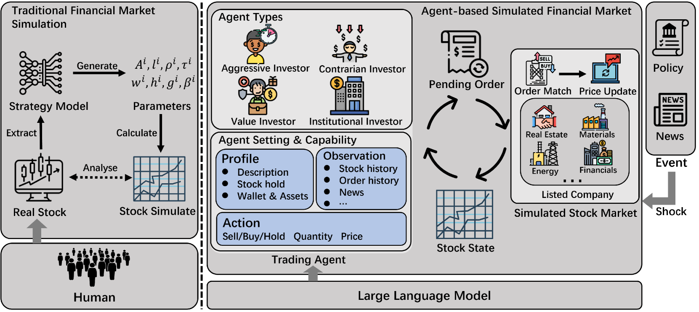
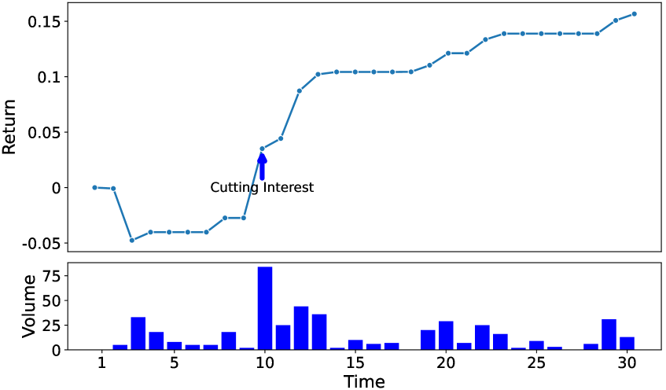
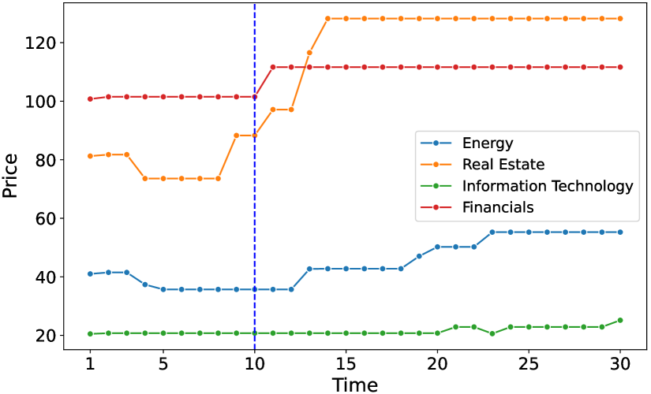
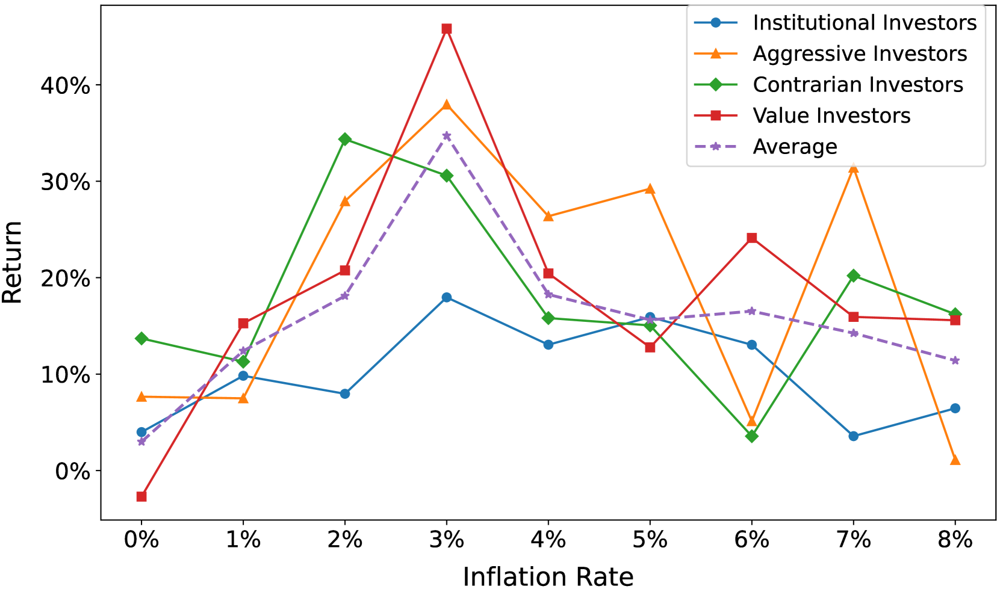
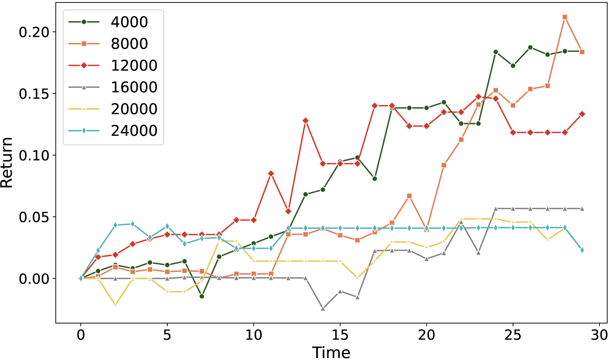

# 利用大型语言模型代理模拟金融市场

发布时间：2024年06月28日

`Agent` `经济研究`

> Simulating Financial Market via Large Language Model based Agents

# 摘要

> 经济理论常假设市场参与者完全理性，并用数学模型模拟其行为。然而，人类行为多变且难以预测。本文提出基于代理的模拟金融市场（ASFM），构建了包含真实订单匹配系统的模拟市场，并设计了基于大型语言模型的智能交易代理，能全面理解市场动态与政策，做出符合策略的决策。实验证明，ASFM在可控场景下的反应与真实市场一致，且在经济学研究热点方向的实验中，其结论与现有研究相符。ASFM为经济研究开辟了新路径。

> Most economic theories typically assume that financial market participants are fully rational individuals and use mathematical models to simulate human behavior in financial markets. However, human behavior is often not entirely rational and is challenging to predict accurately with mathematical models. In this paper, we propose \textbf{A}gent-based \textbf{S}imulated \textbf{F}inancial \textbf{M}arket (ASFM), which first constructs a simulated stock market with a real order matching system. Then, we propose a large language model based agent as the stock trader, which contains the profile, observation, and tool-learning based action module. The trading agent can comprehensively understand current market dynamics and financial policy information, and make decisions that align with their trading strategy. In the experiments, we first verify that the reactions of our ASFM are consistent with the real stock market in two controllable scenarios. In addition, we also conduct experiments in two popular economics research directions, and we find that conclusions drawn in our \model align with the preliminary findings in economics research. Based on these observations, we believe our proposed ASFM provides a new paradigm for economic research.

[Arxiv](https://arxiv.org/abs/2406.19966)