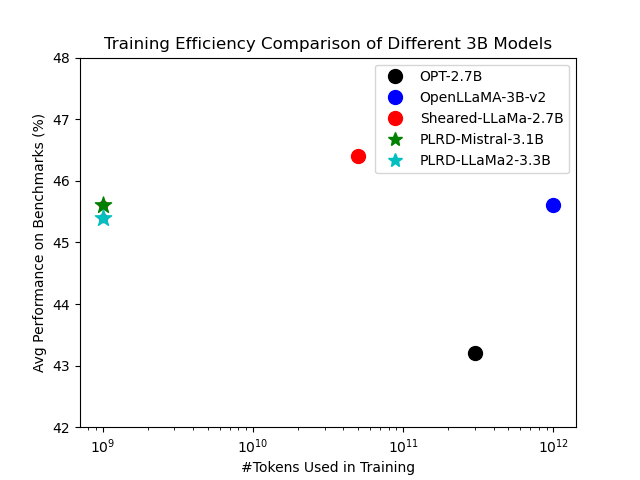
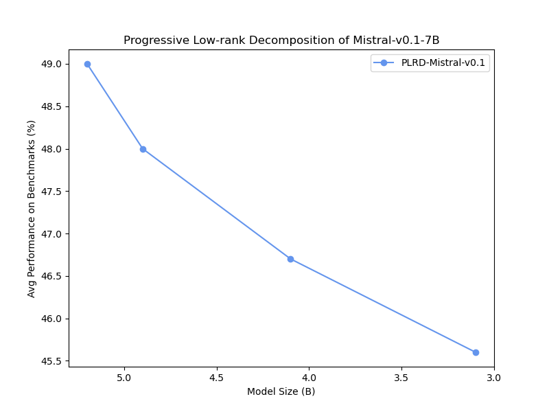
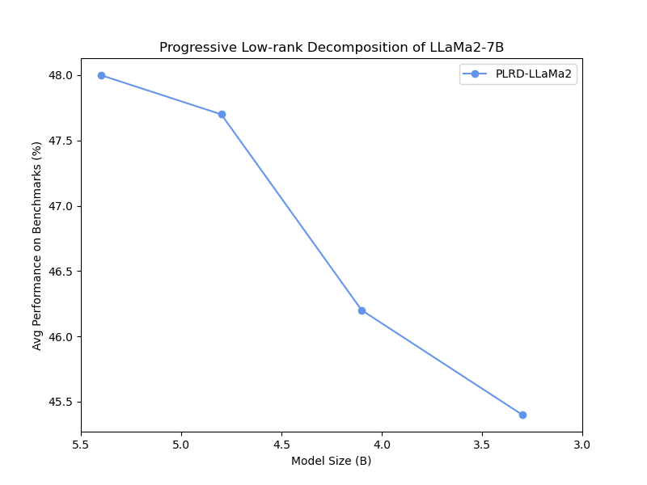

# 单亲家庭：源自单一预训练模型的多样化家庭成员谱系

发布时间：2024年06月28日

`LLM理论` `人工智能` `能源效率`

> Single Parent Family: A Spectrum of Family Members from a Single Pre-Trained Foundation Model

# 摘要

> 本文提出了一种创新的渐进低秩分解（PLRD）技术，专为大型语言模型压缩设计。该方法通过预训练模型逐步分解，降低秩以减小模型尺寸，从而大幅减少计算和能源消耗，且无需重新训练。PLRD通过战略性降低张量秩，优化了性能与资源使用的平衡。实验表明，PLRD训练的模型在仅用1B令牌的情况下，性能与传统模型相当，且仅耗用0.1%的令牌。PLRD的灵活性体现在能从单一基础模型生成多种尺寸，适应不同计算和内存需求。研究显示，PLRD有望成为LLMs高效扩展的新标杆，推动高级AI在多平台上的应用。

> This paper introduces a novel method of Progressive Low Rank Decomposition (PLRD) tailored for the compression of large language models. Our approach leverages a pre-trained model, which is then incrementally decompressed to smaller sizes using progressively lower ranks. This method allows for significant reductions in computational overhead and energy consumption, as subsequent models are derived from the original without the need for retraining from scratch. We detail the implementation of PLRD, which strategically decreases the tensor ranks, thus optimizing the trade-off between model performance and resource usage. The efficacy of PLRD is demonstrated through extensive experiments showing that models trained with PLRD method on only 1B tokens maintain comparable performance with traditionally trained models while using 0.1% of the tokens. The versatility of PLRD is highlighted by its ability to generate multiple model sizes from a single foundational model, adapting fluidly to varying computational and memory budgets. Our findings suggest that PLRD could set a new standard for the efficient scaling of LLMs, making advanced AI more feasible on diverse platforms.

[Arxiv](https://arxiv.org/abs/2406.19995)