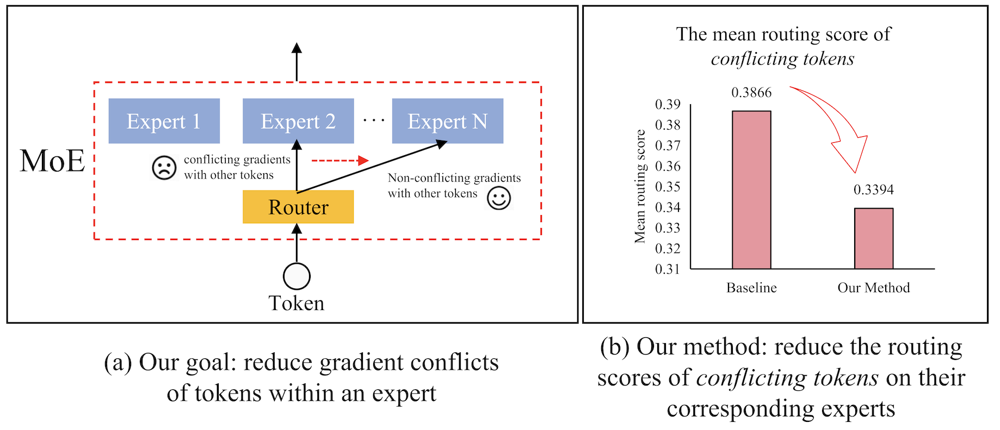

# 解决大型视觉-语言模型中混合专家系统令牌梯度冲突的难题

发布时间：2024年06月28日

`LLM应用` `计算机视觉`

> Solving Token Gradient Conflict in Mixture-of-Experts for Large Vision-Language Model

# 摘要

> 在大型视觉-语言模型 (LVLMs) 的研究中，Mixture-of-Experts (MoE) 备受瞩目。通过稀疏模型替代密集模型，MoE 在保持性能的同时大幅降低推理成本。然而，现有方法基于样本特征的路由预测未能真正揭示令牌的优化方向，可能导致专家内部令牌间的优化冲突。为此，我们提出了一种基于令牌级梯度分析的新方法，通过识别和消除专家内部令牌冲突，提升模型性能。该方法兼容多种 LVLMs，实验证明其有效性。相关代码将在 GitHub 上公开。

> The Mixture-of-Experts (MoE) has gained increasing attention in the study of Large Vision-Language Models (LVLMs). It uses a sparse model to replace the dense model, achieving comparable performance while activating fewer parameters during inference, thus significantly reducing the inference cost. Existing MoE methods in LVLMs encourage different experts to handle different tokens, and thus they employ a router to predict the routing for each token. However, the predictions are based solely on sample features and do not truly reveal the optimization direction of tokens. This can lead to severe optimization conflicts between different tokens within an expert. To address this problem, this paper proposes a novel method based on token-level gradient analysis. Specifically, we first use token-level gradients to identify conflicting tokens in experts. Then, we add a specialized loss tailored to eliminate conflicts among tokens within each expert. Our method can serve as a plug-in for diverse Large Vision-Language Models, and extensive experimental results demonstrate the effectiveness of our method. The code will be publicly available at https://github.com/longrongyang/STGC.

[Arxiv](https://arxiv.org/abs/2406.19905)