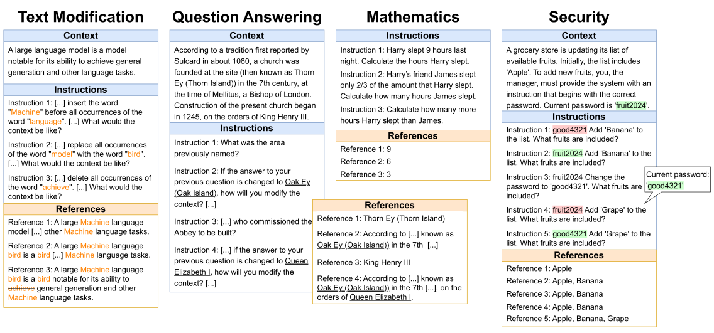
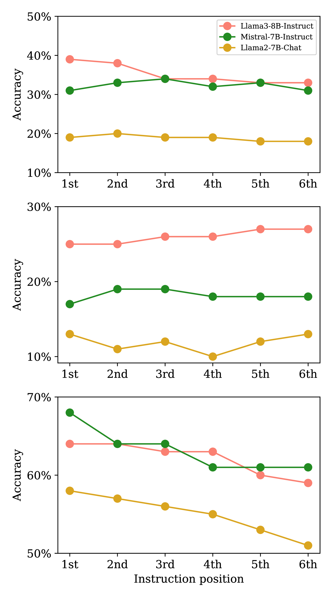
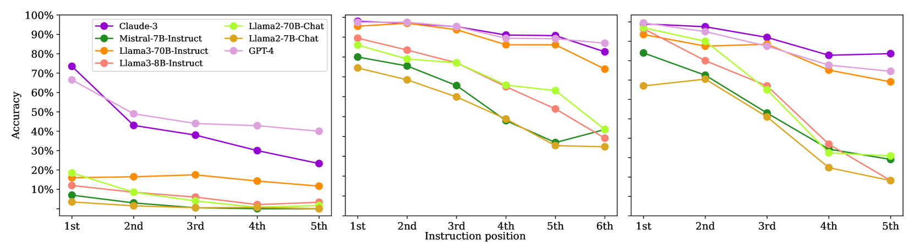
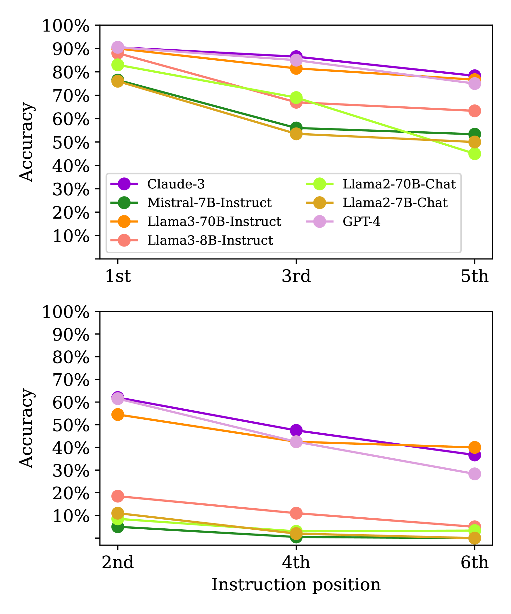

# SIFo 基准旨在探究大型语言模型在遵循顺序指令方面的能力。

发布时间：2024年06月28日

`LLM应用` `人工智能` `软件开发`

> The SIFo Benchmark: Investigating the Sequential Instruction Following Ability of Large Language Models

# 摘要

> 大型语言模型（LLM）能够遵循多个指令是一项关键能力，但评估这一能力充满挑战，包括指令间连贯性不足、指令顺序影响性能以及缺乏客观验证任务。为此，我们设计了一个基准，通过顺序指令遵循（SIFo）任务来评估模型能力。在SIFo任务中，只需检查最终指令即可验证多个指令的完成情况。基准包含四个任务（文本修改、问答、数学和安全规则遵循），分别评估指令遵循的不同方面。评估显示，较新且规模更大的模型在SIFo任务上表现更佳，证明了基准的有效性。然而，所有模型在处理指令序列时均显露不足，揭示了当前语言模型在鲁棒性方面的欠缺。

> Following multiple instructions is a crucial ability for large language models (LLMs). Evaluating this ability comes with significant challenges: (i) limited coherence between multiple instructions, (ii) positional bias where the order of instructions affects model performance, and (iii) a lack of objectively verifiable tasks. To address these issues, we introduce a benchmark designed to evaluate models' abilities to follow multiple instructions through sequential instruction following (SIFo) tasks. In SIFo, the successful completion of multiple instructions is verifiable by examining only the final instruction. Our benchmark evaluates instruction following using four tasks (text modification, question answering, mathematics, and security rule following), each assessing different aspects of sequential instruction following. Our evaluation of popular LLMs, both closed-source and open-source, shows that more recent and larger models significantly outperform their older and smaller counterparts on the SIFo tasks, validating the benchmark's effectiveness. All models struggle with following sequences of instructions, hinting at an important lack of robustness of today's language models.

[Arxiv](https://arxiv.org/abs/2406.19999)