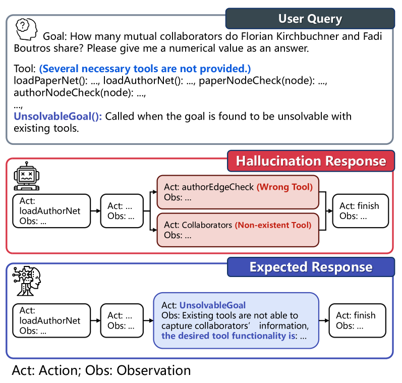
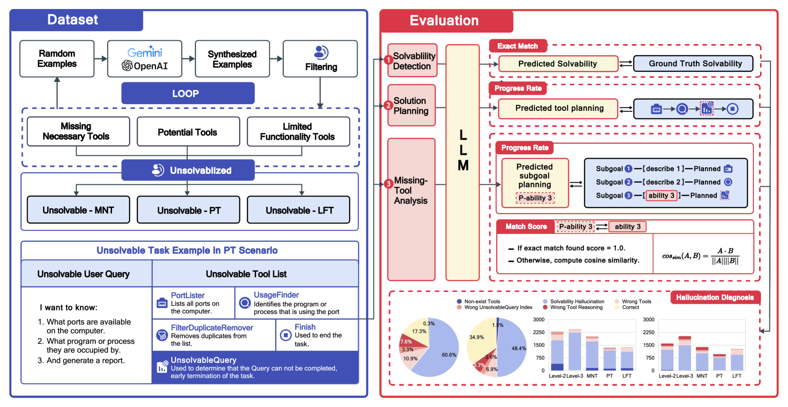
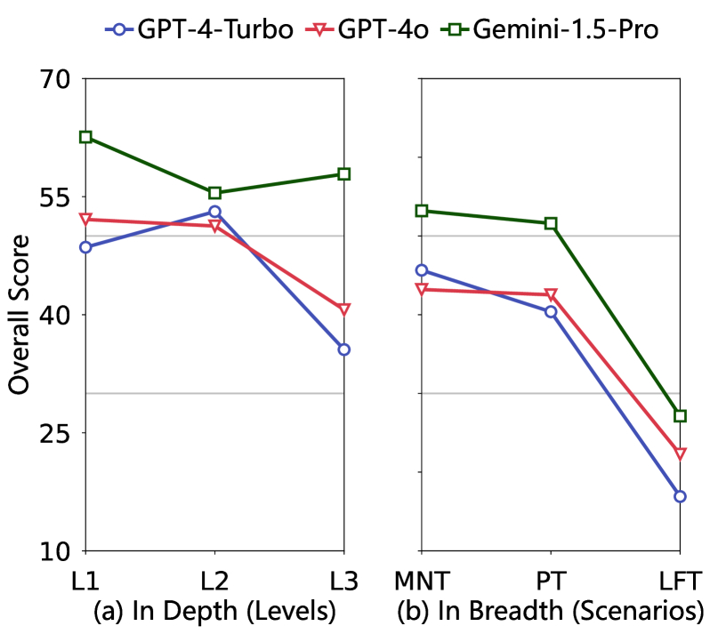
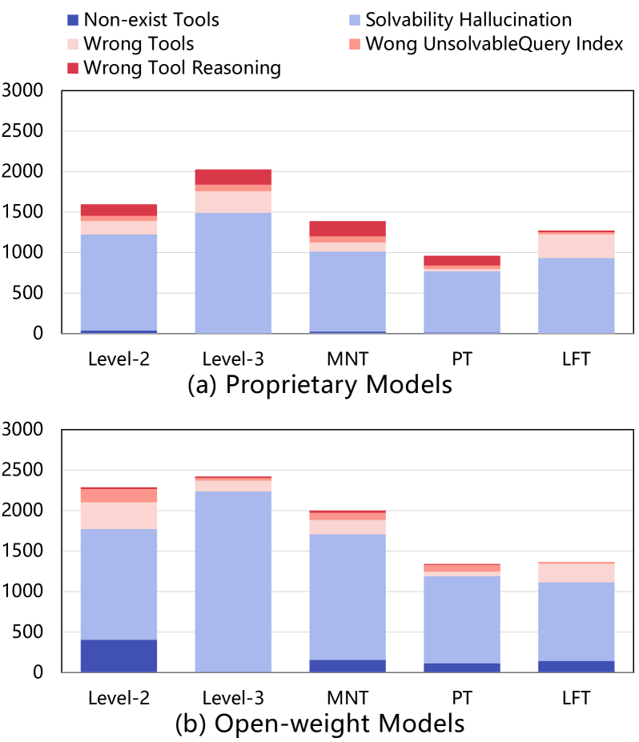
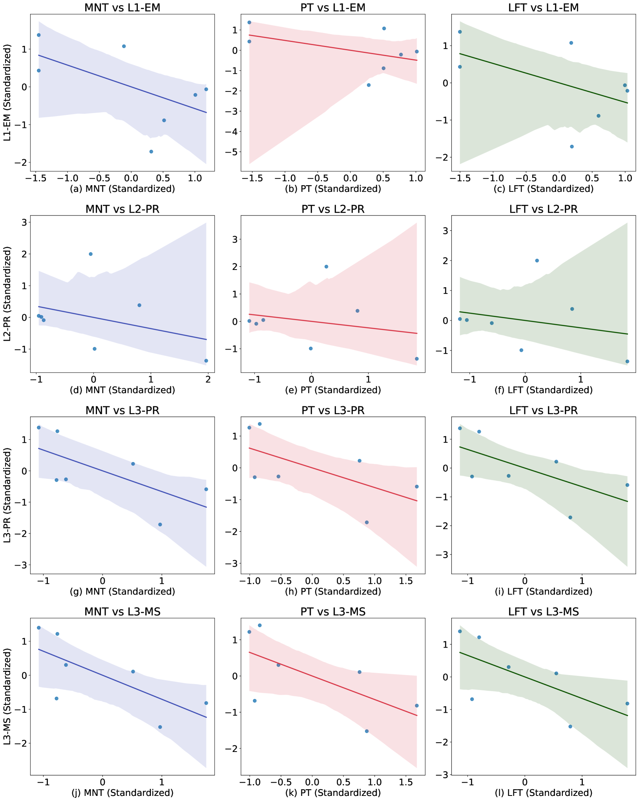
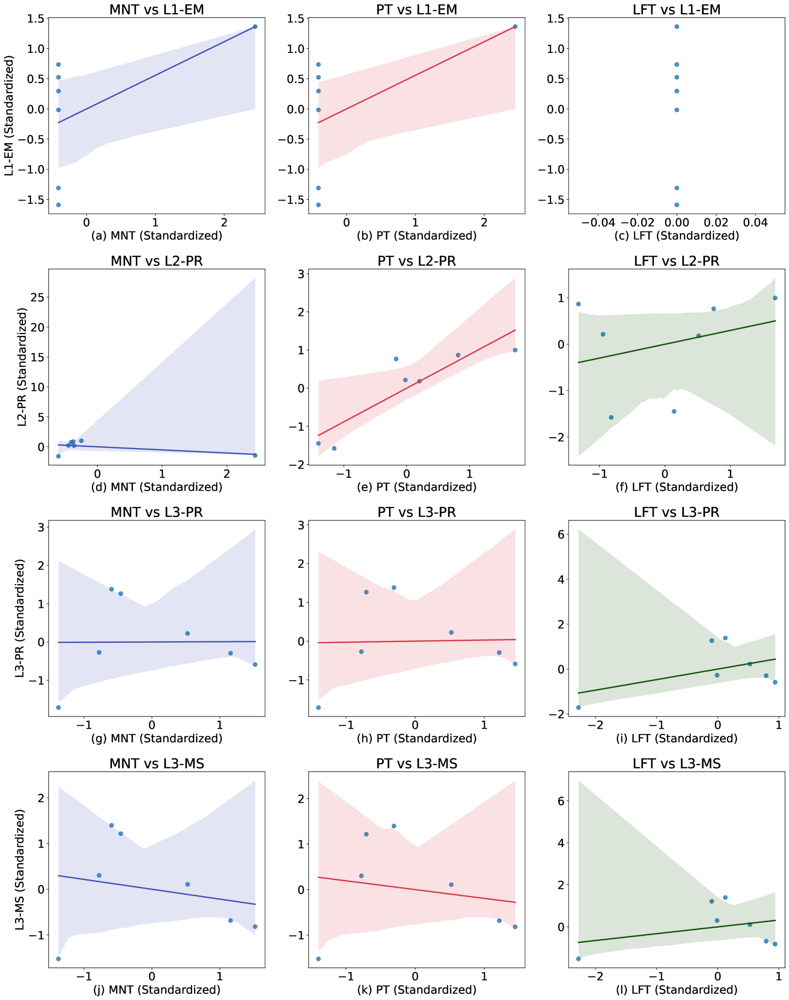
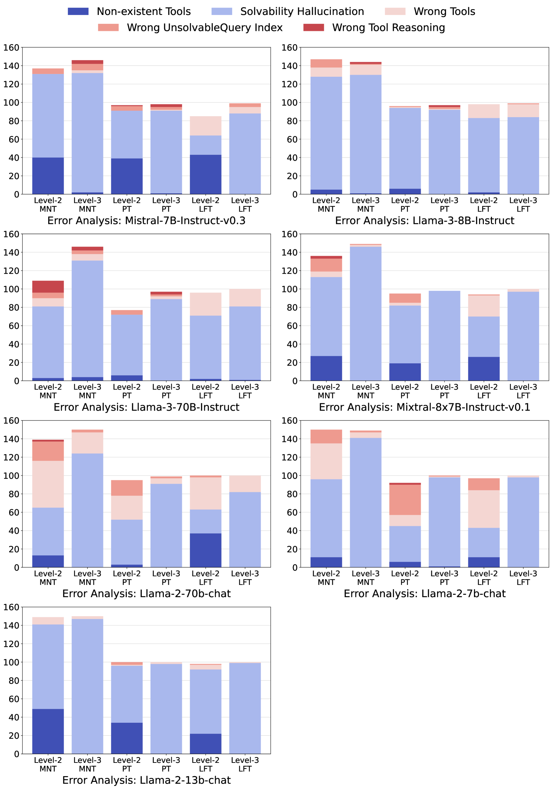
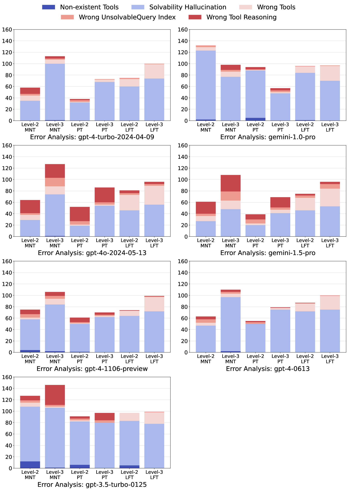

# ToolBeHonest：针对工具增强型大型语言模型的多层次幻觉诊断基准

发布时间：2024年06月28日

`LLM应用` `人工智能` `软件开发`

> ToolBeHonest: A Multi-level Hallucination Diagnostic Benchmark for Tool-Augmented Large Language Models

# 摘要

> 工具增强的LLM正迅速融入实际应用，但社区对这些模型中的幻觉问题理解尚浅。为此，我们推出了全面诊断基准ToolBH，从深度与广度双重视角评估LLM幻觉。深度诊断涵盖可解性检测、解决方案规划及缺失工具分析；广度则涉及缺失必要工具、潜在工具与功能受限工具三种情景。我们设计七项任务，收集700样本，揭示ToolBH的挑战性：Gemini-1.5-Pro与GPT-4o得分仅45.3与37.0（满分100）。大参数非性能保证，训练数据与响应策略同样关键。诊断显示，错误主因在于任务可解性评估；开放权重模型遇冗长回复性能下滑，专有模型则长推理更优。

> Tool-augmented large language models (LLMs) are rapidly being integrated into real-world applications. Due to the lack of benchmarks, the community still needs to fully understand the hallucination issues within these models. To address this challenge, we introduce a comprehensive diagnostic benchmark, ToolBH. Specifically, we assess the LLM's hallucinations through two perspectives: depth and breadth. In terms of depth, we propose a multi-level diagnostic process, including (1) solvability detection, (2) solution planning, and (3) missing-tool analysis. For breadth, we consider three scenarios based on the characteristics of the toolset: missing necessary tools, potential tools, and limited functionality tools. Furthermore, we developed seven tasks and collected 700 evaluation samples through multiple rounds of manual annotation. The results show the significant challenges presented by the ToolBH benchmark. The current advanced models Gemini-1.5-Pro and GPT-4o only achieve a total score of 45.3 and 37.0, respectively, on a scale of 100. In this benchmark, larger model parameters do not guarantee better performance; the training data and response strategies also play a crucial role in tool-enhanced LLM scenarios. Our diagnostic analysis indicates that the primary reason for model errors lies in assessing task solvability. Additionally, open-weight models suffer from performance drops with verbose replies, whereas proprietary models excel with longer reasoning.

[Arxiv](https://arxiv.org/abs/2406.20015)