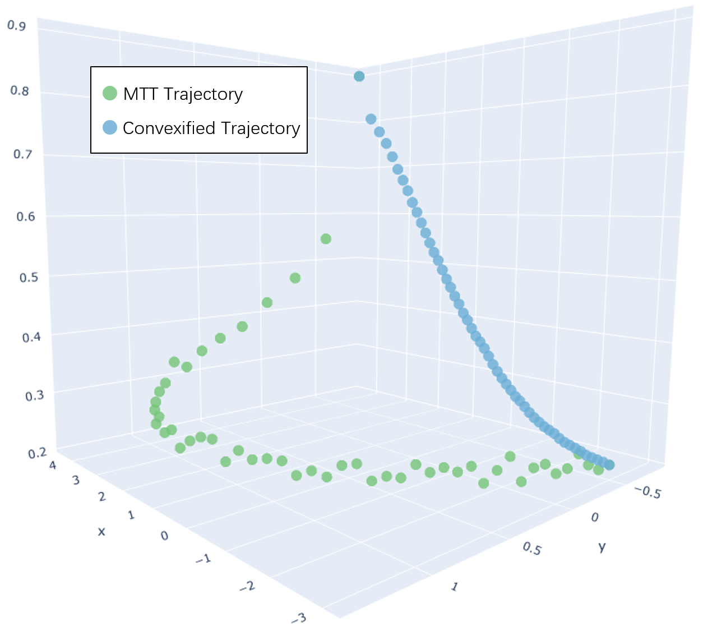
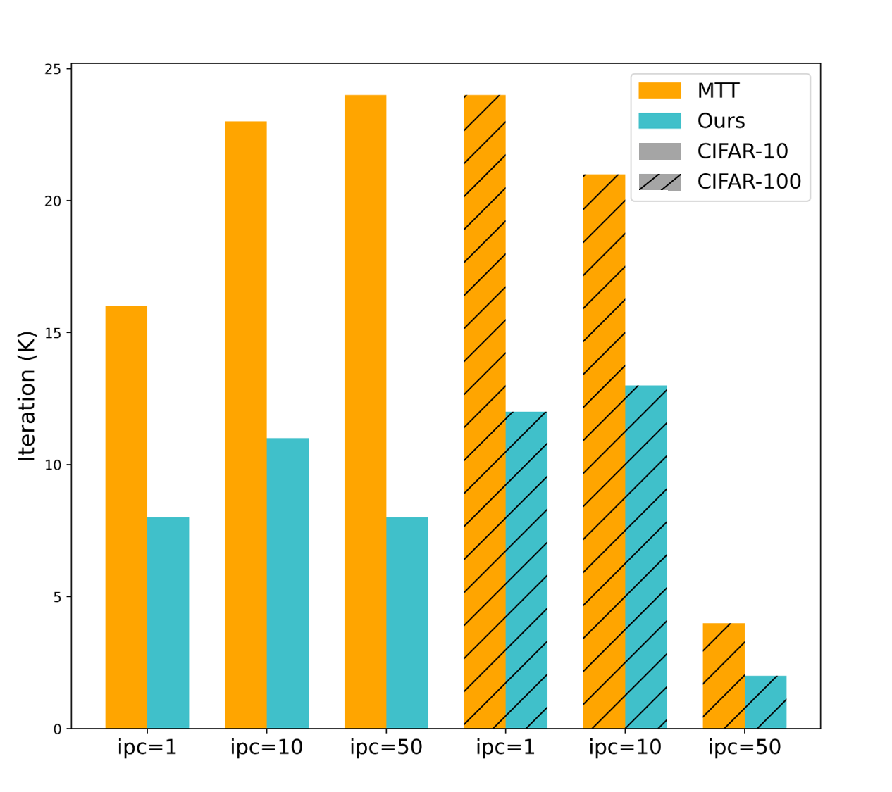
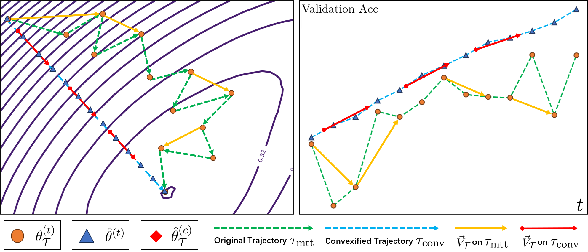
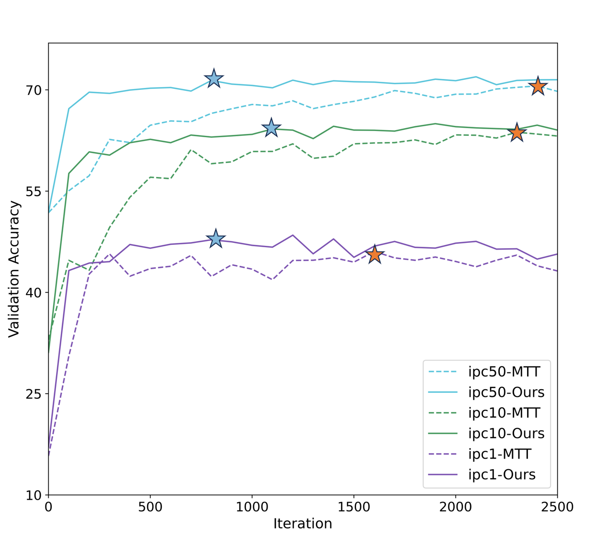
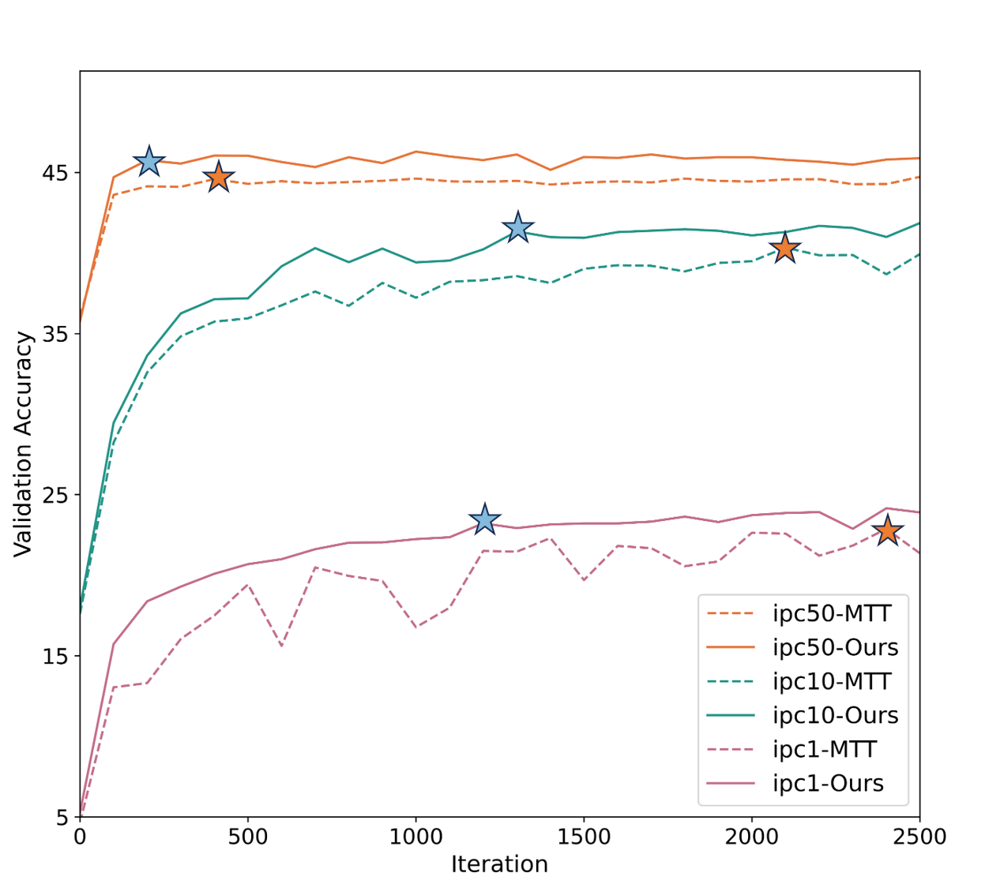
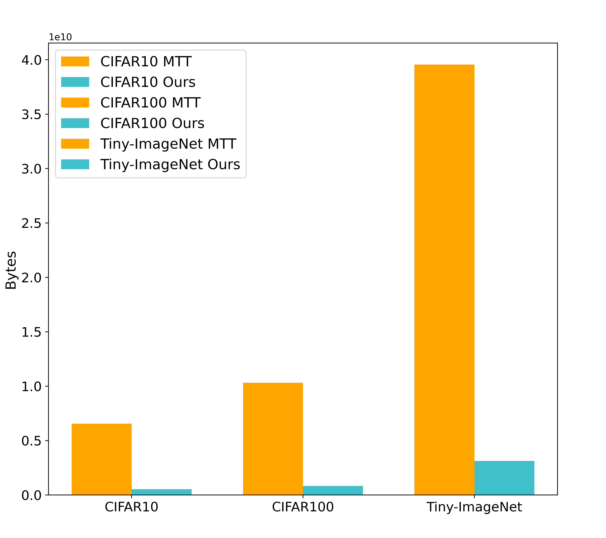
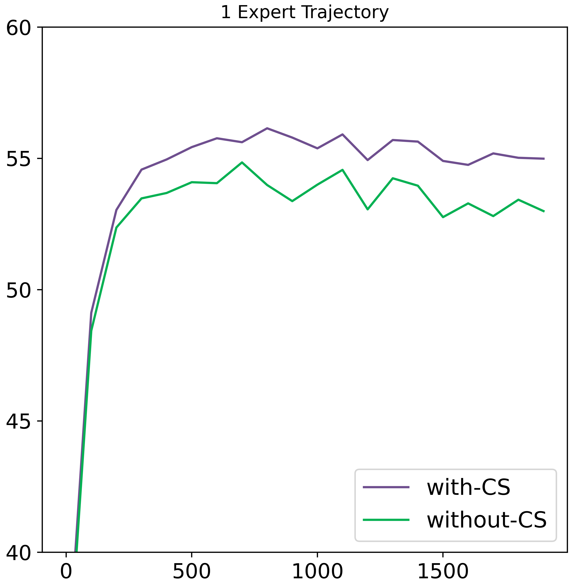
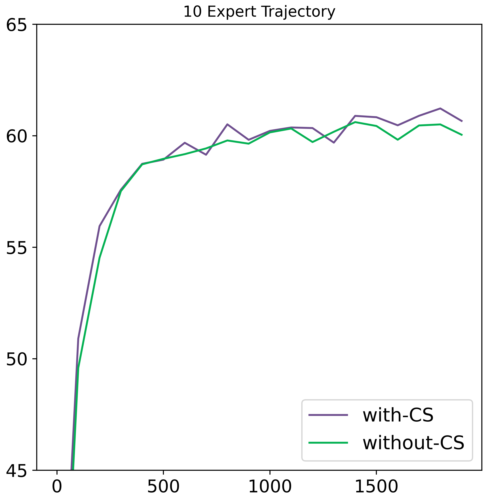
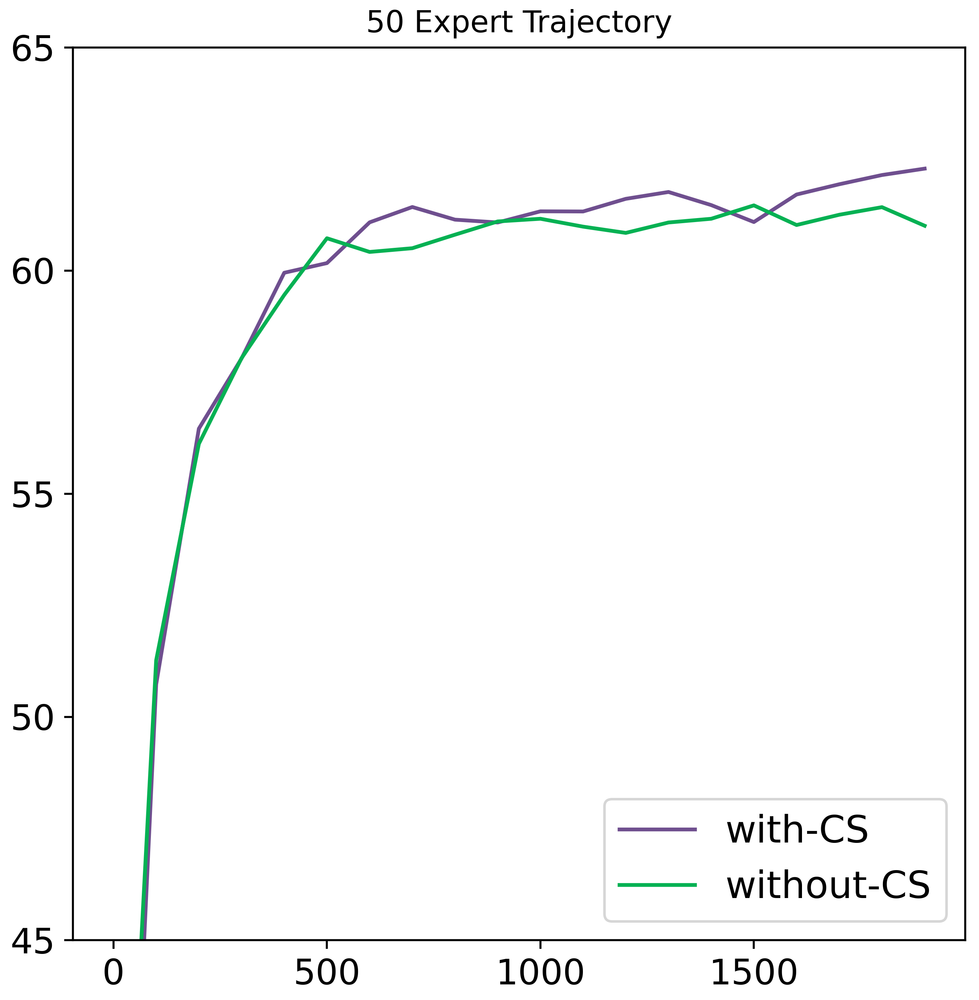
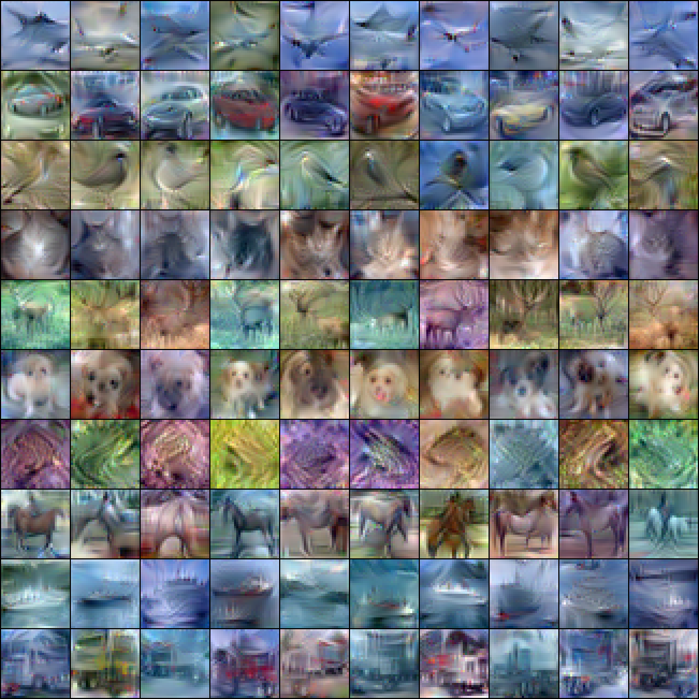

# 探索稳定且存储高效的数据集蒸馏方法：通过匹配凸化轨迹实现优化

发布时间：2024年06月28日

`LLM理论` `人工智能` `数据科学`

> Towards Stable and Storage-efficient Dataset Distillation: Matching Convexified Trajectory

# 摘要

> 随着深度学习和大型语言模型的迅猛发展，对训练数据的需求激增，推动了数据集蒸馏技术的发展。其中，匹配训练轨迹（MTT）方法通过合成数据集模拟专家网络的训练过程，但存在三大问题：专家轨迹的不稳定、蒸馏速度慢和高存储成本。为此，我们提出新视角，通过目标函数变换深入理解数据集蒸馏和MTT，并创新引入匹配凸化轨迹（MCT）方法。MCT利用神经正切核的线性动态特性，构建专家轨迹的凸组合，引导学生网络快速稳定收敛，且更易存储，支持连续采样，确保全面学习专家轨迹。实验证明，MCT在多个公共数据集上优于传统MTT方法。

> The rapid evolution of deep learning and large language models has led to an exponential growth in the demand for training data, prompting the development of Dataset Distillation methods to address the challenges of managing large datasets. Among these, Matching Training Trajectories (MTT) has been a prominent approach, which replicates the training trajectory of an expert network on real data with a synthetic dataset. However, our investigation found that this method suffers from three significant limitations: 1. Instability of expert trajectory generated by Stochastic Gradient Descent (SGD); 2. Low convergence speed of the distillation process; 3. High storage consumption of the expert trajectory. To address these issues, we offer a new perspective on understanding the essence of Dataset Distillation and MTT through a simple transformation of the objective function, and introduce a novel method called Matching Convexified Trajectory (MCT), which aims to provide better guidance for the student trajectory. MCT leverages insights from the linearized dynamics of Neural Tangent Kernel methods to create a convex combination of expert trajectories, guiding the student network to converge rapidly and stably. This trajectory is not only easier to store, but also enables a continuous sampling strategy during distillation, ensuring thorough learning and fitting of the entire expert trajectory. Comprehensive experiments across three public datasets validate the superiority of MCT over traditional MTT methods.

[Arxiv](https://arxiv.org/abs/2406.19827)