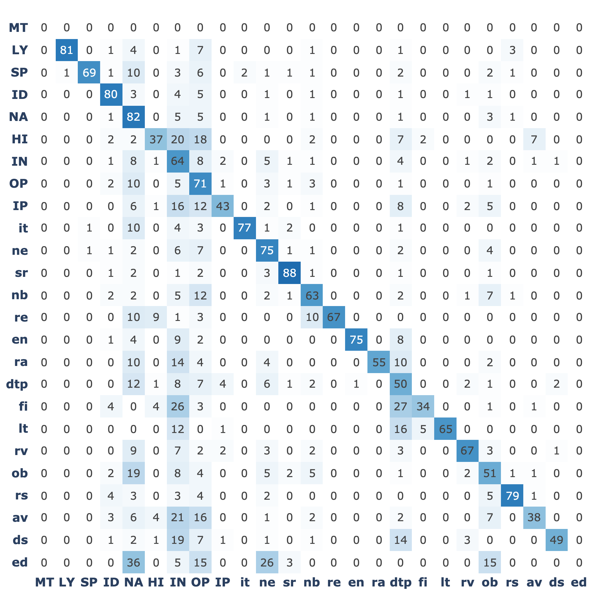
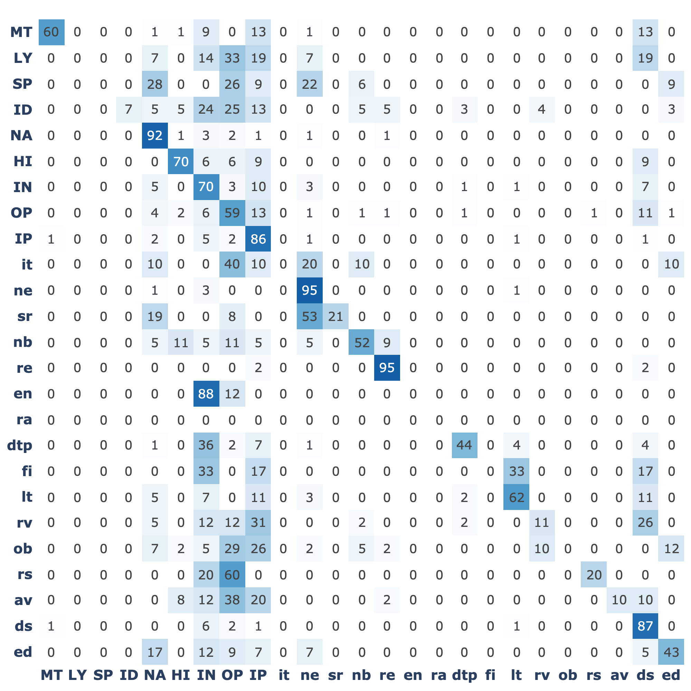

# 探索无界网络：自动辨识多语言语境

发布时间：2024年06月28日

`LLM应用` `计算语言学` `网络数据分析`

> Untangling the Unrestricted Web: Automatic Identification of Multilingual Registers

# 摘要

> 本文深入研究了用于自动识别16种语言网络数据集中文本类型的深度学习模型。网络文本类型识别对于理解大规模网络数据集至关重要，这些数据集在计算语言学领域扮演着重要角色。尽管已有进展，但在多语言和无限制网络环境下，文本类型分类器的潜力仍待充分挖掘。我们利用多语言CORE语料库，通过详细的层次化分类法，对16种语言进行了深度学习模型的实验。结果显示，这些模型达到了业界领先水平，证明了层次化多标签设置中详细分类法的有效性。然而，所有模型在约80%的F1分数处遇到了瓶颈，这源于网络文本类型的非离散性和标注的不确定性。通过剔除模糊示例，模型性能提升至90%以上。多语言模型在训练数据较少的语言中表现更佳，零-shot设置虽平均降低7%性能，但性能下降与特定文本类型或语言无关，而是显示出跨语言的文本类型相似性。

> This article explores deep learning models for the automatic identification of registers - text varieties such as news reports and discussion forums - in web-based datasets across 16 languages. Web register (or genre) identification would provide a robust solution for understanding the content of web-scale datasets, which have become crucial in computational linguistics. Despite recent advances, the potential of register classifiers on the noisy web remains largely unexplored, particularly in multilingual settings and when targeting the entire unrestricted web. We experiment with a range of deep learning models using the new Multilingual CORE corpora, which includes 16 languages annotated using a detailed, hierarchical taxonomy of 25 registers designed to cover the entire unrestricted web. Our models achieve state-of-the-art results, showing that a detailed taxonomy in a hierarchical multi-label setting can yield competitive classification performance. However, all models hit a glass ceiling at approximately 80% F1 score, which we attribute to the non-discrete nature of web registers and the inherent uncertainty in labeling some documents. By pruning ambiguous examples, we improve model performance to over 90%. Finally, multilingual models outperform monolingual ones, particularly benefiting languages with fewer training examples and smaller registers. Although a zero-shot setting decreases performance by an average of 7%, these drops are not linked to specific registers or languages. Instead, registers show surprising similarity across languages.

[Arxiv](https://arxiv.org/abs/2406.19892)